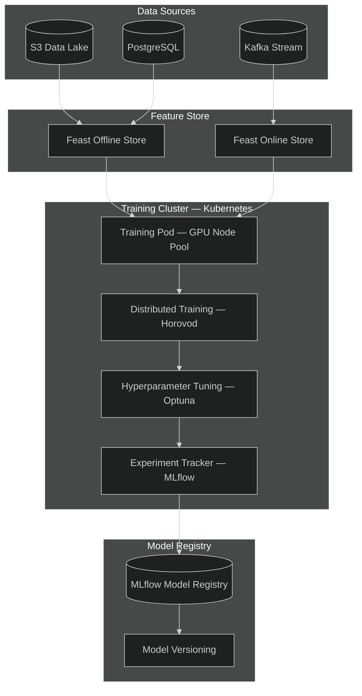
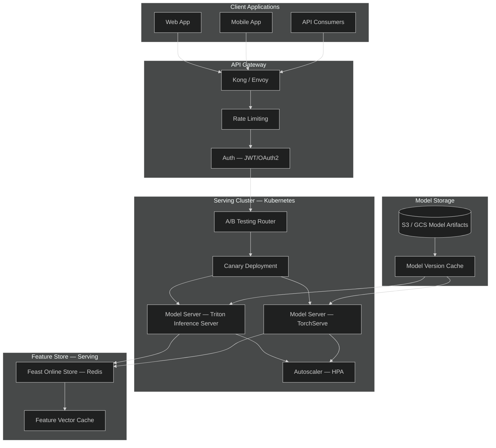
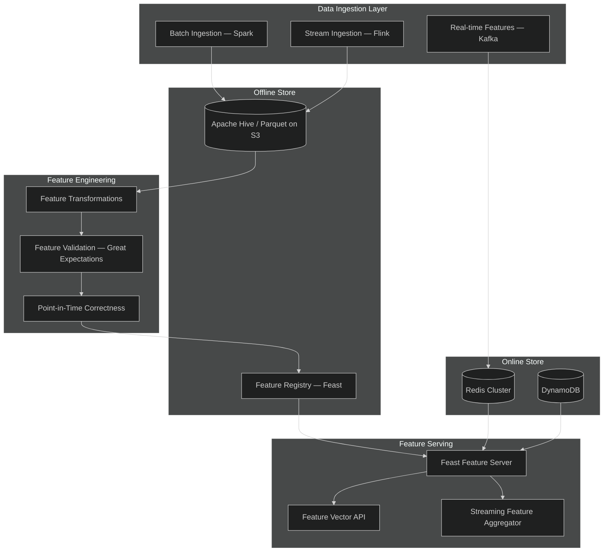
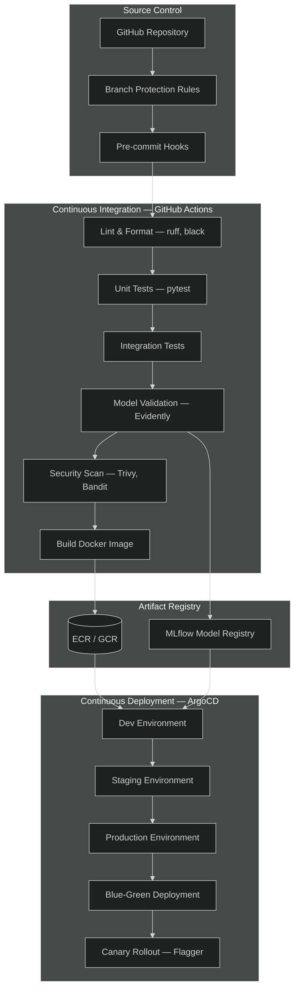
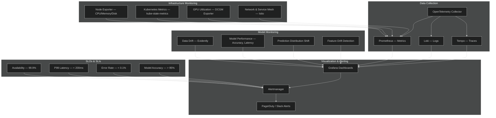

# Data Science Deployment Guide

## 1. Training Cluster Deployment

```mermaid
%%{init: {'theme':'dark'}}%%
flowchart TD
    subgraph DataSources["Data Sources"]
        DS1[(S3 Data Lake)]
        DS2[(PostgreSQL)]
        DS3[(Kafka Stream)]
    end

    subgraph FeatureStore["Feature Store"]
        FS1[Feast Online Store]
        FS2[Feast Offline Store]
    end

    subgraph TrainingCluster["Training Cluster — Kubernetes"]
        TB1[Training Pod — GPU Node Pool]
        TB2[Distributed Training — Horovod]
        TB3[Hyperparameter Tuning — Optuna]
        TB4[Experiment Tracker — MLflow]
    end

    subgraph ModelRegistry["Model Registry"]
        MR1[(MLflow Model Registry)]
        MR2[Model Versioning]
    end

    DS1 --> FS2
    DS2 --> FS2
    DS3 --> FS1
    FS2 --> TB1
    FS1 --> TB1
    TB1 --> TB2
    TB2 --> TB3
    TB3 --> TB4
    TB4 --> MR1
    MR1 --> MR2
```

## 2. Serving Cluster Deployment

```mermaid
%%{init: {'theme':'dark'}}%%
flowchart TD
    subgraph Clients["Client Applications"]
        C1[Web App]
        C2[Mobile App]
        C3[API Consumers]
    end

    subgraph APIGateway["API Gateway"]
        GW1[Kong / Envoy]
        GW2[Rate Limiting]
        GW3[Auth — JWT/OAuth2]
    end

    subgraph ServingCluster["Serving Cluster — Kubernetes"]
        SV1[Model Server — Triton Inference Server]
        SV2[Model Server — TorchServe]
        SV3[Autoscaler — HPA]
        SV4[Canary Deployment]
        SV5[A/B Testing Router]
    end

    subgraph FeatureStoreServing["Feature Store — Serving"]
        FSS1[Feast Online Store — Redis]
        FSS2[Feature Vector Cache]
    end

    subgraph ModelStorage["Model Storage"]
        MS1[(S3 / GCS Model Artifacts)]
        MS2[Model Version Cache]
    end

    C1 --> GW1
    C2 --> GW1
    C3 --> GW1
    GW1 --> GW2
    GW2 --> GW3
    GW3 --> SV5
    SV5 --> SV4
    SV4 --> SV1
    SV4 --> SV2
    SV1 --> SV3
    SV2 --> SV3
    SV1 --> FSS1
    SV2 --> FSS1
    FSS1 --> FSS2
    MS1 --> MS2
    MS2 --> SV1
    MS2 --> SV2
```

## 3. Feature Store Deployment

```mermaid
%%{init: {'theme':'dark'}}%%
flowchart TD
    subgraph Ingestion["Data Ingestion Layer"]
        I1[Batch Ingestion — Spark]
        I2[Stream Ingestion — Flink]
        I3[Real-time Features — Kafka]
    end

    subgraph OfflineStore["Offline Store"]
        OS1[(Apache Hive / Parquet on S3)]
        OS2[Feature Registry — Feast]
    end

    subgraph OnlineStore["Online Store"]
        OL1[(Redis Cluster)]
        OL2[(DynamoDB)]
    end

    subgraph FeatureEngineering["Feature Engineering"]
        FE1[Feature Transformations]
        FE2[Feature Validation — Great Expectations]
        FE3[Point-in-Time Correctness]
    end

    subgraph ServingLayer["Feature Serving"]
        SL1[Feast Feature Server]
        SL2[Feature Vector API]
        SL3[Streaming Feature Aggregator]
    end

    I1 --> OS1
    I2 --> OS1
    I3 --> OL1
    OS1 --> FE1
    FE1 --> FE2
    FE2 --> FE3
    FE3 --> OS2
    OS2 --> SL1
    OL1 --> SL1
    OL2 --> SL1
    SL1 --> SL2
    SL1 --> SL3
```

## 4. CI/CD Pipeline

```mermaid
%%{init: {'theme':'dark'}}%%
flowchart TD
    subgraph Source["Source Control"]
        SC1[GitHub Repository]
        SC2[Branch Protection Rules]
        SC3[Pre-commit Hooks]
    end

    subgraph CI["Continuous Integration — GitHub Actions"]
        CI1[Lint & Format — ruff, black]
        CI2[Unit Tests — pytest]
        CI3[Integration Tests]
        CI4[Model Validation — Evidently]
        CI5[Security Scan — Trivy, Bandit]
        CI6[Build Docker Image]
    end

    subgraph CD["Continuous Deployment — ArgoCD"]
        CD1[Dev Environment]
        CD2[Staging Environment]
        CD3[Production Environment]
        CD4[Blue-Green Deployment]
        CD5[Canary Rollout — Flagger]
    end

    subgraph ArtifactRegistry["Artifact Registry"]
        AR1[(ECR / GCR)]
        AR2[MLflow Model Registry]
    end

    SC1 --> SC2
    SC2 --> SC3
    SC3 --> CI1
    CI1 --> CI2
    CI2 --> CI3
    CI3 --> CI4
    CI4 --> CI5
    CI5 --> CI6
    CI6 --> AR1
    CI4 --> AR2
    AR1 --> CD1
    AR2 --> CD1
    CD1 --> CD2
    CD2 --> CD3
    CD3 --> CD4
    CD4 --> CD5
```

## 5. Monitoring Setup

```mermaid
%%{init: {'theme':'dark'}}%%
flowchart TD
    subgraph DataCollection["Data Collection"]
        DC1[Prometheus — Metrics]
        DC2[Loki — Logs]
        DC3[Tempo — Traces]
        DC4[OpenTelemetry Collector]
    end

    subgraph Dashboards["Visualization & Alerting"]
        DB1[Grafana Dashboards]
        DB2[Alertmanager]
        DB3[PagerDuty / Slack Alerts]
    end

    subgraph ModelMonitoring["Model Monitoring"]
        MM1[Data Drift — Evidently]
        MM2[Model Performance — Accuracy, Latency]
        MM3[Prediction Distribution Shift]
        MM4[Feature Drift Detection]
    end

    subgraph InfrastructureMonitoring["Infrastructure Monitoring"]
        IM1[Node Exporter — CPU/Memory/Disk]
        IM2[Kubernetes Metrics — kube-state-metrics]
        IM3[GPU Utilization — DCGM Exporter]
        IM4[Network & Service Mesh — Istio]
    end

    subgraph SLOs["SLOs & SLIs"]
        SLO1[Availability — 99.9%]
        SLO2[P99 Latency — < 200ms]
        SLO3[Error Rate — < 0.1%]
        SLO4[Model Accuracy — > 95%]
    end

    DC1 --> DB1
    DC2 --> DB1
    DC3 --> DB1
    DC4 --> DC1
    DC4 --> DC2
    DC4 --> DC3
    DB1 --> DB2
    DB2 --> DB3

    MM1 --> DB1
    MM2 --> DB1
    MM3 --> DB1
    MM4 --> DB1

    IM1 --> DC1
    IM2 --> DC1
    IM3 --> DC1
    IM4 --> DC1

    SLO1 --> DB2
    SLO2 --> DB2
    SLO3 --> DB2
    SLO4 --> DB2
```
