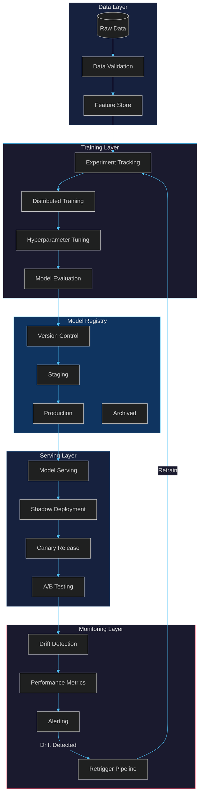
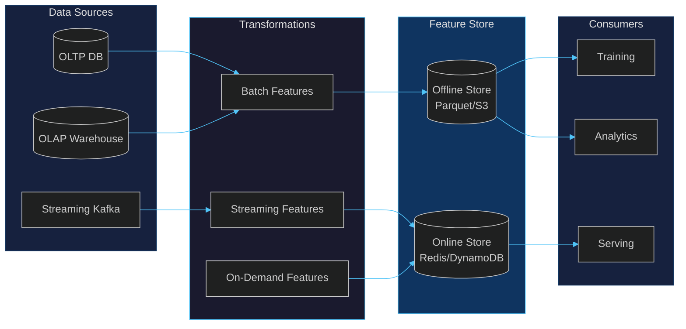
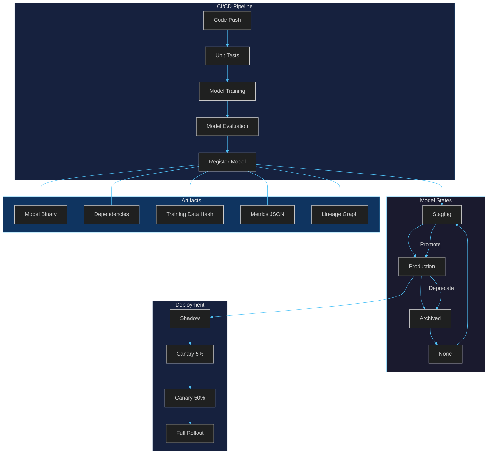
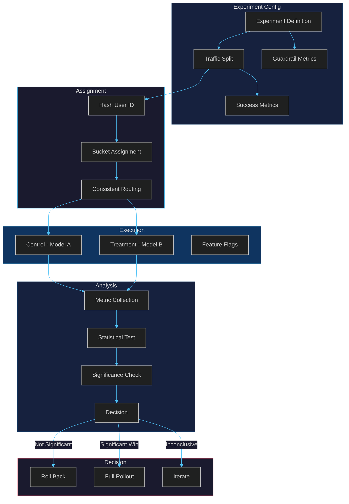
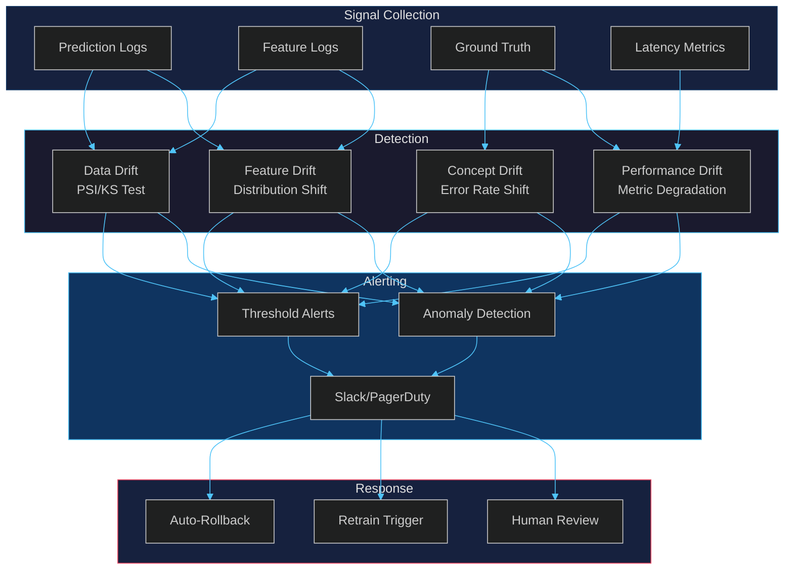

# Data Science Implementation

## 1. MLOps Pipeline



### Pipeline Stages

| Stage | Tool | Output |
|-------|------|--------|
| Data Validation | Great Expectations | Validation report |
| Feature Engineering | Feast | Feature vectors |
| Experiment Tracking | MLflow | Run metadata |
| Training | PyTorch / Ray | Trained model |
| Registry | MLflow Registry | Versioned model |
| Serving | Triton / Seldon | REST/gRPC endpoint |
| Monitoring | Evidently / Prometheus | Drift & metrics |

---

## 2. Feature Engineering Patterns

### Feature Store Architecture



### Core Patterns

**Point-in-Time Correctness**
- Use event timestamps, not ingestion timestamps
- Prevent training-serving skew with time-travel joins
- Validate feature freshness before serving

**Feature Categories**

| Category | Example | Storage | TTL |
|----------|---------|---------|-----|
| Batch | Daily aggregates | Parquet/S3 | 30 days |
| Streaming | Real-time counters | Redis | 1 hour |
| On-Demand | Request context | In-memory | Per-request |
| Embedding | User vectors | Faiss/Milvus | 7 days |

**Feature Pipeline Contract**
```python
@feature_view(
    entities=[user_id],
    ttl=timedelta(hours=24),
    online=True,
)
def user_features(user_events):
    return {
        "total_orders_7d": aggregate(user_events, window="7d"),
        "avg_order_value_30d": mean(user_events.amount, window="30d"),
        "last_active_days": days_since(user_events[-1].timestamp),
    }
```

---

## 3. Model Registry Architecture



### Registry Metadata Schema

```json
{
  "model_id": "fraud-detection",
  "version": "42",
  "stage": "production",
  "metrics": {"auc": 0.94, "precision": 0.89, "recall": 0.82},
  "training_data": {"hash": "sha256:abc123", "rows": 1500000},
  "hyperparams": {"lr": 0.001, "epochs": 50, "batch_size": 256},
  "dependencies": {"torch": "2.1.0", "feast": "0.34.0"},
  "lineage": {"parent_version": 41, "experiment_id": "exp-2024-001"},
  "approved_by": "data-science-lead",
  "deployed_at": "2024-01-15T10:30:00Z"
}
```

### Promotion Criteria

| From | To | Criteria |
|------|----|----------|
| None | Staging | CI passes, evaluation complete |
| Staging | Production | AUC > 0.90, no data drift, peer review |
| Production | Archived | Superseded by newer version |
| Archived | None | Re-validated and re-registered |

---

## 4. A/B Testing Framework



### Experiment Configuration

```yaml
experiment:
  name: "recommendation-model-v2"
  id: "exp-rec-2024-001"
  hypothesis: "Neural CF improves CTR by 5%"
  start_date: "2024-01-15"
  end_date: "2024-02-15"
  traffic_allocation: 100
  variants:
    control:
      model: "collaborative-filtering-v1"
      weight: 50
    treatment:
      model: "neural-cf-v2"
      weight: 50
  metrics:
    primary: "ctr"
    secondary: ["conversion_rate", "revenue_per_user"]
    guardrails: ["latency_p99", "error_rate"]
  significance:
    alpha: 0.05
    power: 0.80
    mde: 0.05
```

### Statistical Tests

| Scenario | Test | Notes |
|----------|------|-------|
| Continuous metric | Welch's t-test | Unequal variances |
| Proportion metric | Chi-squared / Z-test | CTR, conversion |
| Multiple variants | Bonferroni correction | Family-wise error |
| Sequential testing | Always-valid p-values | Early stopping |

---

## 5. Monitoring and Observability



### Monitoring Layers

| Layer | What | Tool | Frequency |
|-------|------|------|-----------|
| Infrastructure | CPU/GPU, memory, disk | Prometheus | 15s |
| Serving | Latency, throughput, errors | Envoy/StatsD | Real-time |
| Data | Schema, distribution, nulls | Evidently | Hourly |
| Model | Prediction distribution, confidence | Custom | Real-time |
| Business | Revenue, conversion, retention | BI Dashboard | Daily |

### Drift Detection Methods

| Drift Type | Method | Threshold | Action |
|------------|--------|-----------|--------|
| Data Drift | PSI | > 0.2 | Alert + retrain |
| Feature Drift | KS test | p < 0.01 | Alert |
| Concept Drift | Error rate CUSUM | 3σ shift | Auto-rollback |
| Performance | Rolling AUC | < 0.85 | Retrain |

### Alert Routing

```
severity: critical
  condition: error_rate > 5% OR latency_p99 > 500ms
  action: auto-rollback + page on-call

severity: warning
  condition: psi > 0.2 OR auc_drop > 0.03
  action: slack #ml-alerts + create ticket

severity: info
  condition: feature_freshness > 2x expected
  action: slack #ml-ops
```

### Retrigger Policy

```yaml
retraining:
  trigger:
    schedule: "0 2 * * 0"  # Weekly
    drift_threshold: 0.25
    performance_threshold: 0.85
  validation:
    min_auc: 0.88
    max_psi: 0.15
    min_samples: 10000
  deployment:
    strategy: canary
    stages: [5, 25, 50, 100]
    stage_duration: 30m
    auto_promote: true
    rollback_on_failure: true
```
