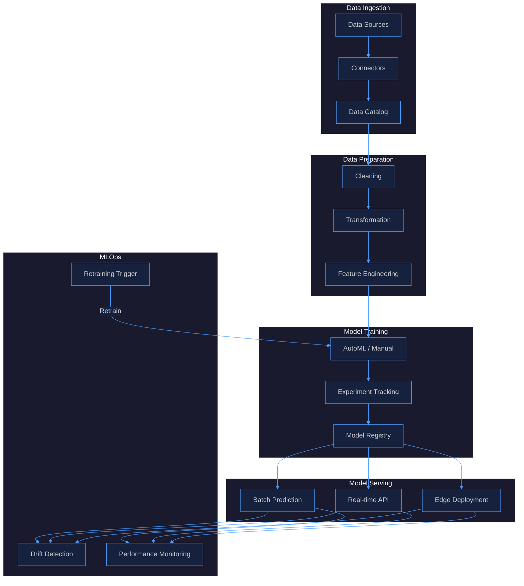
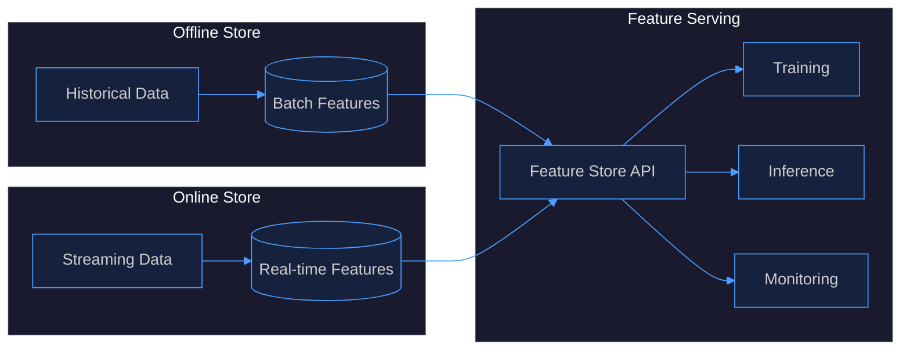
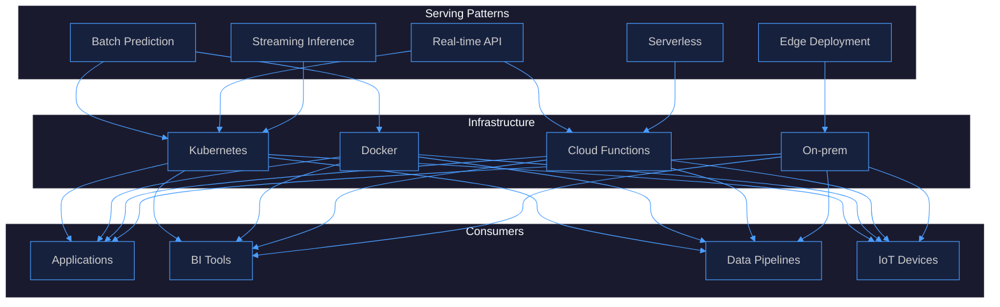
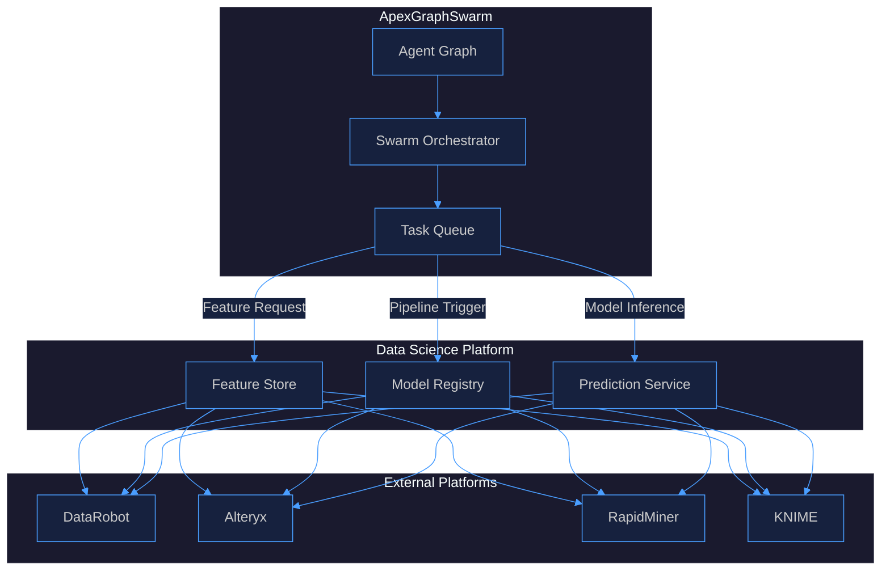

# Data Science Platforms Research

## 1. Platform Comparison

| Platform | Vendor | License | Key Strength | AutoML | MLOps | GenAI |
|----------|--------|---------|-------------|--------|-------|-------|
| **DataRobot** | DataRobot Inc. | Proprietary SaaS/On-prem | Enterprise AutoML, time-series, multimodal | ★★★★★ | ★★★★☆ | ★★★★☆ |
| **Alteryx** | Alteryx Inc. | Proprietary SaaS/On-prem | Drag-and-drop data prep, workflow automation | ★★★☆☆ | ★★★☆☆ | ★★★☆☆ |
| **RapidMiner** | Altair (Siemens) | Proprietary SaaS/On-prem | Visual pipeline builder, data fabric, knowledge graphs | ★★★★☆ | ★★★★☆ | ★★★★☆ |
| **KNIME** | KNIME AG | Open-source (Apache 2.0) | Free, extensible, 300+ connectors, community | ★★★☆☆ | ★★★☆☆ | ★★★☆☆ |
| **Sage** | Sage Group | Proprietary SaaS | SMB accounting/finance AI, agentic AI roadmap | ★★☆☆☆ | ★★☆☆☆ | ★★★★★ |

### Detailed Notes

- **DataRobot**: Leader in enterprise AutoML. Strong MLOps with dedicated/portable prediction servers, model monitoring, drift detection, SHAP explainability. NVIDIA AI Enterprise integration (2025). Custom model proxies for external models. Covalent for compute orchestration.
- **Alteryx**: Alteryx One platform (Summer 2026 release). Governed analytics, AI-ready data from any source. AiDIN AI engine for GenAI/ML. Strong in business analyst self-service. Copilot and GenAI tools embedded (Dec 2025).
- **RapidMiner**: Gartner MQ Leader 2025. AI Hub Server + Job Agents + Real-Time Scoring Agent. SAS language engine for legacy modernization. Knowledge graphs via proprietary graph database. AI fabric concept (data fabric + AI factory).
- **KNIME**: Free open-source Analytics Platform. 300+ data connectors. K-AI assistant (Dec 2024) for natural language workflow generation. Business Hub for enterprise governance. $30M Series B (Aug 2024) for ModelOps. Columnar table backend, Spark integration.
- **Sage**: SMB-focused. Sage Copilot (GenAI assistant) for 40,000+ customers. Three waves: task-based AI → generative AI → agentic AI. Sage AI Factory for model training/deployment. Domain-specific models for accounting/payroll/compliance.

---

## 2. ML Pipeline Architecture

---

## 3. Feature Store Patterns

### Key Patterns

| Pattern | Description | Use Case |
|---------|-------------|----------|
| **Batch Feature Store** | Pre-computed features stored in data warehouse | Training, batch scoring |
| **Online Feature Store** | Low-latency key-value store for real-time features | Real-time inference |
| **Hybrid Store** | Unified offline/online with point-in-time correctness | Training-serving consistency |
| **Feature Pipeline** | Reusable transformation logic as code | Feature engineering automation |

---

## 4. Model Serving Patterns

### Serving Pattern Comparison

| Pattern | Latency | Scalability | Complexity | Best For |
|---------|---------|-------------|------------|----------|
| **Batch** | Hours | High | Low | Large datasets, reports |
| **Real-time API** | ms–s | High | Medium | Interactive apps |
| **Streaming** | ms | Very High | High | Event-driven systems |
| **Edge** | ms | Medium | High | IoT, offline scenarios |
| **Serverless** | ms–s | Auto | Low | Variable workloads |

---

## 5. Integration with ApexGraphSwarm

### Integration Points

| Integration | Mechanism | Purpose |
|-------------|-----------|---------|
| **Feature Store** | REST API / SDK | Serve features to swarm agents |
| **Model Registry** | API / Webhook | Register and version models |
| **Prediction Service** | gRPC / REST | Real-time inference for agents |
| **Pipeline Orchestration** | Airflow / Kubeflow | Schedule and monitor ML pipelines |
| **Monitoring** | Prometheus / Grafana | Track model and agent performance |

### ApexGraphSwarm + Data Science Workflow

1. **Agent requests features** → Feature Store serves pre-computed or real-time features
2. **Agent triggers model** → Model Registry routes to appropriate serving endpoint
3. **Prediction returned** → Agent uses result for decision-making
4. **Feedback loop** → Agent outcomes logged for model retraining
5. **Swarm coordination** → Multiple agents share features and models via centralized store

---

## Summary

| Aspect | Recommendation |
|--------|---------------|
| **Enterprise AutoML** | DataRobot |
| **Data Prep & Workflows** | Alteryx |
| **Visual Pipelines & Graphs** | RapidMiner |
| **Open-source / Budget** | KNIME |
| **SMB Finance AI** | Sage |
| **Feature Store** | Hybrid (offline + online) |
| **Model Serving** | Real-time API + Batch |
| **Swarm Integration** | REST/gRPC with centralized Feature Store |
