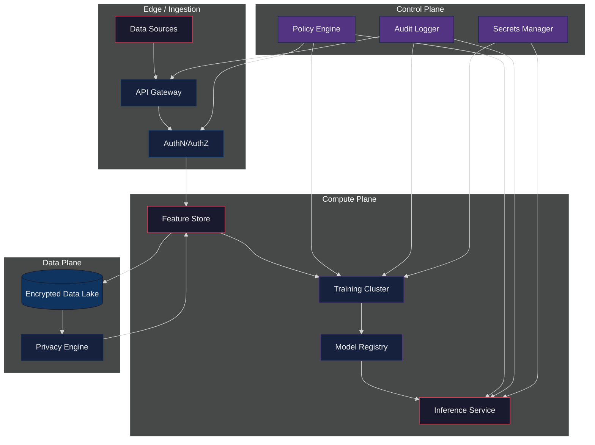
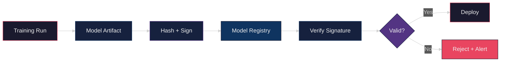
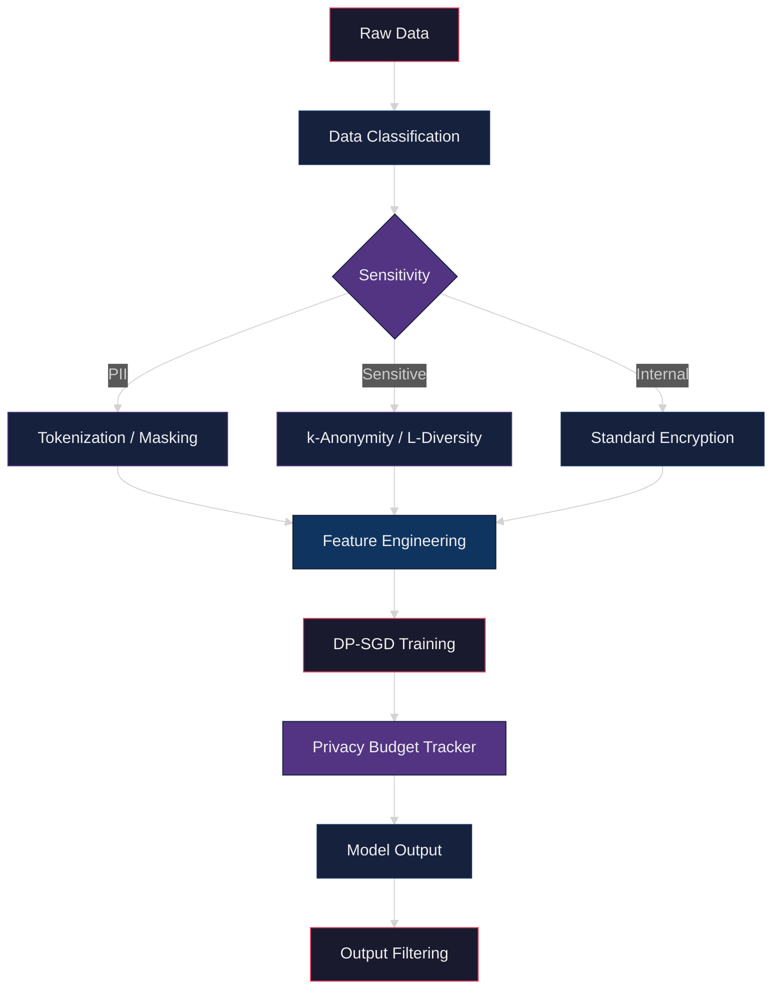
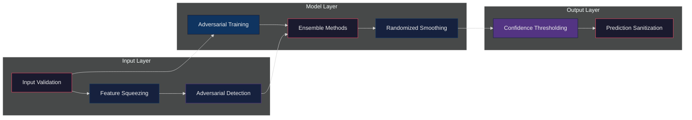
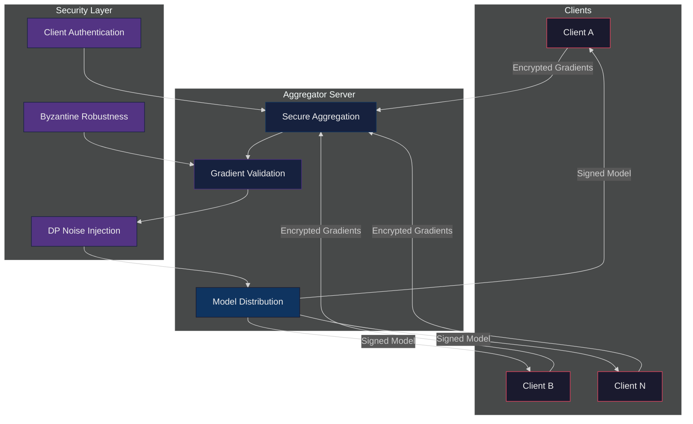

# Data Science Security

Security architecture, patterns, and practices for ML systems in APEX-OS.

## 1. Security Architecture

**Layers:** Edge (TLS/mTLS, rate limiting) → Compute (sandboxed training, signed models) → Data (encryption at rest/in transit, tokenization) → Control (policy-as-code, audit trails, secret rotation).

## 2. Model Security Patterns

### 2.1 Model Signing & Provenance

### 2.2 Key Patterns

| Pattern | Purpose | Implementation |
|---|---|---|
| Model signing | Integrity & provenance | Sigstore/cosign, SHA-256 digest |
| Adversarial training | Robustness | PGD, FGSM during training |
| Input sanitization | Injection defense | Schema validation, anomaly detection |
| Rate limiting | Model extraction defense | Per-user quotas, query budgets |
| Watermarking | IP protection | Trigger-set based watermark |
| Canary deployment | Safe rollout | Shadow mode, A/B testing |
| Model versioning | Rollback capability | Immutable registry, blue/green |

### 2.3 Threat Model

- **Model extraction** — query-based stealing of model behavior
- **Model inversion** — reconstructing training data from model outputs
- **Membership inference** — determining if a sample was in training data
- **Data poisoning** — corrupting training data to degrade model
- **Backdoor attacks** — hidden triggers causing misclassification

## 3. Data Privacy Techniques

### 3.1 Privacy-Preserving ML Pipeline

### 3.2 Techniques Reference

| Technique | Use Case | Trade-off |
|---|---|---|
| Differential Privacy (DP-SGD) | Training on sensitive data | Privacy budget vs. accuracy |
| k-Anonymity | Structured data release | Information loss |
| Homomorphic Encryption | Compute on encrypted data | High computational overhead |
| Secure Multi-Party Computation | Cross-org collaboration | Communication complexity |
| Data masking / tokenization | PII protection | Reversibility risk |
| Federated analytics | Aggregate stats without raw data sharing | Limited query expressiveness |
| Synthetic data generation | Testing, sharing | Fidelity vs. privacy |

### 3.3 Privacy Budget Management

- Track epsilon (ε) consumption per training run
- Enforce per-user and per-query privacy budgets
- Auto-exhaust: stop training when budget depleted
- Log all budget consumption to audit trail

## 4. Adversarial Attack Mitigation

### 4.1 Defense-in-Depth

### 4.2 Attack-Specific Defenses

| Attack | Defense | Notes |
|---|---|---|
| FGSM / PGD | Adversarial training | Generate attacks during training |
| Carlini-Wagner | Randomized smoothing | Certified robustness bounds |
| Data poisoning | Data validation, anomaly detection | Statistical tests on training data |
| Backdoor / Trojan | Neural Cleanse, activation clustering | Trigger detection |
| Model inversion | DP-SGD, output perturbation | Limit information leakage |
| Membership inference | Regularization, prediction confidence masking | Reduce overfitting signals |
| Evasion (inference-time) | Input transformation, ensemble diversity | Feature squeezing, JPEG compression |

### 4.3 Detection & Response

1. **Monitor** — track prediction distribution drift, confidence anomalies
2. **Detect** — flag inputs with high adversarial perturbation scores
3. **Respond** — quarantine suspicious inputs, alert security team
4. **Retrain** — incorporate detected attacks into adversarial training set

## 5. Federated Learning Security

### 5.1 FL Architecture

### 5.2 FL Threats & Mitigations

| Threat | Description | Mitigation |
|---|---|---|
| Gradient leakage | Reconstructing data from gradients | DP noise, gradient compression |
| Byzantine clients | Malicious clients sending bad gradients | Krum, median-based aggregation |
| Model poisoning | Persistent backdoor injection | Anomaly detection, client reputation |
| Inference attacks | Extracting info from global model | DP-SGD, secure aggregation |
| Sybil attacks | Single adversary controls many clients | Client authentication, rate limiting |
| Free-riding | Clients not contributing honestly | Contribution tracking, incentive design |

### 5.3 Secure Aggregation Protocol

1. **Key exchange** — pairwise keys between clients and server
2. **Masked submission** — clients mask gradients with pairwise masks
3. **Aggregation** — server sums masked gradients (masks cancel out)
4. **Unmasking** — server recovers true aggregate
5. **DP noise** — calibrated noise added to final aggregate

### 5.4 Best Practices

- Use secure aggregation (SecAgg) protocol for gradient privacy
- Apply client-level DP (not just record-level)
- Implement Byzantine-robust aggregation (Krum, trimmed mean)
- Authenticate clients via mTLS + attestation
- Monitor client contribution quality and reputation
- Limit rounds per client to reduce attack surface
- Use differential privacy budget tracking per client

---

## Quick Reference: Security Checklist

- [ ] All models signed and verified before deployment
- [ ] Training data classified and protected per sensitivity
- [ ] Differential privacy budget tracked and enforced
- [ ] Adversarial training enabled for production models
- [ ] Input validation and anomaly detection in place
- [ ] Federated learning uses secure aggregation
- [ ] Byzantine-robust aggregation for FL
- [ ] Audit logging for all data access and model operations
- [ ] Secrets rotated via Secrets Manager
- [ ] Incident response playbook covers ML-specific scenarios
