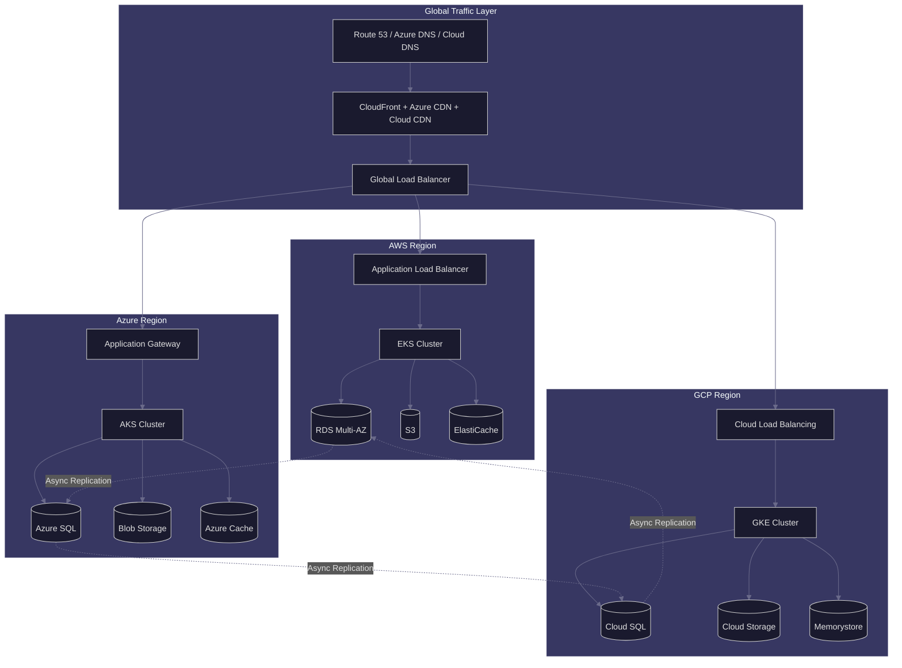
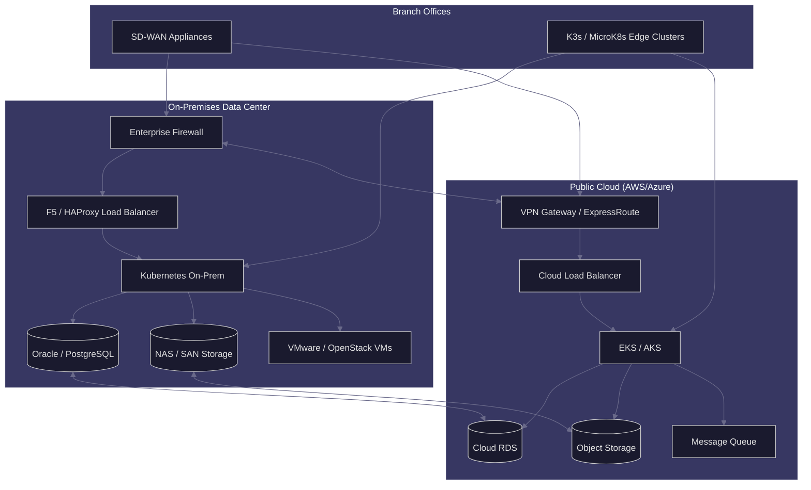
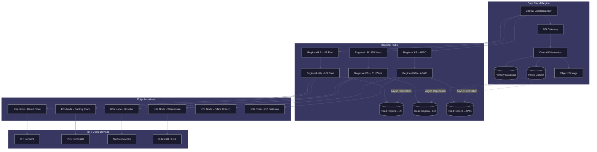
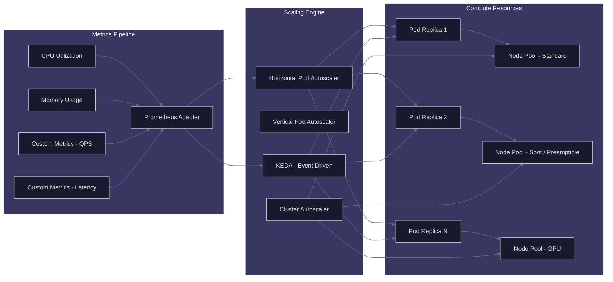
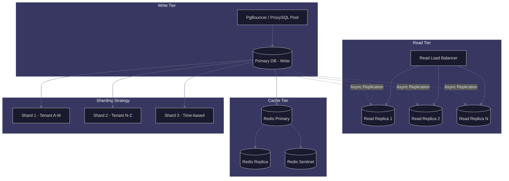
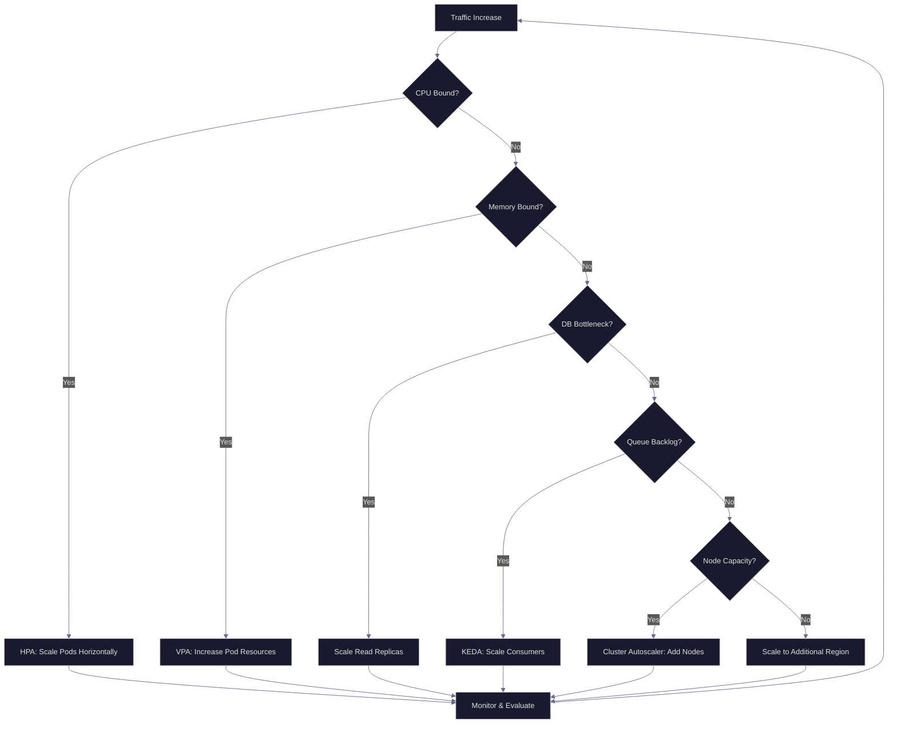

# APEX-OS Deployment Architecture

## 1. Multi-Cloud Deployment

Distributes workloads across AWS, Azure, and GCP for vendor independence and regional optimization.

## 2. Hybrid Cloud Deployment

Combines on-premises infrastructure with public cloud for data sovereignty and burst capacity.

## 3. Edge Deployment

Deploys lightweight compute to edge locations for low-latency processing and offline resilience.

## 4. Disaster Recovery Topology

Multi-tier DR strategy with hot, warm, and cold standby configurations.

```mermaid
%%{init: {'theme':'dark', 'themeVariables': {'primaryColor':'#1a1a2e','primaryTextColor':'#e0e0e0','primaryBorderColor':'#4a4a6a','lineColor':'#6a6a8a','secondaryColor':'#16213e','tertiaryColor':'#0f3460','background':'#0d0d1a','mainBkg':'#1a1a2e','secondBkg':'#16213e','tertiaryBkg':'#0f3460','textColor':'#e0e0e0','fontSize':'14px'}}}%%
graph TB
    subgraph Primary["Primary Region (Active)"]
        P-LB[Load Balancer]
        P-K8s[Kubernetes Cluster]
        P-DB[(Primary DB)]
        P-Cache[(Redis)]
        P-S3[(Object Storage)]
        P-MQ[Message Queue]
    end

    subgraph HotStandby["Hot Standby Region (Active-Active)"]
        H-LB[Load Balancer]
        H-K8s[Kubernetes Cluster]
        H-DB[(Standby DB - Sync)]
        H-Cache[(Redis Replica)]
        H-S3[(Object Storage Replica)]
        H-MQ[Message Queue Mirror]
    end

    subgraph WarmStandby["Warm Standby Region (Passive)"]
        W-LB[Load Balancer - Scaled to 0]
        W-K8s[Kubernetes - Scaled to 0]
        W-DB[(Standby DB - Async)]
        W-S3[(Object Storage - Async)]
    end

    subgraph ColdDR["Cold DR Region (Offline)"]
        C-Terraform[Terraform State]
        C-AMI[Golden AMIs / Images]
        C-Backups[Encrypted Backups]
        C-IaC[Infrastructure as Code]
    end

    subgraph Backup["Backup & Monitoring"]
        Veeam[Veeam / Velero]
        Prometheus[Prometheus + Grafana]
        PagerDuty[PagerDuty / Opsgenie]
    end

    P-LB <--> H-LB
    P-K8s <--> H-K8s
    P-DB <--> H-DB
    P-Cache <--> H-Cache
    P-S3 <--> H-S3
    P-MQ <--> H-MQ

    P-DB -.Async Replication.-> W-DB
    P-S3 -.Async Replication.-> W-S3

    P-DB -.Scheduled Backups.-> C-Backups
    P-S3 -.Scheduled Backups.-> C-Backups

    Veeam --> P-DB
    Veeam --> P-S3
    Veeam --> C-Backups

    Prometheus --> P-K8s
    Prometheus --> H-K8s
    Prometheus --> PagerDuty

    C-IaC --> C-Terraform
    C-AMI --> W-K8s
```

## 5. Scaling Strategies

### 5.1 Horizontal Pod Autoscaling (HPA)

### 5.2 Database Scaling

### 5.3 Auto-Scaling Policies

| Policy | Trigger | Action | Cooldown |
|--------|---------|--------|----------|
| CPU Scale-Out | CPU > 70% for 2 min | +2 replicas | 60s |
| CPU Scale-In | CPU < 30% for 10 min | -1 replica | 300s |
| Memory Scale-Out | Memory > 80% for 2 min | +2 replicas | 60s |
| QPS Scale-Out | QPS > 1000 per pod | +3 replicas | 30s |
| Latency Scale-Out | P99 > 500ms | +2 replicas | 60s |
| Node Scale-Out | Pending pods > 0 for 1 min | +1 node | 120s |
| Node Scale-In | Node utilization < 40% for 15 min | -1 node | 600s |
| KEDA Queue Depth | Messages > 1000 | +1 consumer per 500 msg | 30s |
| Schedule-Based | Business hours (9-18) | Min 5 replicas | N/A |
| Schedule-Based | Off-hours | Min 2 replicas | N/A |

### 5.4 Scaling Architecture Decision Tree

