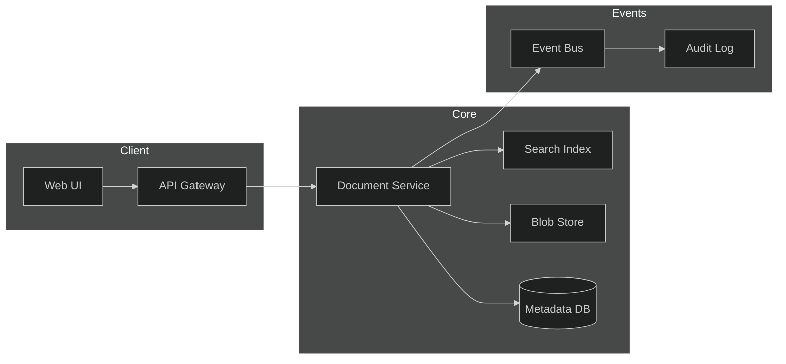
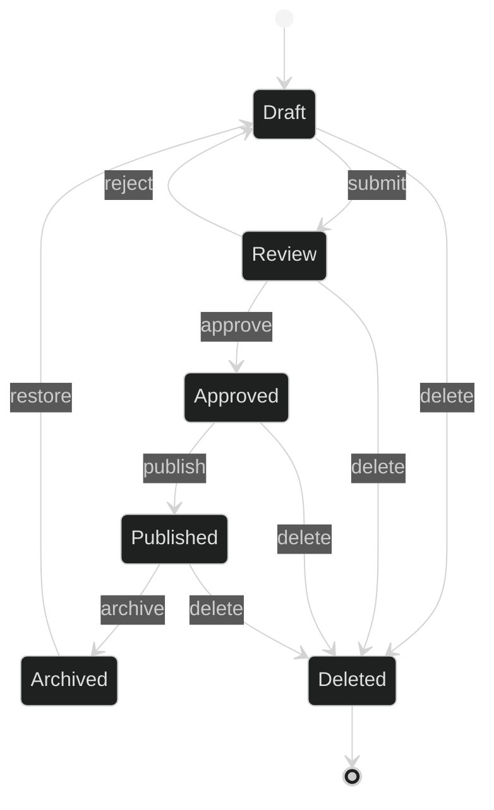
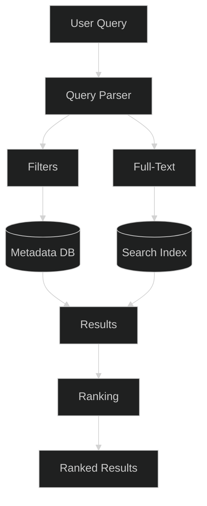
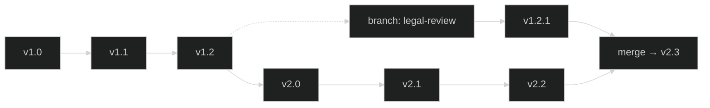

# Document Management

## 1. Architecture

- **Document Service** — CRUD, versioning, permissions, workflow transitions.
- **Blob Store** — immutable file content (S3-compatible).
- **Metadata DB** — document records, tags, ACLs, version pointers.
- **Search Index** — Elasticsearch/OpenSearch for full-text queries.
- **Event Bus** — publishes `document.created`, `document.updated`, `document.deleted` for audit and integrations.

## 2. Document Types

| Type | Extension | MIME | Storage |
|------|-----------|------|---------|
| Contract | `.pdf`, `.docx` | `application/pdf`, `application/vnd.openxmlformats-officedocument.wordprocessingml.document` | Blob + preview |
| Invoice | `.pdf`, `.xml` | `application/pdf`, `application/xml` | Blob + structured extract |
| Report | `.md`, `.pdf` | `text/markdown`, `application/pdf` | Blob + rendered HTML |
| Policy | `.md` | `text/markdown` | Blob + rendered HTML |
| Spreadsheet | `.xlsx`, `.csv` | `application/vnd.openxmlformats-officedocument.spreadsheetml.sheet`, `text/csv` | Blob + tabular index |
| Image | `.png`, `.jpg`, `.svg` | `image/png`, `image/jpeg`, `image/svg+xml` | Blob + thumbnail |

Each type defines: allowed MIME types, max size, preview generator, and extraction pipeline.

## 3. Document Workflow

- **Draft** — editable, visible to owner and collaborators.
- **Review** — locked for editing; reviewers can approve or reject.
- **Approved** — locked; ready for publication.
- **Published** — read-only; visible to all authorized users.
- **Archived** — read-only; hidden from default search.
- **Deleted** — soft-deleted; recoverable within retention period.

Transitions emit events on the bus. Permissions are enforced at each transition.

## 4. Document Search

- **Full-text** — tokenized search over extracted text content (Elasticsearch).
- **Metadata filters** — type, author, date range, tags, status, custom fields.
- **Faceted** — aggregations on type, author, status for drill-down.
- **Ranking** — relevance score + recency boost + user permission weighting.
- **Highlighting** — matched terms highlighted in snippets.

API: `GET /api/v1/documents?q=&type=&author=&status=&tags=&from=&to=&page=`

## 5. Document Versioning

- **Immutable versions** — each save creates a new version; content is never mutated.
- **Semantic versioning** — `MAJOR.MINOR` (e.g., `v2.1`); major on structural changes, minor on edits.
- **Branching** — parallel version lines for review tracks; merge creates a new version.
- **Diff** — text diff between any two versions; binary diff via metadata comparison.
- **Rollback** — restore any prior version as the new head (creates a new version, never deletes history).
- **Retention** — configurable per document type; archived versions moved to cold storage.

Version metadata: `version_id`, `parent_id`, `author`, `timestamp`, `change_summary`, `blob_ref`.
