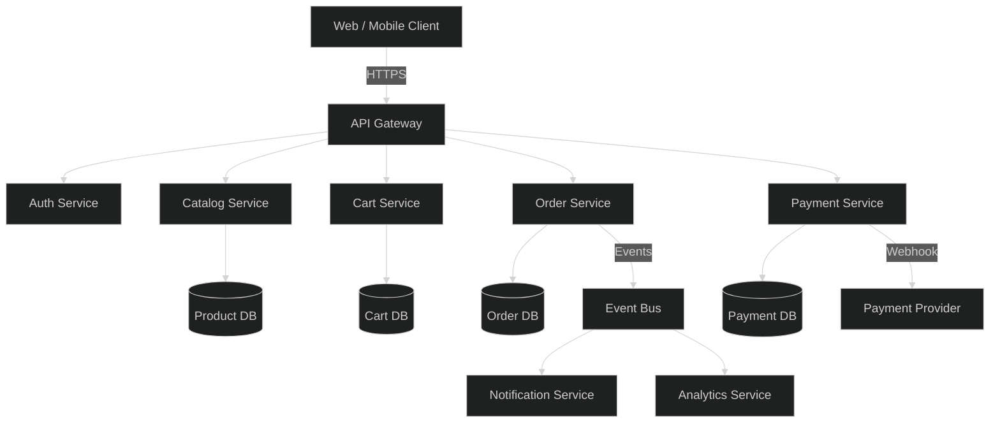
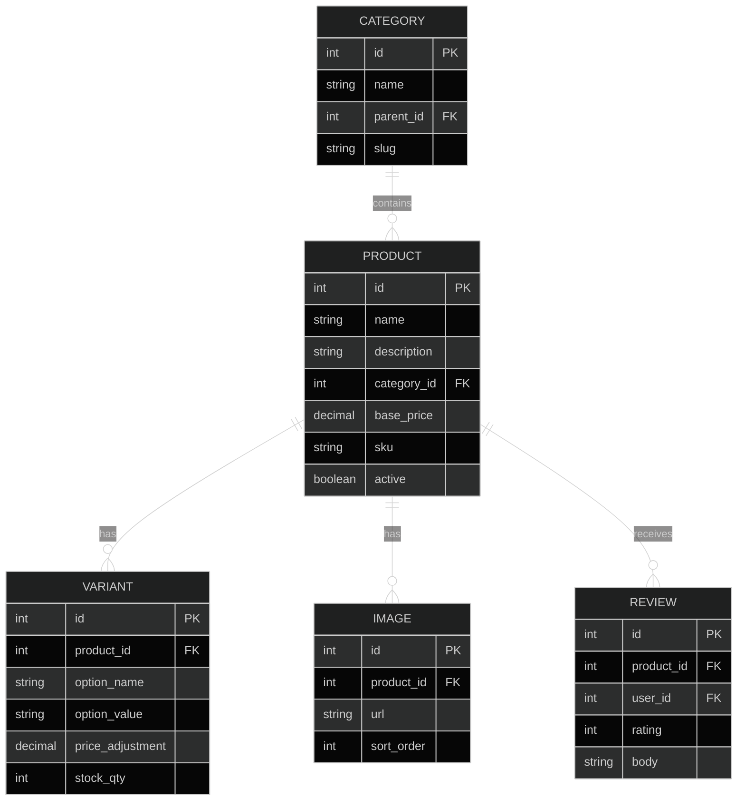
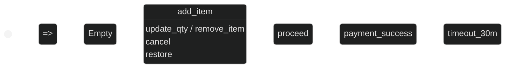
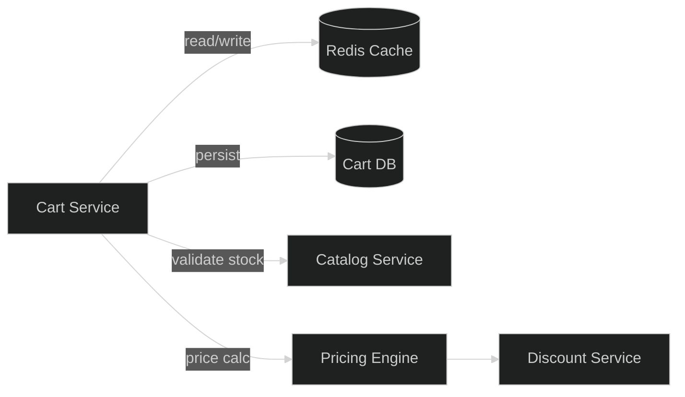
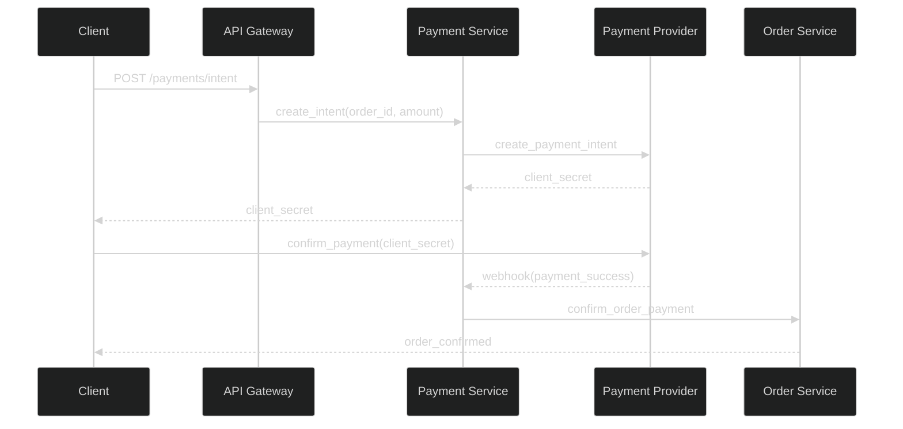
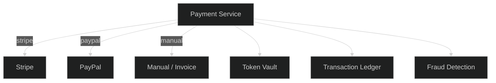
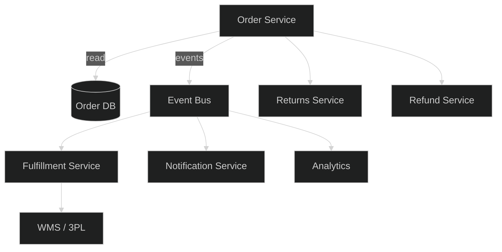

# E-Commerce Module

## 1. Architecture Overview

## 2. Product Catalog

**Key endpoints:**
- `GET /api/v1/products` — list with filters (category, price range, search)
- `GET /api/v1/products/:id` — detail with variants
- `POST /api/v1/products` — create (admin)
- `PUT /api/v1/products/:id` — update
- `DELETE /api/v1/products/:id` — soft delete

## 3. Shopping Cart

**Cart operations:**
- `POST /api/v1/cart/items` — add item (product_id, variant_id, qty)
- `PUT /api/v1/cart/items/:id` — update quantity
- `DELETE /api/v1/cart/items/:id` — remove item
- `GET /api/v1/cart` — get cart with totals
- `POST /api/v1/cart/apply-coupon` — apply discount code

## 4. Payment Processing

**Payment flow:**
1. Client creates payment intent → receives `client_secret`
2. Client confirms with provider SDK
3. Provider webhook → Payment Service updates status
4. On success → Order Service confirms order
5. On failure → cart restored, user notified

## 5. Order Management

```mermaid
%%{init: {'theme': 'dark'}}%%
stateDiagram-v2
    [*] => Pending
    Pending => Confirmed: payment_received
    Confirmed => Processing: warehouse_pick
    Processing => Shipped: label_created
    Shipped => Delivered: carrier_confirm
    Delivered => Completed: return_window_close
    Pending => Cancelled: user_cancel / payment_failed
    Confirmed => Cancelled: admin_cancel
    Shipped => Returned: return_requested
    Returned => Refunded: refund_processed
    Completed => [*]
    Cancelled => [*]
    Refunded => [*]
```

**Order endpoints:**
- `POST /api/v1/orders` — create from cart
- `GET /api/v1/orders` — list user orders
- `GET /api/v1/orders/:id` — order detail
- `POST /api/v1/orders/:id/cancel` — cancel (pre-ship)
- `POST /api/v1/orders/:id/return` — initiate return
- `GET /api/v1/orders/:id/tracking` — shipment tracking

**Order data model:**

| Field | Type | Description |
|-------|------|-------------|
| id | bigint PK | Order number |
| user_id | bigint FK | Customer |
| status | enum | Order state |
| total | decimal | Grand total |
| currency | char(3) | ISO 4217 |
| shipping_addr | jsonb | Snapshot |
| billing_addr | jsonb | Snapshot |
| created_at | timestamp | Order date |
