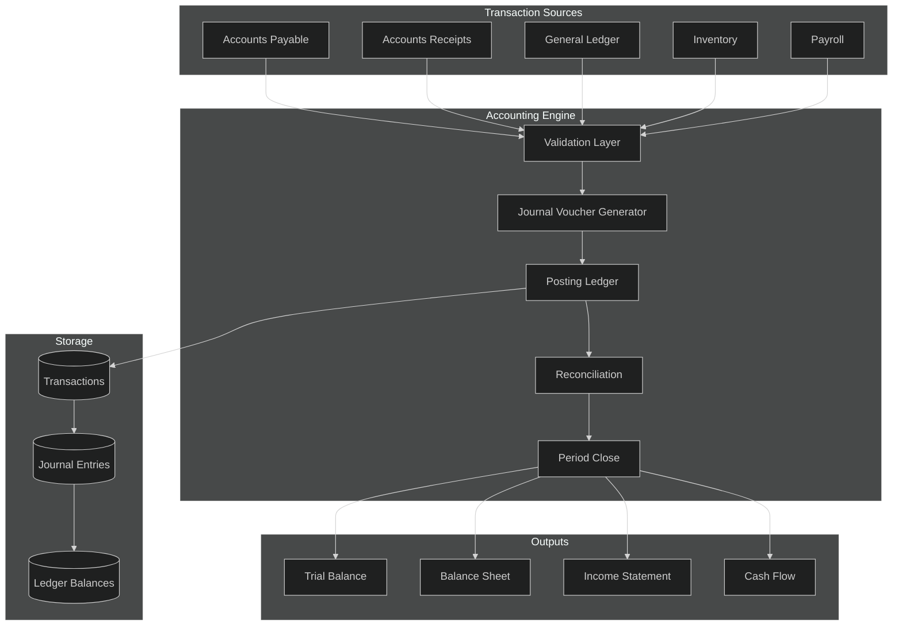
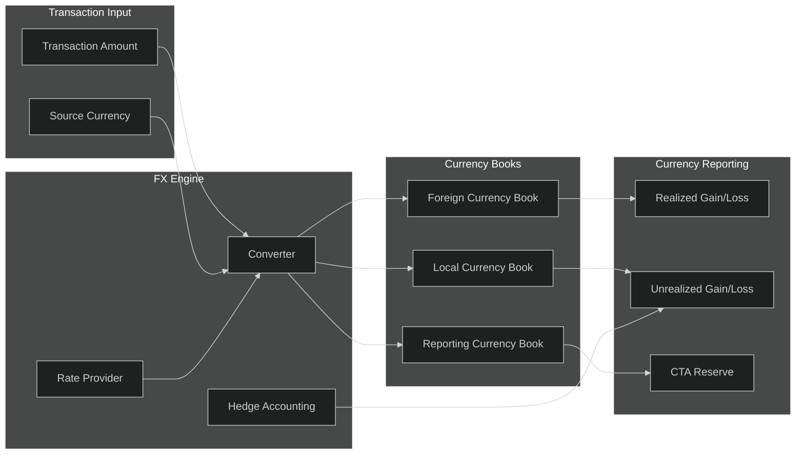
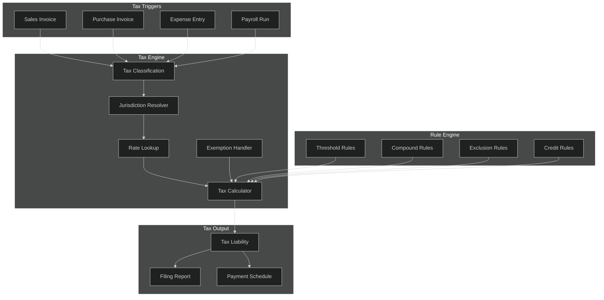
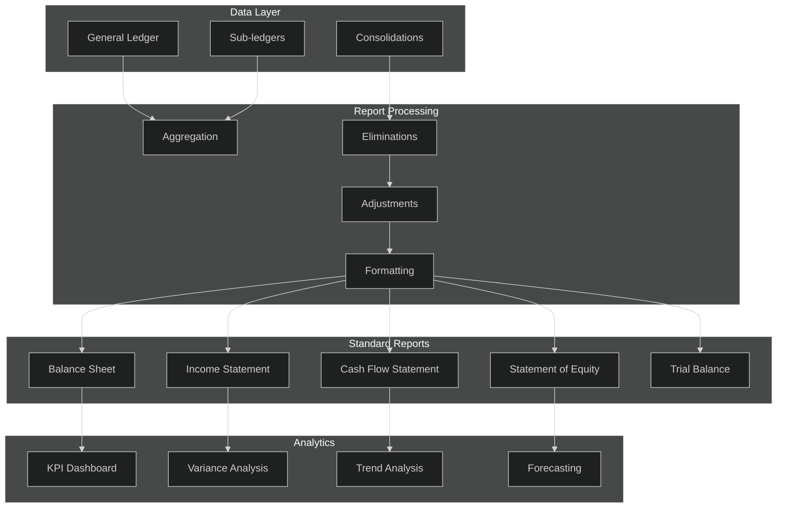
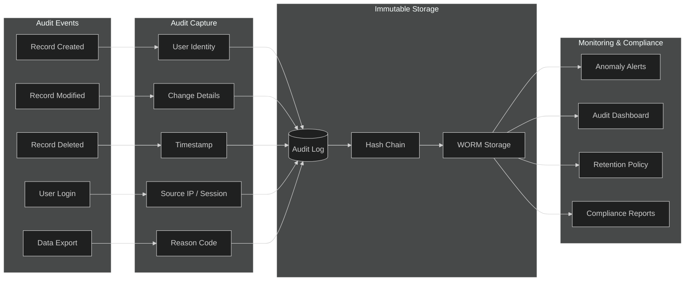

# APEX-OS Financial Architecture

## 1. Accounting Engine Architecture

```mermaid
%%{init: {'theme': 'dark'}}%%
flowchart TB
    subgraph Sources["Transaction Sources"]
        AP[Accounts Payable]
        AR[Accounts Receipts]
        GL[General Ledger]
        INV[Inventory]
        PAY[Payroll]
    end

    subgraph Engine["Accounting Engine"]
        VAL[Validation Layer]
        JV[Journal Voucher Generator]
        PL[Posting Ledger]
        REC[Reconciliation]
        CL[Period Close]
    end

    subgraph Storage["Storage"]
        TXN[(Transactions)]
        JE[(Journal Entries)]
        LB[(Ledger Balances)]
    end

    subgraph Output["Outputs"]
        TB[Trial Balance]
        BS[Balance Sheet]
        IS[Income Statement]
        CF[Cash Flow]
    end

    AP --> VAL
    AR --> VAL
    GL --> VAL
    INV --> VAL
    PAY --> VAL

    VAL --> JV
    JV --> PL
    PL --> TXN
    TXN --> JE
    JE --> LB

    PL --> REC
    REC --> CL
    CL --> TB
    CL --> BS
    CL --> IS
    CL --> CF
```

## 2. Multi-Currency Support

```mermaid
%%{init: {'theme': 'dark'}}%%
flowchart LR
    subgraph Input["Transaction Input"]
        TX[Transaction Amount]
        CCY[Source Currency]
    end

    subgraph FX["FX Engine"]
        RATE[Rate Provider]
        CONV[Converter]
        HEDGE[Hedge Accounting]
    end

    subgraph Books["Currency Books"]
        FC[Foreign Currency Book]
        LC[Local Currency Book]
        RC[Reporting Currency Book]
    end

    subgraph Reporting["Currency Reporting"]
        GAIN[Realized Gain/Loss]
        UNREAL[Unrealized Gain/Loss]
        CTA[CTA Reserve]
    end

    TX --> CONV
    CCY --> CONV
    RATE --> CONV
    CONV --> FC
    CONV --> LC
    CONV --> RC

    FC --> GAIN
    LC --> UNREAL
    RC --> CTA
    HEDGE --> UNREAL
```

## 3. Tax Calculation Engine

```mermaid
%%{init: {'theme': 'dark'}}%%
flowchart TB
    subgraph Triggers["Tax Triggers"]
        SALE[Sales Invoice]
        PUR[Purchase Invoice]
        EXP[Expense Entry]
        PAYR[Payroll Run]
    end

    subgraph Engine["Tax Engine"]
        CLASS[Tax Classification]
        JUR[Jurisdiction Resolver]
        RATE[Rate Lookup]
        CALC[Tax Calculator]
        EXEMP[Exemption Handler]
    end

    subgraph Rules["Rule Engine"]
        THRESH[Threshold Rules]
        COMP[Compound Rules]
        EXCL[Exclusion Rules]
        CRDT[Credit Rules]
    end

    subgraph Output["Tax Output"]
        LIAB[Tax Liability]
        FIL[Filing Report]
        PAY[Payment Schedule]
    end

    SALE --> CLASS
    PUR --> CLASS
    EXP --> CLASS
    PAYR --> CLASS

    CLASS --> JUR
    JUR --> RATE
    RATE --> CALC
    EXEMP --> CALC

    THRESH --> CALC
    COMP --> CALC
    EXCL --> CALC
    CRDT --> CALC

    CALC --> LIAB
    LIAB --> FIL
    LIAB --> PAY
```

## 4. Financial Reporting

```mermaid
%%{init: {'theme': 'dark'}}%%
flowchart TB
    subgraph Data["Data Layer"]
        GL[General Ledger]
        SUB[Sub-ledgers]
        CONS[Consolidations]
    end

    subgraph Processing["Report Processing"]
        AGG[Aggregation]
        ELIM[Eliminations]
        ADJ[Adjustments]
        FMT[Formatting]
    end

    subgraph Reports["Standard Reports"]
        BS[Balance Sheet]
        IS[Income Statement]
        CF[Cash Flow Statement]
        EQ[Statement of Equity]
        TB[Trial Balance]
    end

    subgraph Analytics["Analytics"]
        KPI[KPI Dashboard]
        VAR[Variance Analysis]
        TND[Trend Analysis]
        FCST[Forecasting]
    end

    GL --> AGG
    SUB --> AGG
    CONS --> ELIM
    ELIM --> ADJ
    ADJ --> FMT

    FMT --> BS
    FMT --> IS
    FMT --> CF
    FMT --> EQ
    FMT --> TB

    BS --> KPI
    IS --> VAR
    CF --> TND
    EQ --> FCST
```

## 5. Audit Trail

```mermaid
%%{init: {'theme': 'dark'}}%%
flowchart LR
    subgraph Events["Audit Events"]
        CREATE[Record Created]
        MODIFY[Record Modified]
        DELETE[Record Deleted]
        LOGIN[User Login]
        EXPORT[Data Export]
    end

    subgraph Capture["Audit Capture"]
        WHO[User Identity]
        WHAT[Change Details]
        WHEN[Timestamp]
        WHERE[Source IP / Session]
        WHY[Reason Code]
    end

    subgraph Storage["Immutable Storage"]
        LOG[(Audit Log)]
        HASH[Hash Chain]
        WORM[WORM Storage]
    end

    subgraph Monitoring["Monitoring & Compliance"]
        ALERT[Anomaly Alerts]
        DASH[Audit Dashboard]
        RET[Retention Policy]
        COMP[Compliance Reports]
    end

    CREATE --> WHO
    MODIFY --> WHAT
    DELETE --> WHEN
    LOGIN --> WHERE
    EXPORT --> WHY

    WHO --> LOG
    WHAT --> LOG
    WHEN --> LOG
    WHERE --> LOG
    WHY --> LOG

    LOG --> HASH
    HASH --> WORM

    WORM --> ALERT
    WORM --> DASH
    WORM --> RET
    WORM --> COMP
```
