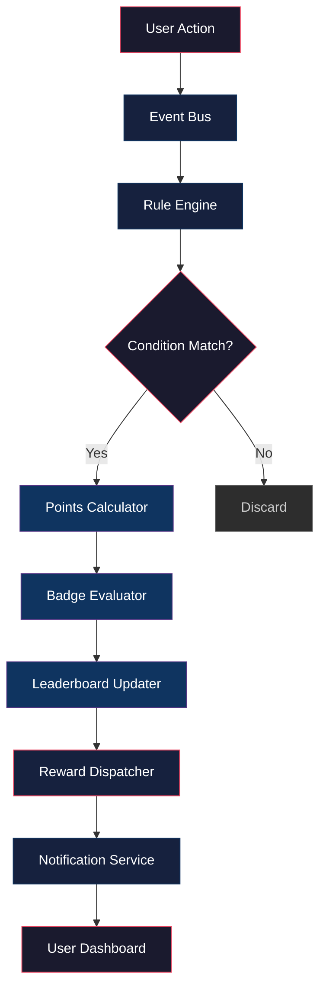
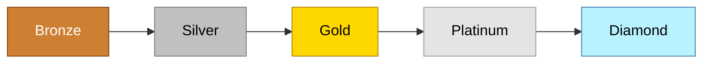
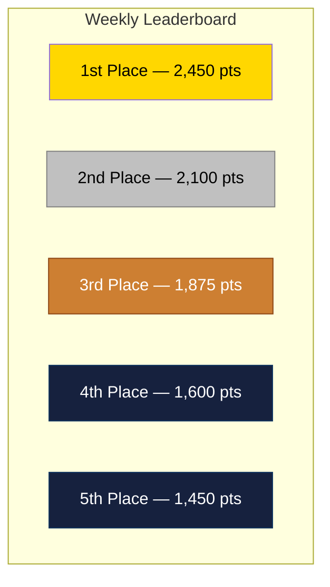
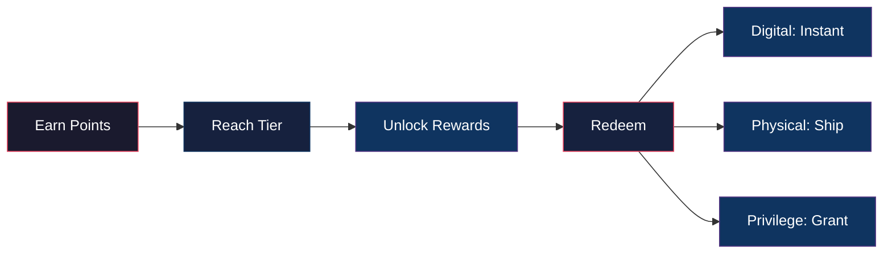

# Gamification System

## 1. Architecture



### Components

| Component | Responsibility |
|-----------|---------------|
| Event Bus | Captures all user actions (tasks, logins, contributions) |
| Rule Engine | Evaluates conditions against user activity |
| Points Calculator | Computes point awards based on action weight |
| Badge Evaluator | Checks badge criteria and awards achievements |
| Leaderboard Updater | Recalculates rankings in real-time |
| Reward Dispatcher | Grants unlocks, perks, and privileges |
| Notification Service | Alerts users of new achievements |

---

## 2. Points System

### Point Values

| Action | Points | Cooldown |
|--------|--------|----------|
| Daily login | 5 | 24h |
| Complete task | 20 | None |
| Create task | 10 | None |
| Comment on task | 5 | 1h |
| Upload file | 15 | None |
| Refer a user | 100 | Once per user |
| Streak (7 days) | 50 | Weekly |
| Streak (30 days) | 200 | Monthly |
| Mentor session | 75 | Daily |
| Bug report accepted | 40 | None |
| Feature shipped | 150 | None |

### Multipliers

- **Role multiplier**: Admin ×1.5, Member ×1.0, Guest ×0.5
- **Difficulty multiplier**: Easy ×1.0, Medium ×1.5, Hard ×2.0
- **Team bonus**: +10% when team goal is met

### Decay

- Points decay 1% per month of inactivity
- Streak resets after 48h of no activity
- Seasonal resets every quarter (top 3 seasons count to lifetime)

---

## 3. Badges

### Badge Tiers

| Tier | Color | Requirement |
|------|-------|-------------|
| Bronze | #cd7f32 | 1 badge criterion met |
| Silver | #c0c0c0 | 3 criteria met |
| Gold | #ffd700 | 5 criteria met |
| Platinum | #e5e4e2 | 10 criteria met |
| Diamond | #b9f2ff | All criteria in category |

### Badge Categories

#### Contribution
- **First Blood** — Complete your first task
- **Centurion** — Complete 100 tasks
- **Task Master** — Complete 500 tasks
- **Perfectionist** — 50 tasks with zero revisions

#### Collaboration
- **Team Player** — Join 5 team projects
- **Mentor** — Help 10 users onboard
- **Connector** — Refer 5 active users
- **Bridge Builder** — Cross-team collaboration on 20 tasks

#### Consistency
- **Early Bird** — 7-day login streak
- **Unstoppable** — 30-day login streak
- **Iron Will** — 100-day login streak
- **Legend** — 365-day login streak

#### Quality
- **Bug Hunter** — 10 accepted bug reports
- **Innovator** — 5 shipped features
- **Craftsman** — 100 tasks rated excellent
- **Visionary** — Proposed feature adopted by team

### Badge Display



---

## 4. Leaderboards

### Leaderboard Types

| Type | Scope | Reset |
|------|-------|-------|
| Global | All users | Weekly |
| Team | Within team | Weekly |
| Department | Cross-team | Monthly |
| Seasonal | All users | Quarterly |
| Lifetime | All users | Never |

### Ranking Algorithm

```
Score = (Points × Recency Factor) + (Badges × 10) + (Streak Bonus)

Recency Factor = 1.0 (today) → 0.5 (30 days ago) → 0.1 (90+ days)
Streak Bonus = min(streak_days, 30) × 2
```

### Anti-Gaming Measures

- Rate limiting: max 50 actions/hour count toward leaderboard
- Anomaly detection: flag unusual point spikes for review
- Cooldown enforcement: duplicate actions within 5min are ignored
- Audit trail: all point awards logged with timestamp and source

### Leaderboard Display



---

## 5. Rewards

### Reward Tiers

| Points Balance | Tier | Unlocks |
|---------------|------|---------|
| 0–499 | Newcomer | Basic profile customization |
| 500–1,999 | Contributor | Custom avatar, priority support |
| 2,000–4,999 | Achiever | Exclusive badges, early feature access |
| 5,000–9,999 | Champion | Team lead nomination, swag box |
| 10,000–24,999 | Elite | Conference ticket, merch store |
| 25,000+ | Legend | Lifetime perks, advisory board seat |

### Reward Types

#### Digital Rewards
- Profile themes and custom colors
- Exclusive badge frames
- Animated avatars
- Custom emoji reactions
- Priority feature voting

#### Physical Rewards
- Branded merchandise (t-shirts, mugs, stickers)
- Swag boxes (quarterly for top 100)
- Conference tickets (annual for top 10)
- Hardware gifts (mechanical keyboards, headsets)

#### Privilege Rewards
- Skip-the-line support
- Direct line to product team
- Beta feature access
- Team budget allocation rights
- Flexible time-off hours

#### Social Rewards
- Public recognition on company-wide channel
- "Wall of Fame" profile highlight
- Mentorship program eligibility
- Speaking opportunity at all-hands

### Redemption Flow



### Reward Expiration

- Digital rewards: never expire
- Physical rewards: must redeem within 90 days
- Privilege rewards: expire at end of quarter
- Seasonal rewards: expire at season end
