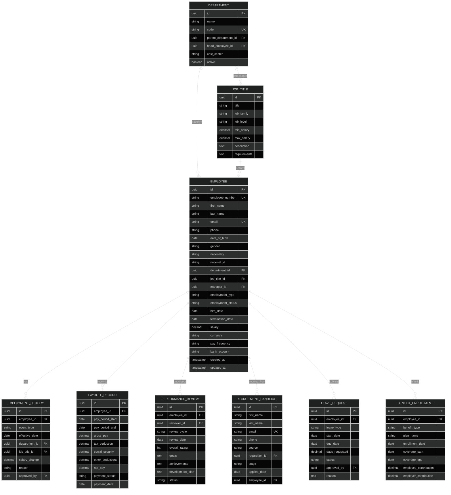
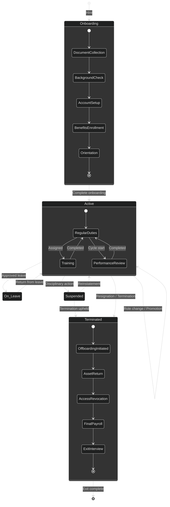
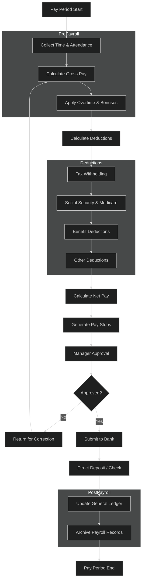

# HR Architecture

## 1. HR Data Model



## 2. Employee Lifecycle



## 3. Payroll Processing



## 4. Performance Management

```mermaid
%%{init: {'theme': 'dark'}}%%
flowchart LR
    A[Goal Setting] --> B[Mid-Year Review]
    B --> C[Continuous Feedback]
    C --> D[Year-End Review]
    D --> E[Calibration]
    E --> F[Rating Assignment]
    F --> G[Compensation Adjustment]
    G --> H[Development Plan]
    H --> I[Promotion Decision]
    I --> J[Succession Planning]
    J --> A

    subgraph GoalSetting {
        A1[SMART Goals] --> A2[Manager Alignment]
        A2 --> A3[Employee Acknowledgment]
    }

    subgraph ReviewProcess {
        D1[Self Assessment] --> D2[Peer Feedback]
        D2 --> D3[Manager Assessment]
        D3 --> D4[360° Review]
    }

    subgraph Outcomes {
        F1[Exceeds Expectations] --> F2[Merit Increase + Bonus]
        F3[Meets Expectations] --> F4[Standard Merit Increase]
        F5[Needs Improvement] --> F6[Performance Improvement Plan]
    }

    subgraph Development {
        H1[Training Needs] --> H2[Skill Gap Analysis]
        H2 --> H3[Career Pathing]
        H3 --> H4[Mentorship Assignment]
    }
```

## 5. Recruitment Pipeline

```mermaid
%%{init: {'theme': 'dark'}}%%
flowchart TD
    A[Requisition Created] --> B[Requisition Approved]
    B --> C[Job Posting]
    C --> D[Application Received]
    D --> E[Resume Screening]
    E --> F{Qualified?}
    F -->|No| G[Reject / Talent Pool]
    F -->|Yes| H[Phone Screen]
    H --> I{Pass?}
    I -->|No| G
    I -->|Yes| J[Technical Assessment]
    J --> K{Pass?}
    K -->|No| G
    K -->|Yes| L[Panel Interview]
    L --> M{Pass?}
    M -->|No| G
    M -->|Yes| N[Cultural Fit Interview]
    N --> O{Pass?}
    O -->|No| G
    O -->|Yes| P[Background Check]
    P --> Q{Clear?}
    Q -->|No| G
    Q -->|Yes| R[Offer Extended]
    R --> S{Accepted?}
    S -->|No| G
    S -->|Yes| T[Pre-Boarding]
    T --> U[Onboarding Scheduled]
    U --> V[Hired]

    subgraph Sourcing {
        C1[Job Boards] --> C2[Social Media]
        C2 --> C3[Employee Referrals]
        C3 --> C4[Recruitment Agencies]
        C4 --> C5[Career Site]
    }

    subgraph Assessment {
        J1[Coding Test] --> J2[Case Study]
        J2 --> J3[Role Play]
        J3 --> J4[Personality Test]
    }
```
