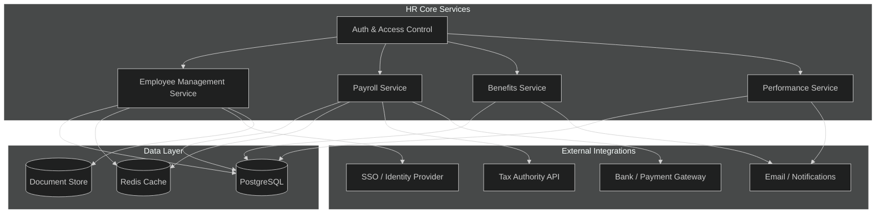
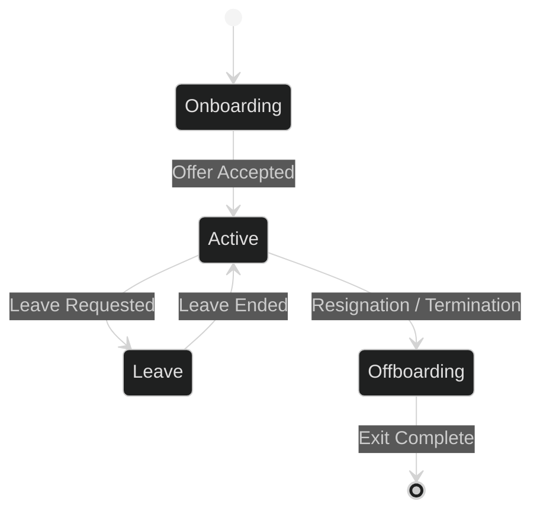
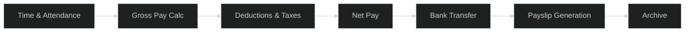
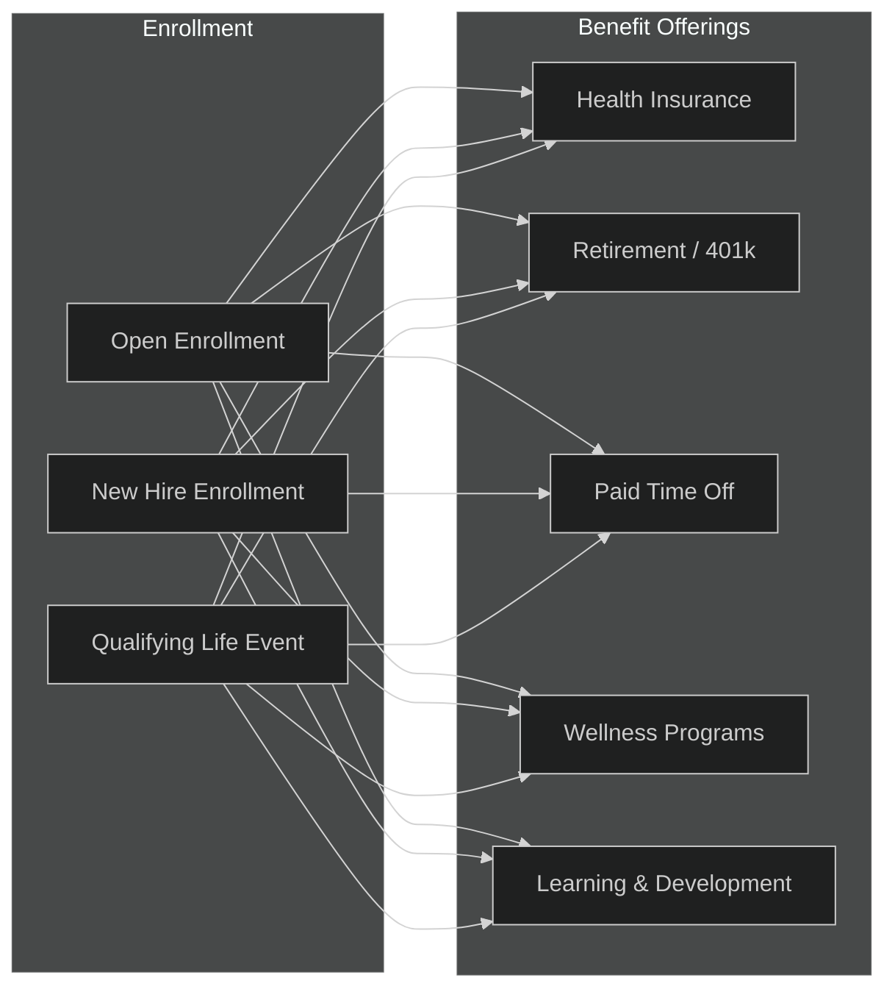
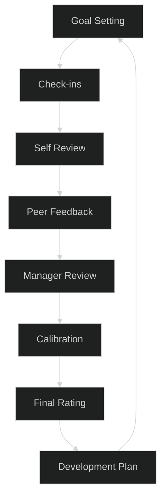

# HR Module — APEX-OS Business Platform

## 1. HR Architecture

## 2. Employee Management

### Lifecycle

### Key Features
- Employee profiles with personal, job, and contact data
- Org chart and reporting lines
- Document management (contracts, IDs, certifications)
- Leave and attendance tracking
- Role-based access control (RBAC)

## 3. Payroll

### Payroll Flow

### Components
- Salary structures and pay grades
- Automated tax calculation and filing
- Multi-currency support
- Payslip generation and distribution
- Year-end reporting (W-2, etc.)
- Reimbursement processing

## 4. Benefits

### Benefits Administration

### Features
- Self-service benefits portal
- Dependent management
- Carrier integrations (insurance providers)
- Cost tracking and budgeting
- Compliance reporting (ACA, etc.)

## 5. Performance

### Review Cycle

### Components
- OKRs and goal management
- Continuous feedback and check-ins
- 360-degree reviews
- Competency assessments
- Development plans and career paths
- Performance analytics and reporting
