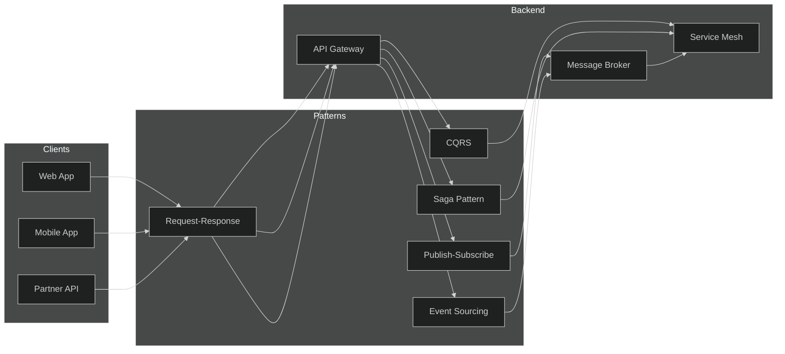
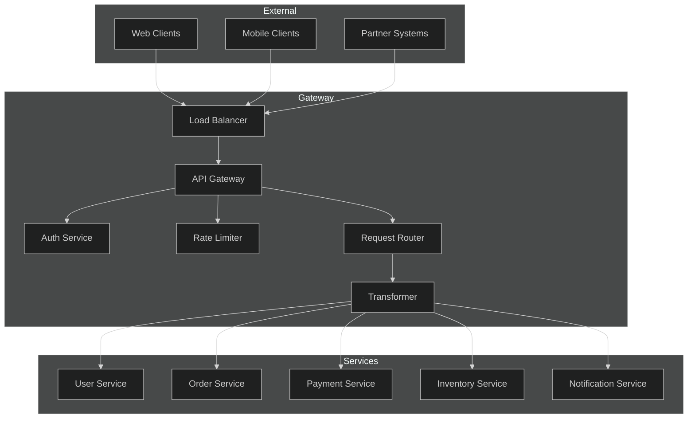
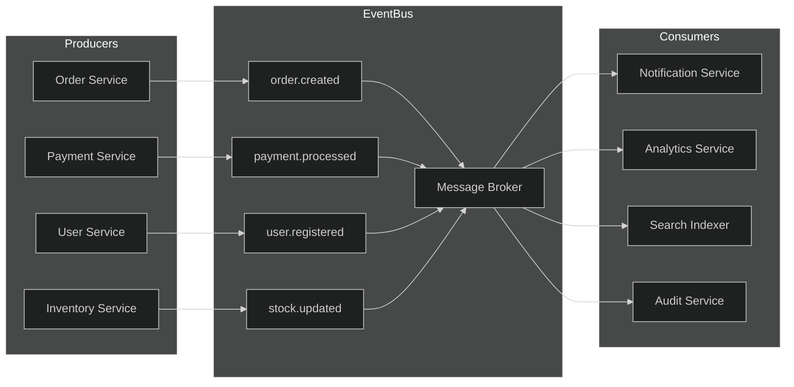
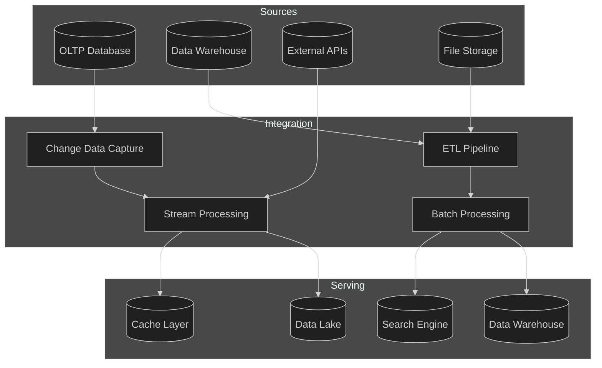
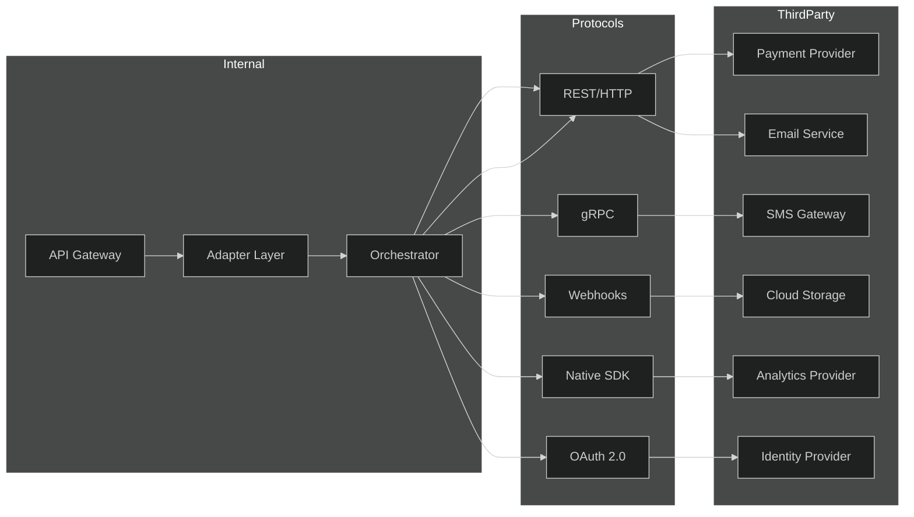

# Integration Architecture

## 1. Integration Patterns

```mermaid
%%{init: {'theme': 'dark'}}%%
flowchart LR
    subgraph Clients
        A[Web App]
        B[Mobile App]
        C[Partner API]
    end

    subgraph Patterns
        D[Request-Response]
        E[Publish-Subscribe]
        F[Event Sourcing]
        G[CQRS]
        H[Saga Pattern]
    end

    subgraph Backend
        I[API Gateway]
        J[Service Mesh]
        K[Message Broker]
    end

    A --> D --> I
    B --> D --> I
    C --> D --> I
    I --> E --> K
    I --> F --> K
    I --> G --> J
    I --> H --> J
    K --> J
```

## 2. API Gateway Architecture

```mermaid
%%{init: {'theme': 'dark'}}%%
flowchart TB
    subgraph External
        W[Web Clients]
        M[Mobile Clients]
        P[Partner Systems]
    end

    subgraph Gateway
        LB[Load Balancer]
        AG[API Gateway]
        AUTH[Auth Service]
        RATE[Rate Limiter]
        ROUTER[Request Router]
        TRANS[Transformer]
    end

    subgraph Services
        S1[User Service]
        S2[Order Service]
        S3[Payment Service]
        S4[Inventory Service]
        S5[Notification Service]
    end

    W --> LB
    M --> LB
    P --> LB
    LB --> AG
    AG --> AUTH
    AG --> RATE
    AG --> ROUTER
    ROUTER --> TRANS
    TRANS --> S1
    TRANS --> S2
    TRANS --> S3
    TRANS --> S4
    TRANS --> S5
```

## 3. Event-Driven Integration

```mermaid
%%{init: {'theme': 'dark'}}%%
flowchart LR
    subgraph Producers
        E1[Order Service]
        E2[Payment Service]
        E3[User Service]
        E4[Inventory Service]
    end

    subgraph EventBus
        EB[Message Broker]
        T1[order.created]
        T2[payment.processed]
        T3[user.registered]
        T4[stock.updated]
    end

    subgraph Consumers
        C1[Notification Service]
        C2[Analytics Service]
        C3[Search Indexer]
        C4[Audit Service]
    end

    E1 --> T1 --> EB
    E2 --> T2 --> EB
    E3 --> T3 --> EB
    E4 --> T4 --> EB
    EB --> C1
    EB --> C2
    EB --> C3
    EB --> C4
```

## 4. Data Integration

```mermaid
%%{init: {'theme': 'dark'}}%%
flowchart TB
    subgraph Sources
        D1[(OLTP Database)]
        D2[(Data Warehouse)]
        D3[(External APIs)]
        D4[(File Storage)]
    end

    subgraph Integration
        ETL[ETL Pipeline]
        CDC[Change Data Capture]
        STREAM[Stream Processing]
        BATCH[Batch Processing]
    end

    subgraph Serving
        DW[(Data Warehouse)]
        DS[(Data Lake)]
        CACHE[(Cache Layer)]
        SEARCH[(Search Engine)]
    end

    D1 --> CDC --> STREAM
    D2 --> ETL --> BATCH
    D3 --> STREAM
    D4 --> ETL
    STREAM --> DS
    BATCH --> DW
    STREAM --> CACHE
    BATCH --> SEARCH
```

## 5. Third-Party Integration

```mermaid
%%{init: {'theme': 'dark'}}%%
flowchart LR
    subgraph Internal
        GW[API Gateway]
        ADAPTER[Adapter Layer]
        ORCH[Orchestrator]
    end

    subgraph ThirdParty
        TP1[Payment Provider]
        TP2[Email Service]
        TP3[SMS Gateway]
        TP4[Cloud Storage]
        TP5[Analytics Provider]
        TP6[Identity Provider]
    end

    subgraph Protocols
        REST[REST/HTTP]
        GRPC[gRPC]
        OAUTH[OAuth 2.0]
        WEBHOOK[Webhooks]
        SDK[Native SDK]
    end

    GW --> ADAPTER
    ADAPTER --> ORCH
    ORCH --> REST --> TP1
    ORCH --> REST --> TP2
    ORCH --> GRPC --> TP3
    ORCH --> OAUTH --> TP6
    ORCH --> WEBHOOK --> TP4
    ORCH --> SDK --> TP5
```
