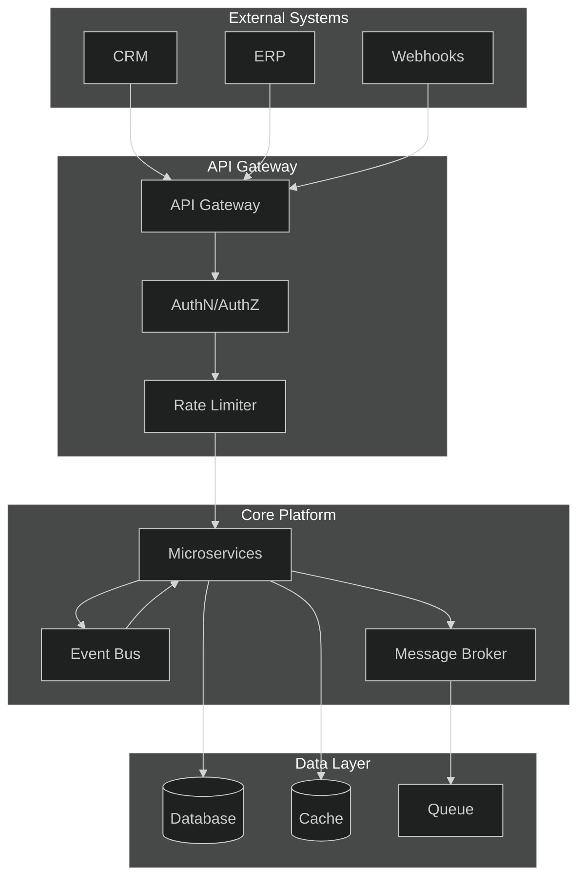
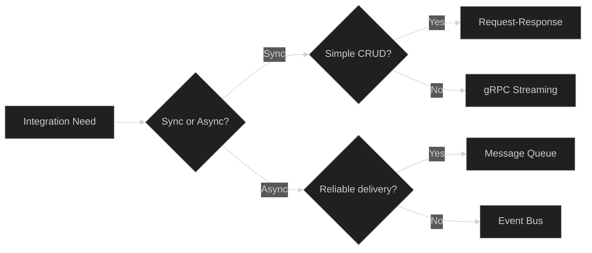
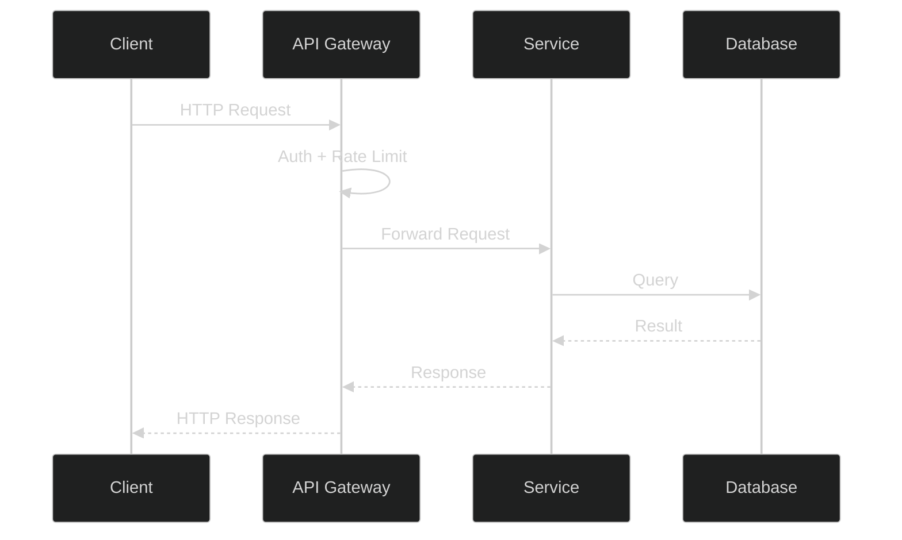
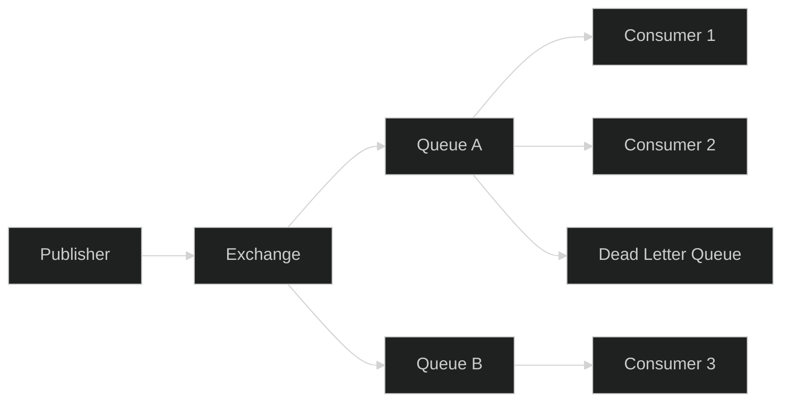
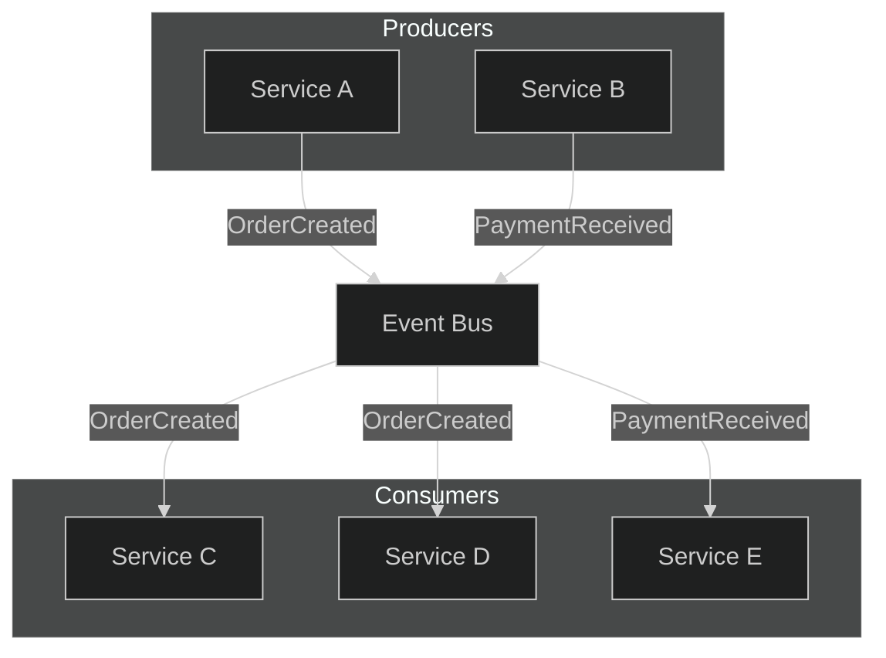

# Integration Hub

## 1. Integration Architecture



## 2. Integration Patterns

| Pattern | Use Case | Implementation |
|---------|----------|----------------|
| Request-Response | Sync CRUD | REST/gRPC via API Gateway |
| Event-Driven | Async domain events | Event Bus (pub/sub) |
| Message Queue | Reliable task processing | Message Broker (work queues) |
| Webhook | External notifications | HTTP callbacks with retry |
| Saga | Distributed transactions | Orchestration + compensation |
| CQRS | Read/write separation | Separate read models + projections |

### Pattern Selection Guide



## 3. API Gateway

- **Routing**: Path-based routing to microservices
- **Authentication**: JWT validation, API key verification
- **Rate Limiting**: Token bucket per client/tenant
- **Transformation**: Request/response mapping, versioning
- **Observability**: Request logging, metrics, distributed tracing



## 4. Message Broker

- **Protocol**: AMQP 1.0 / MQTT
- **Delivery Guarantees**: At-least-once with idempotent consumers
- **Queue Types**: Work queues, pub/sub, dead-letter
- **Scaling**: Consumer groups with partition-aware routing



## 5. Event Bus

- **Transport**: In-process mediator + outbox pattern
- **Event Types**: Domain events, integration events, system events
- **Delivery**: In-memory for same-process, broker-backed for cross-service
- **Ordering**: Per-aggregate ordering guarantees



### Event Envelope

```json
{
  "id": "uuid-v4",
  "type": "OrderCreated",
  "source": "order-service",
  "timestamp": "2026-10-02T12:00:00Z",
  "correlationId": "uuid-v4",
  "causationId": "uuid-v4",
  "payload": {}
}
```
