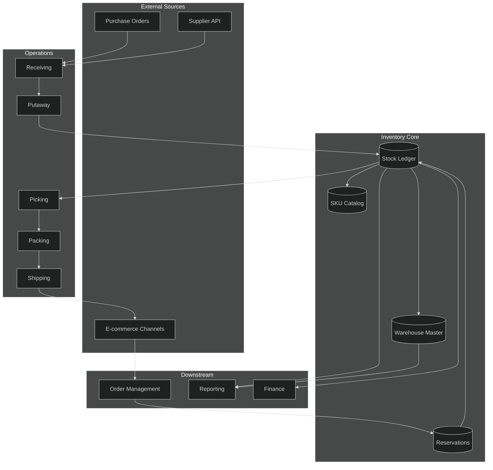
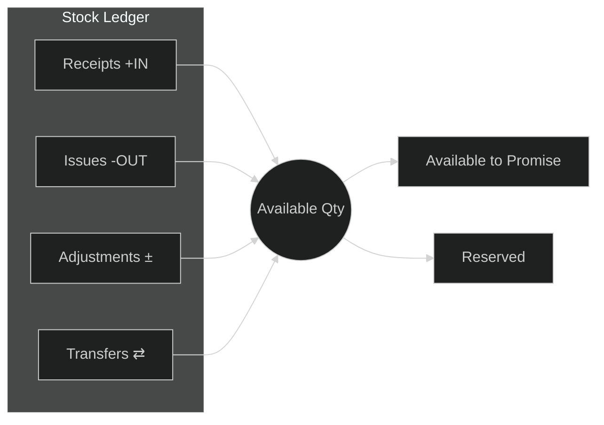
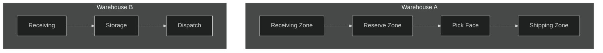
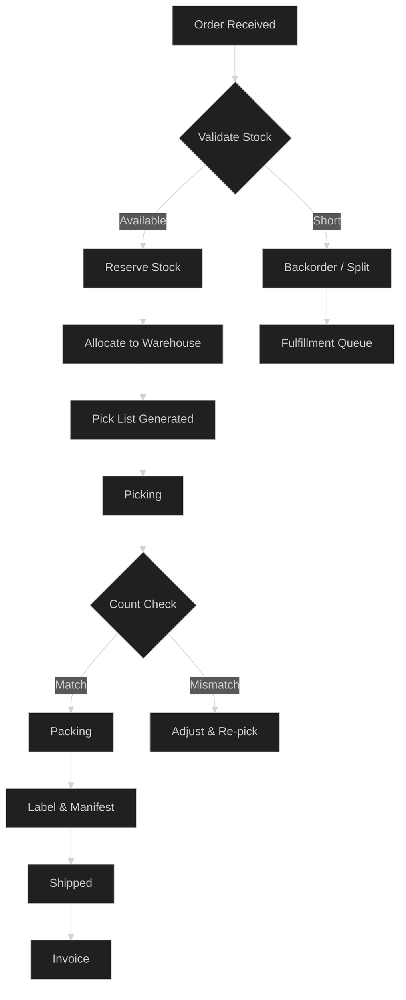
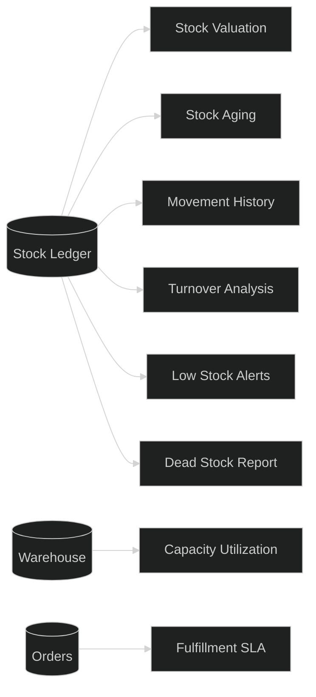

# Inventory Module

## 1. Inventory Architecture

## 2. Stock Management

Stock is tracked per SKU per warehouse location using a double-entry ledger.

**Key rules:**
- Every stock movement creates an immutable ledger entry (before/after quantities).
- Available = On-hand − Reserved − Quarantined.
- ATP (Available-to-Promise) computed in real time for order promising.
- Negative stock blocked by default; configurable per SKU.

## 3. Warehouse Management

Multi-warehouse support with zone-based putaway and pick path optimization.

**Key rules:**
- Putaway strategies: fixed slot, nearest-empty, velocity-based.
- Pick strategies: FIFO, FEFO (expiry), wave, batch.
- Inter-warehouse transfers create in-transit records until receipt confirmation.
- Cycle counts adjust stock with full audit trail.

## 4. Order Fulfillment

**Key rules:**
- Reservation is soft (TTL) until pick confirmation; hard-reserved at shipment.
- Split shipments supported when partial stock available.
- Auto-allocation by proximity, cost, or priority rules.

## 5. Reporting

**Standard reports:**
- Stock valuation (FIFO / weighted average).
- Aging buckets: 0-30, 31-60, 61-90, 90+ days.
- Turnover ratio = COGS / Average inventory.
- Fill rate = Orders shipped complete / Total orders.
