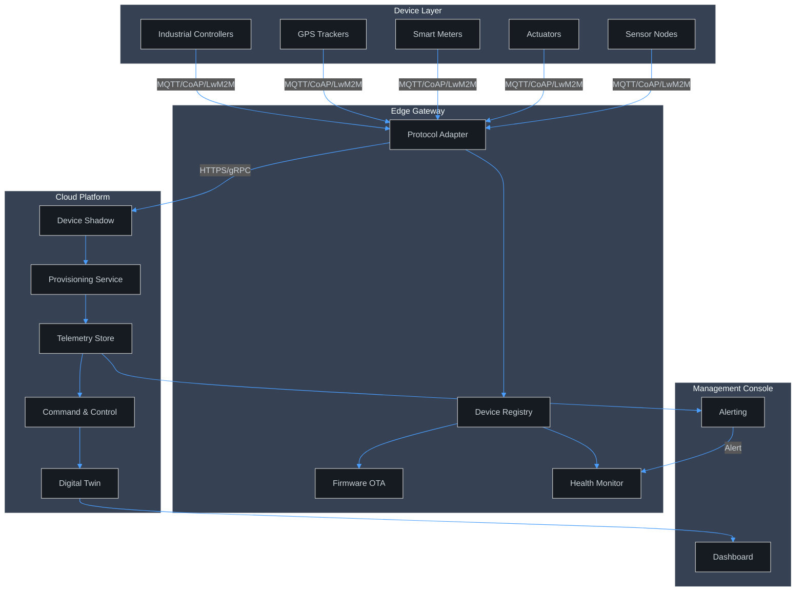
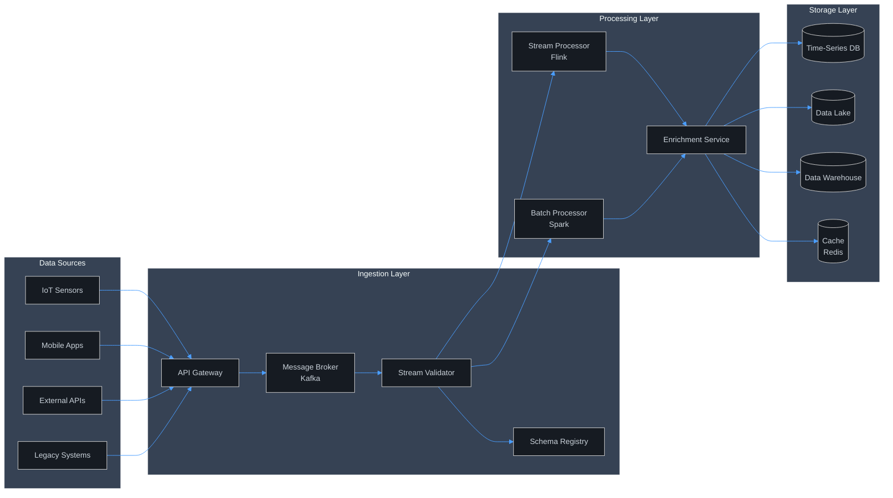
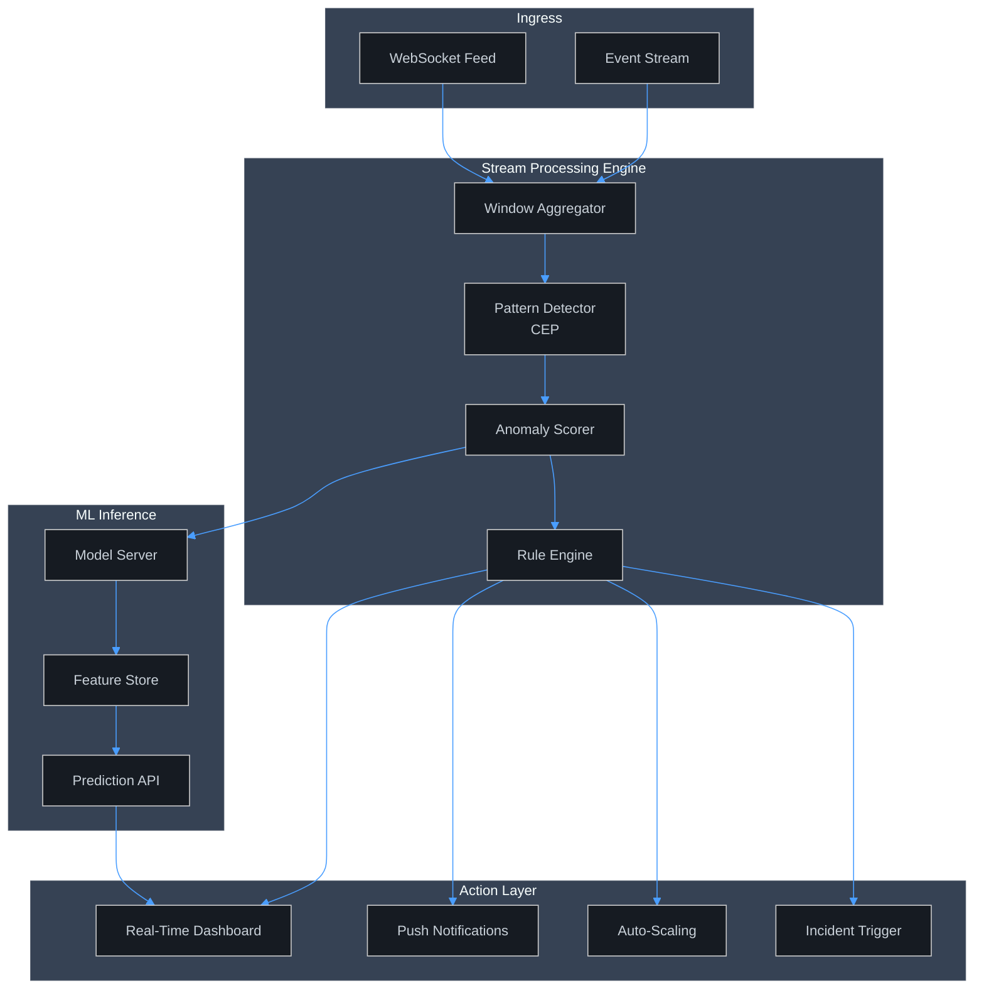
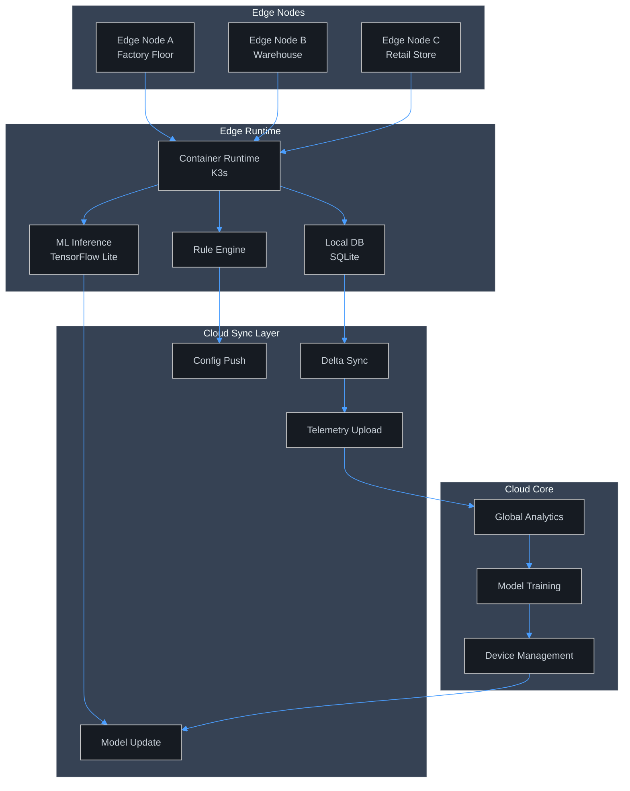
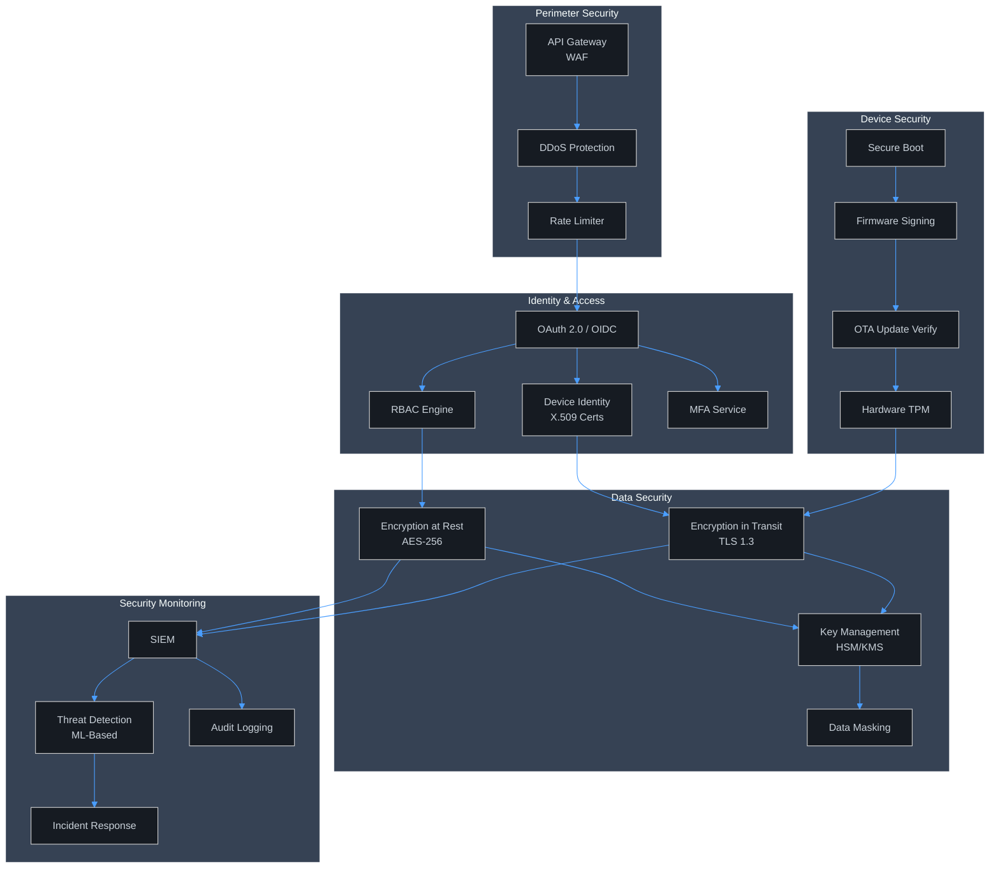

# IoT Architecture

## 1. IoT Device Management

```mermaid
%%{init: {'theme':'dark', 'themeVariables': {'primaryColor':'#1e3a5f','primaryTextColor':'#e0e0e0','primaryBorderColor':'#4a9eff','lineColor':'#4a9eff','secondaryColor':'#2d2d2d','tertiaryColor':'#1a1a2e','background':'#0d1117','mainBkg':'#161b22','secondBkg':'#21262d','textColor':'#c9d1d9','fontSize':'14px'}}}%%
flowchart TD
    subgraph Device_Layer["Device Layer"]
        S1[Sensor Nodes]
        S2[Actuators]
        S3[Smart Meters]
        S4[GPS Trackers]
        S5[Industrial Controllers]
    end

    subgraph Edge_Gateway["Edge Gateway"]
        GW1[Protocol Adapter]
        GW2[Device Registry]
        GW3[Firmware OTA]
        GW4[Health Monitor]
    end

    subgraph Cloud_Platform["Cloud Platform"]
        CP1[Device Shadow]
        CP2[Provisioning Service]
        CP3[Telemetry Store]
        CP4[Command & Control]
        CP5[Digital Twin]
    end

    subgraph Management["Management Console"]
        M1[Dashboard]
        M2[Alerting]
    end

    S1 & S2 & S3 & S4 & S5 -->|MQTT/CoAP/LwM2M| GW1
    GW1 --> GW2
    GW2 --> GW3
    GW2 --> GW4
    GW1 -->|HTTPS/gRPC| CP1
    CP1 --> CP2
    CP2 --> CP3
    CP3 --> CP4
    CP4 --> CP5
    CP5 --> M1
    CP3 --> M2
    M2 -->|Alert| GW4
```

## 2. Data Ingestion Pipeline

```mermaid
%%{init: {'theme':'dark', 'themeVariables': {'primaryColor':'#1e3a5f','primaryTextColor':'#e0e0e0','primaryBorderColor':'#4a9eff','lineColor':'#4a9eff','secondaryColor':'#2d2d2d','tertiaryColor':'#1a1a2e','background':'#0d1117','mainBkg':'#161b22','secondBkg':'#21262d','textColor':'#c9d1d9','fontSize':'14px'}}}%%
flowchart LR
    subgraph Sources["Data Sources"]
        D1[IoT Sensors]
        D2[Mobile Apps]
        D3[External APIs]
        D4[Legacy Systems]
    end

    subgraph Ingestion["Ingestion Layer"]
        I1[API Gateway]
        I2[Message Broker<br/>Kafka]
        I3[Stream Validator]
        I4[Schema Registry]
    end

    subgraph Processing["Processing Layer"]
        P1[Stream Processor<br/>Flink]
        P2[Batch Processor<br/>Spark]
        P3[Enrichment Service]
    end

    subgraph Storage["Storage Layer"]
        S1[(Time-Series DB)]
        S2[(Data Lake)]
        S3[(Data Warehouse)]
        S4[(Cache<br/>Redis)]
    end

    D1 & D2 & D3 & D4 --> I1
    I1 --> I2
    I2 --> I3
    I3 --> I4
    I3 --> P1
    I3 --> P2
    P1 --> P3
    P2 --> P3
    P3 --> S1
    P3 --> S2
    P3 --> S3
    P3 --> S4
```

## 3. Real-Time Processing

```mermaid
%%{init: {'theme':'dark', 'themeVariables': {'primaryColor':'#1e3a5f','primaryTextColor':'#e0e0e0','primaryBorderColor':'#4a9eff','lineColor':'#4a9eff','secondaryColor':'#2d2d2d','tertiaryColor':'#1a1a2e','background':'#0d1117','mainBkg':'#161b22','secondBkg':'#21262d','textColor':'#c9d1d9','fontSize':'14px'}}}%%
flowchart TD
    subgraph Ingress["Ingress"]
        IN1[Event Stream]
        IN2[WebSocket Feed]
    end

    subgraph Stream_Engine["Stream Processing Engine"]
        SE1[Window Aggregator]
        SE2[Pattern Detector<br/>CEP]
        SE3[Anomaly Scorer]
        SE4[Rule Engine]
    end

    subgraph Actions["Action Layer"]
        A1[Real-Time Dashboard]
        A2[Push Notifications]
        A3[Auto-Scaling]
        A4[Incident Trigger]
    end

    subgraph ML["ML Inference"]
        ML1[Model Server]
        ML2[Feature Store]
        ML3[Prediction API]
    end

    IN1 & IN2 --> SE1
    SE1 --> SE2
    SE2 --> SE3
    SE3 --> SE4
    SE3 --> ML1
    ML1 --> ML2
    ML2 --> ML3
    SE4 --> A1
    SE4 --> A2
    SE4 --> A3
    SE4 --> A4
    ML3 --> A1
```

## 4. Edge Computing

```mermaid
%%{init: {'theme':'dark', 'themeVariables': {'primaryColor':'#1e3a5f','primaryTextColor':'#e0e0e0','primaryBorderColor':'#4a9eff','lineColor':'#4a9eff','secondaryColor':'#2d2d2d','tertiaryColor':'#1a1a2e','background':'#0d1117','mainBkg':'#161b22','secondBkg':'#21262d','textColor':'#c9d1d9','fontSize':'14px'}}}%%
flowchart TD
    subgraph Edge_Nodes["Edge Nodes"]
        EN1[Edge Node A<br/>Factory Floor]
        EN2[Edge Node B<br/>Warehouse]
        EN3[Edge Node C<br/>Retail Store]
    end

    subgraph Edge_Runtime["Edge Runtime"]
        ER1[Container Runtime<br/>K3s]
        ER2[Local DB<br/>SQLite]
        ER3[ML Inference<br/>TensorFlow Lite]
        ER4[Rule Engine]
    end

    subgraph Cloud_Sync["Cloud Sync Layer"]
        CS1[Delta Sync]
        CS2[Model Update]
        CS3[Config Push]
        CS4[Telemetry Upload]
    end

    subgraph Cloud_Core["Cloud Core"]
        CC1[Global Analytics]
        CC2[Model Training]
        CC3[Device Management]
    end

    EN1 & EN2 & EN3 --> ER1
    ER1 --> ER2
    ER1 --> ER3
    ER1 --> ER4
    ER2 --> CS1
    ER3 --> CS2
    ER4 --> CS3
    CS1 --> CS4
    CS4 --> CC1
    CC1 --> CC2
    CC2 --> CC3
    CC3 --> CS2
```

## 5. Security Architecture

```mermaid
%%{init: {'theme':'dark', 'themeVariables': {'primaryColor':'#1e3a5f','primaryTextColor':'#e0e0e0','primaryBorderColor':'#4a9eff','lineColor':'#4a9eff','secondaryColor':'#2d2d2d','tertiaryColor':'#1a1a2e','background':'#0d1117','mainBkg':'#161b22','secondBkg':'#21262d','textColor':'#c9d1d9','fontSize':'14px'}}}%%
flowchart TD
    subgraph Perimeter["Perimeter Security"]
        P1[API Gateway<br/>WAF]
        P2[DDoS Protection]
        P3[Rate Limiter]
    end

    subgraph Identity["Identity & Access"]
        I1[OAuth 2.0 / OIDC]
        I2[RBAC Engine]
        I3[Device Identity<br/>X.509 Certs]
        I4[MFA Service]
    end

    subgraph Data_Security["Data Security"]
        D1[Encryption at Rest<br/>AES-256]
        D2[Encryption in Transit<br/>TLS 1.3]
        D3[Key Management<br/>HSM/KMS]
        D4[Data Masking]
    end

    subgraph Device_Security["Device Security"]
        DS1[Secure Boot]
        DS2[Firmware Signing]
        DS3[OTA Update Verify]
        DS4[Hardware TPM]
    end

    subgraph Monitoring["Security Monitoring"]
        M1[SIEM]
        M2[Threat Detection<br/>ML-Based]
        M3[Audit Logging]
        M4[Incident Response]
    end

    P1 --> P2
    P2 --> P3
    P3 --> I1
    I1 --> I2
    I1 --> I3
    I1 --> I4
    I2 --> D1
    I3 --> D2
    D1 --> D3
    D2 --> D3
    D3 --> D4
    DS1 --> DS2
    DS2 --> DS3
    DS3 --> DS4
    DS4 --> D2
    D1 --> M1
    D2 --> M1
    M1 --> M2
    M1 --> M3
    M2 --> M4
```
