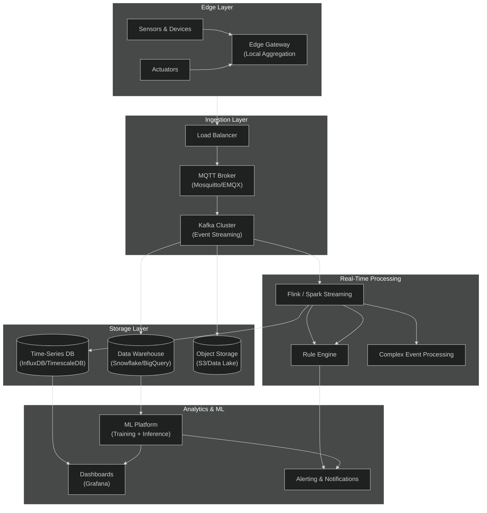
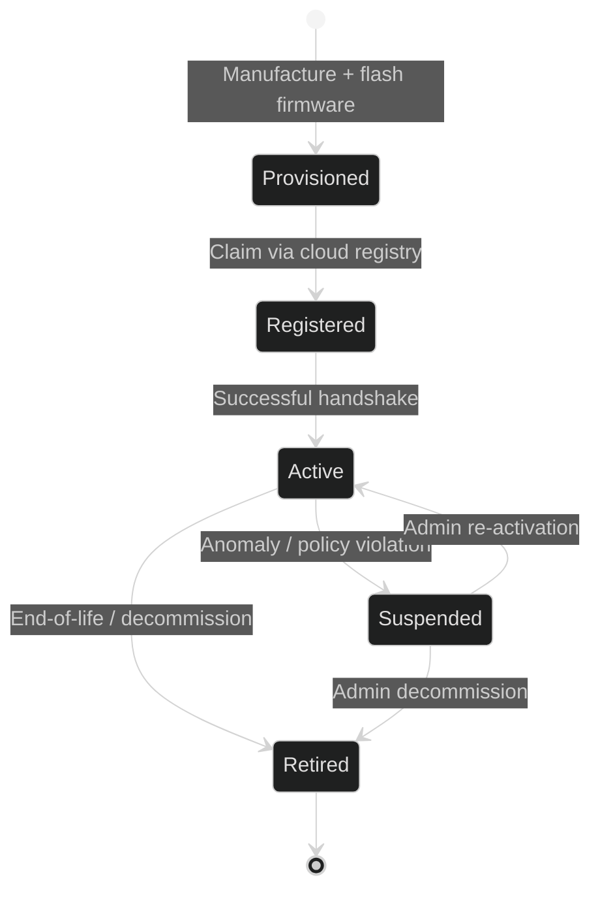
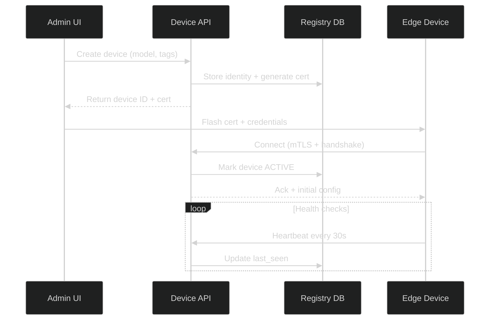
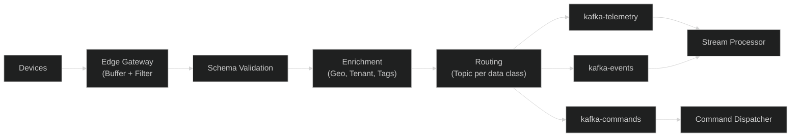
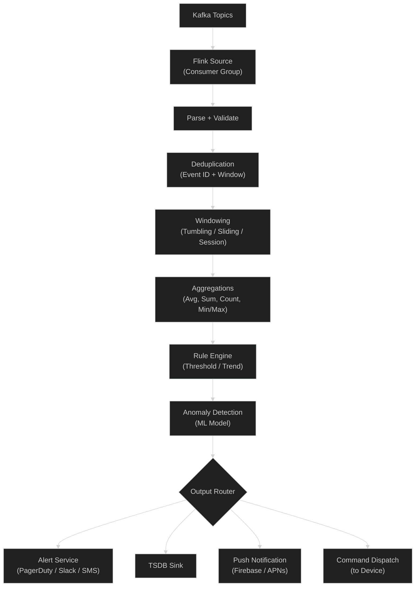
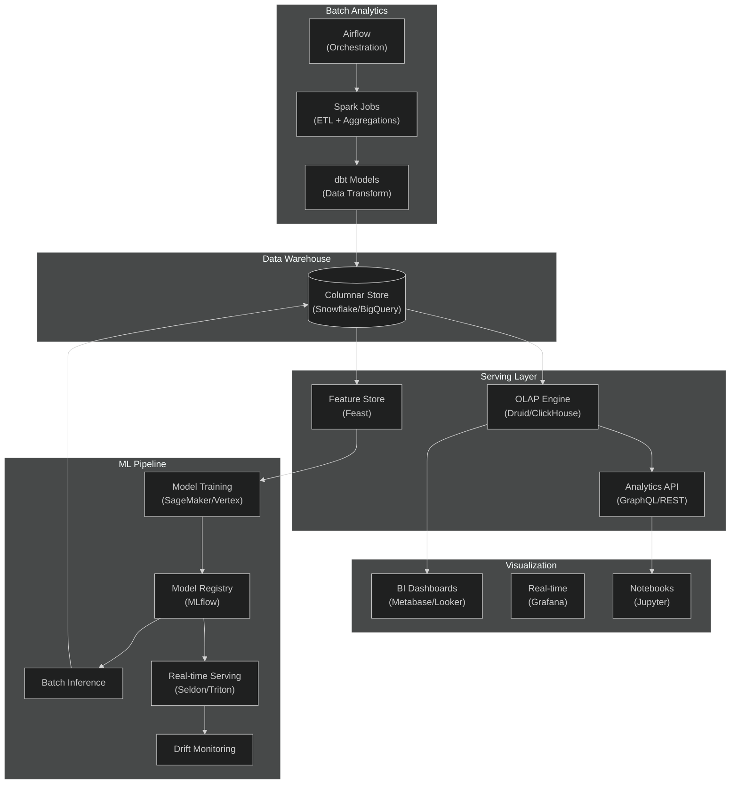
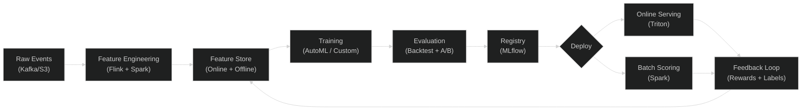

# IoT Architecture & Platform Guide

APEX-OS Business Platform — IoT subsystem covering device lifecycle, data ingestion, real-time processing, and analytics.

---

## 1. IoT Architecture

Layered edge-to-cloud architecture:



**Key principles:**

- **Edge autonomy:** Gateways buffer, filter, and act locally when cloud connectivity drops.
- **Event-driven backbone:** Kafka as the single source of truth; consumers are decoupled.
- **Tiered storage:** Hot data in TSDB, cold data in object storage, analytics in the warehouse.
- **Exactly-once semantics:** Idempotent producers + transactional consumers prevent duplicates.

---

## 2. Device Management

### 2.1 Device Lifecycle



### 2.2 Core Capabilities

| Capability | Description | Technology |
|------------|-------------|------------|
| **Provisioning** | Zero-touch enrollment using X.509 certs or TPM-based identity | AWS IoT Core / Azure IoT Hub JITP |
| **Registry** | Device registry with metadata, tags, group hierarchy | PostgreSQL + GraphQL API |
| **OTA Firmware** | Delta updates with rollback, signed images, staged rollout | Mender / RAUC |
| **Shadow / Twin** | Desired vs. reported state reconciliation | Azure IoT Shadow / Digital Twin |
| **Monitoring** | Heartbeat, connectivity, battery, health metrics | Prometheus + custom agent |
| **Remote Config** | Push configuration changes, feature flags | MQTT control channel |
| **Certificate Mgmt** | Automated rotation, revocation via CRL/OCSP | HashiCorp Vault / ACME |
| **Grouping** | Fleet segmentation by region, model, custom tags | Tag-based dynamic groups |

### 2.3 Device Identity & Security

- Every device has a unique X.509 certificate burned during provisioning.
- Device identity is bound to hardware (TPM / secure element) where available.
- Mutual TLS for all cloud connections.
- Least-privilege topic ACLs (devices can only publish to their own namespaces).
- Certificate rotation every 90 days, automated via renewal agent.

### 2.4 API Surface



---

## 3. Data Ingestion

### 3.1 Protocol Support

| Protocol | Use Case | Default Port |
|----------|----------|-------------|
| **MQTT 5.0** | Telemetry from constrained devices | 8883 (TLS) |
| **MQTT over WebSocket** | Browser / mobile apps | 443 |
| **CoAP** | UDP-based, ultra-low-power (LoRaWAN, NB-IoT) | 5684 (DTLS) |
| **HTTP/REST** | Bulk uploads, firmware callbacks | 443 |
| **gRPC** | High-throughput internal services | 50051 |
| **LoRaWAN** | Long-range, low-power via gateways | Via packet forwarder |

### 3.2 Message Format

All telemetry follows a canonical schema (JSON / Protobuf):

```json
{
  "device_id": "dev-01HX3K...",
  "ts": 1727800000000,
  "type": "telemetry",
  "metrics": { "temperature": 23.4, "humidity": 58.2, "pressure": 1013.2 },
  "metadata": { "firmware": "2.1.0", "rssi": -72, "battery": 87 }
}
```

- **Protobuf** for high-frequency sensors (bandwidth-efficient).
- **JSON Schema** registry enforces contract validation at the edge gateway.
- **Avro** used for Kafka topic schemas with Confluent Schema Registry.

### 3.3 Ingestion Pipeline



### 3.4 Throughput & Scaling

- MQTT brokers scale horizontally via EMQX clustering (10M+ concurrent connections).
- Kafka partitions by `device_id % N` for ordered per-device processing.
- Backpressure handled via consumer lag monitoring + auto-scaling consumers.
- Dead-letter queue (DLQ) for poison messages after 3 retries.

---

## 4. Real-Time Processing

### 4.1 Stream Processing Architecture



### 4.2 Processing Patterns

| Pattern | Example | Implementation |
|---------|---------|----------------|
| **Filtering** | Drop readings outside physical bounds | Flink `filter()` |
| **Windowed Aggregation** | 5-min avg temperature per zone | Flink `window(TumblingEventTimeWindows)` |
| **Sessionization** | Detect device power-on cycles | Flink `EventTimeSessionWindows` |
| **CEP** | "Temp spike followed by pressure drop within 60s" | Flink CEP `Pattern` API |
| **Enrichment** | Join telemetry with device metadata | Async I/O to registry cache |
| **Anomaly Detection** | Isolation Forest on metric vectors | Flink ML + model serving |

### 4.3 Latency Targets

| Stage | Target Latency |
|-------|---------------|
| Device → Gateway | < 100 ms |
| Gateway → Kafka | < 200 ms |
| Kafka → Rule evaluation | < 500 ms |
| Alert dispatched | < 1 s end-to-end |

### 4.4 Fault Tolerance

- Kafka replication factor 3, min.insync.replicas=2.
- Flink checkpoints to distributed storage (S3/HDFS) every 30s.
- Savepoints for stateful job upgrades with zero data loss.
- Idempotent sinks prevent duplicate writes on replay.

---

## 5. Analytics

### 5.1 Analytics Stack



### 5.2 Analytics Use Cases

| Use Case | Description | Data Source |
|----------|-------------|-------------|
| **Operational Dashboards** | Live fleet health, connectivity, battery status | TSDB + Grafana |
| **Predictive Maintenance** | Forecast failure probability from vibration/temp trends | Feature Store → ML |
| **Energy Optimization** | Analyze consumption patterns, identify waste | Warehouse → dbt |
| **Fleet Utilization** | Device uptime, deployment ROI, geospatial heatmaps | OLAP → Metabase |
| **Anomaly Investigation** | Drill into alerts, replay events, root-cause analysis | Notebook + raw events |
| **SLA Reporting** | Uptime %, MTTR, compliance reporting | Warehouse → BI |

### 5.3 Real-Time vs. Batch

| Aspect | Real-Time (Flink) | Batch (Spark) |
|--------|-------------------|---------------|
| **Latency** | Sub-second | Minutes to hours |
| **Data volume** | Per-event | Petabyte-scale scans |
| **Use case** | Alerts, live dashboards | Training data, deep analysis |
| **State** | In-memory + RocksDB | Disk-based shuffles |
| **Output** | TSDB, push notifications | Warehouse, reports |

### 5.4 ML Pipeline



### 5.5 Data Retention

| Tier | Storage | Retention |
|------|---------|-----------|
| **Hot** | InfluxDB / TimescaleDB | 30 days |
| **Warm** | Apache Parquet on S3 | 1 year |
| **Cold** | Glacier / Archive | 7 years (compliance) |

Automated lifecycle policies move data between tiers based on age and access patterns.
