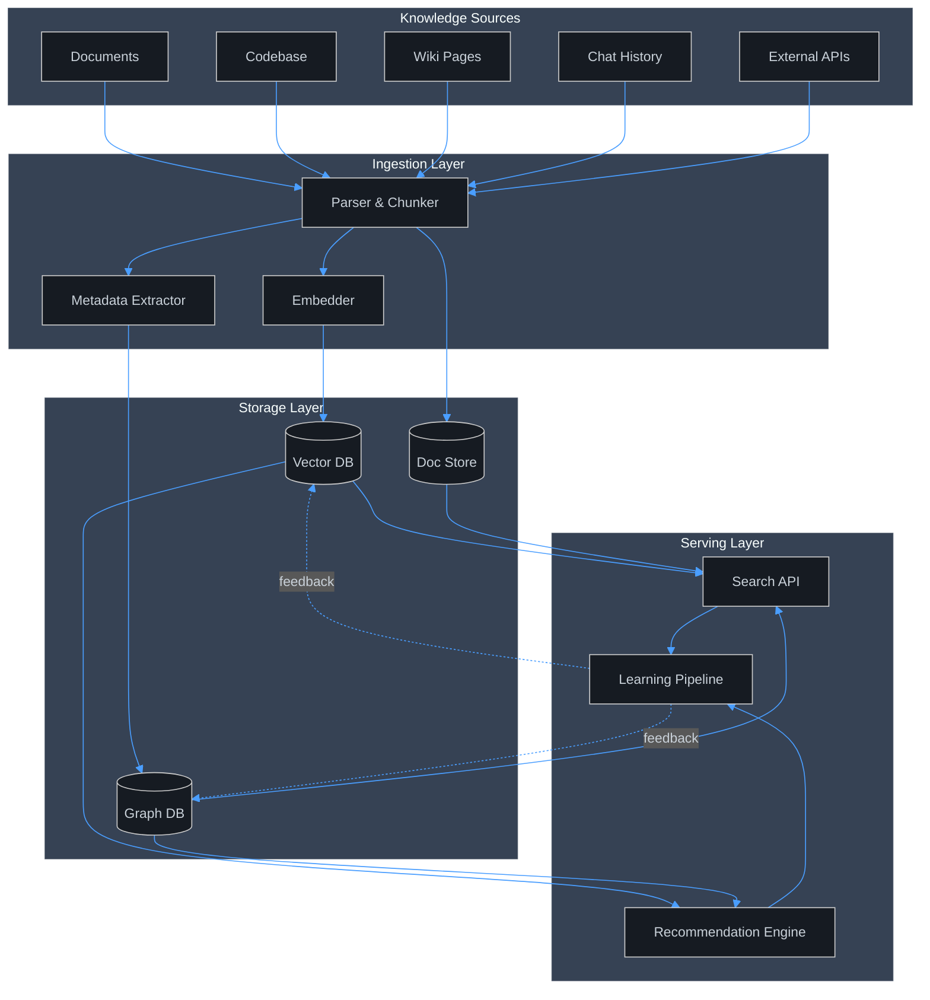
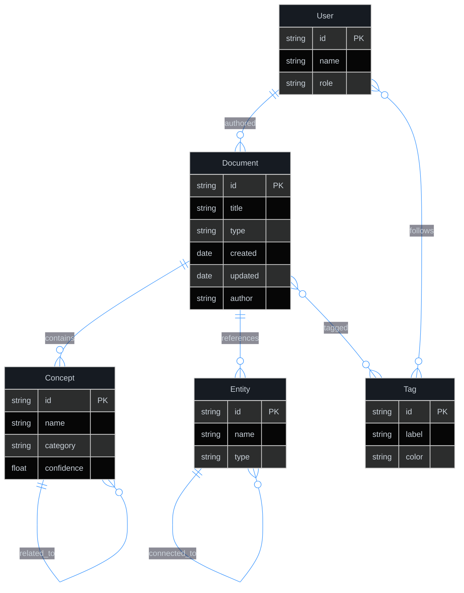
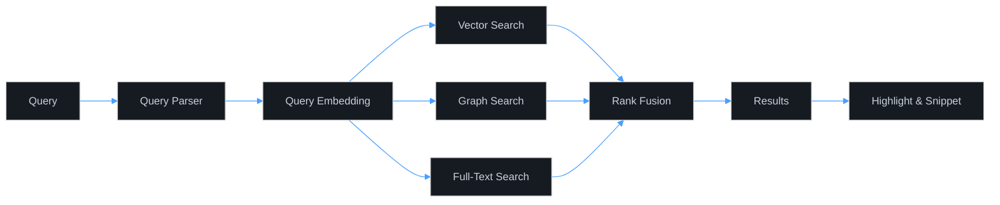
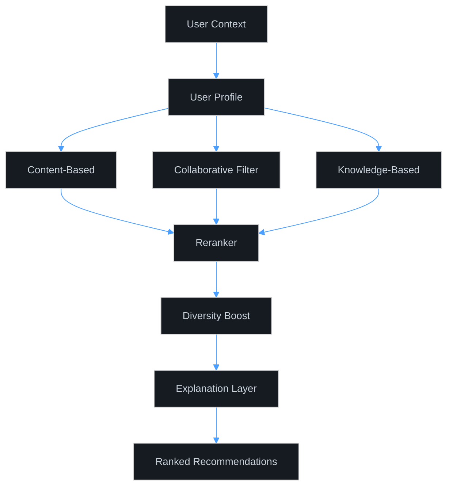
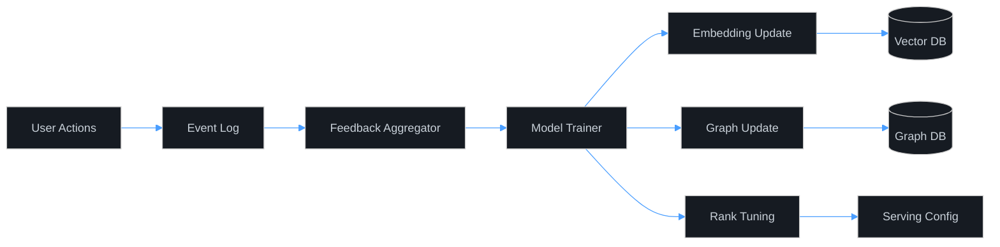

# Knowledge Management

## 1. Architecture

## 2. Knowledge Graph

## 3. Search

**Search modes:**
- **Semantic** — vector similarity over embeddings
- **Keyword** — BM25 full-text with fuzzy matching
- **Graph** — traversal over entity/concept relationships
- **Hybrid** — weighted fusion of all three

## 4. Recommendations

**Signals:**
- Content similarity (embedding distance)
- Collaborative patterns (users like you)
- Knowledge graph proximity
- Recency & freshness decay
- Explicit feedback (thumbs, bookmarks)

## 5. Learning

**Learning loops:**
- **Implicit** — clicks, dwell time, scroll depth
- **Explicit** — ratings, bookmarks, shares
- **Periodic** — nightly re-index, weekly model refresh
- **Online** — real-time embedding adjustments
