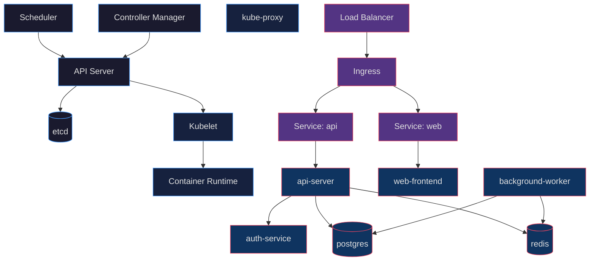
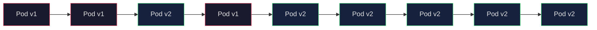
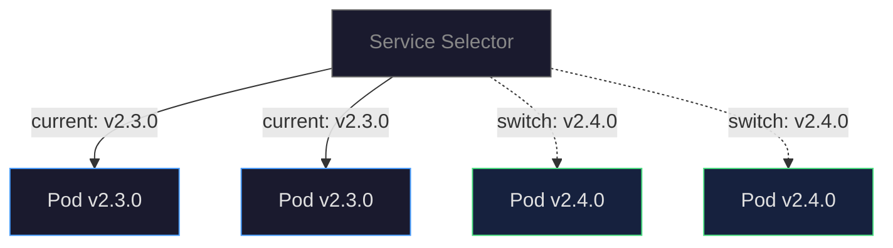
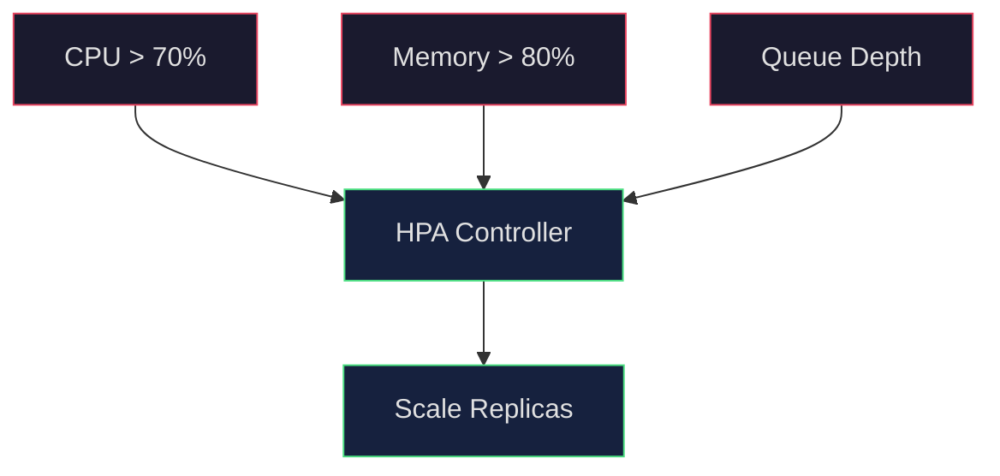
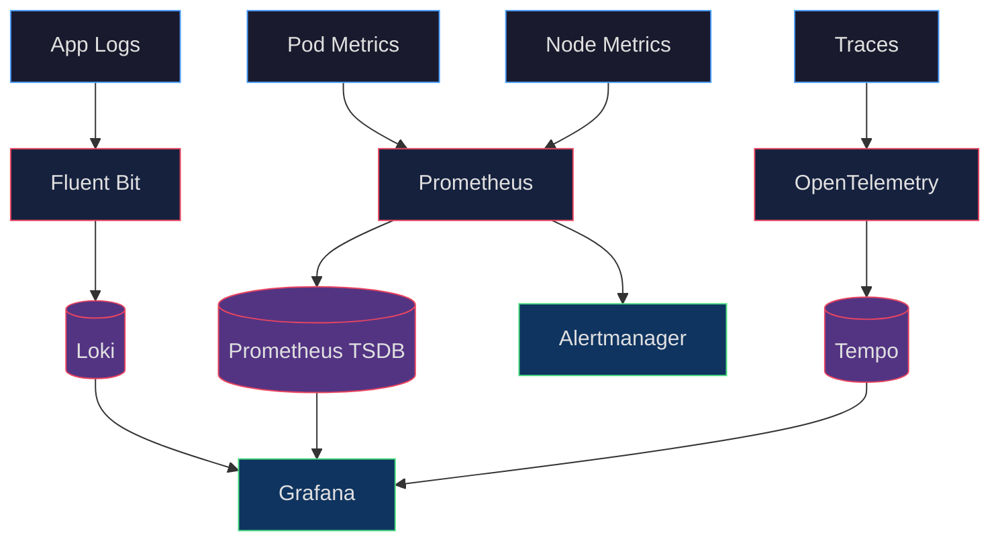
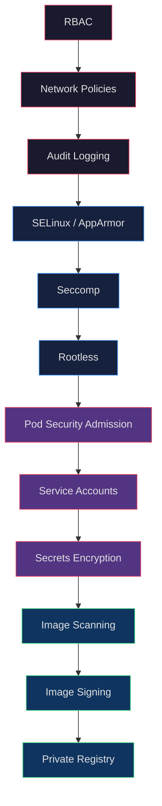

# APEX-OS Kubernetes Architecture

## 1. Architecture Overview



| Component | Role |
|-----------|------|
| API Server | Cluster gateway; validates and processes REST requests |
| etcd | Distributed key-value store for all cluster state |
| Scheduler | Assigns Pods to Nodes based on resource requirements |
| Controller Manager | Runs controller loops (replica, endpoint, namespace) |
| Kubelet | Node agent; ensures containers run in Pods |
| kube-proxy | Maintains network rules for Service abstraction |

---

## 2. Deployment Strategy

### Rolling Updates



### Deployment Config

```yaml
apiVersion: apps/v1
kind: Deployment
metadata:
  name: apex-api
  namespace: apex-core
spec:
  replicas: 3
  strategy:
    type: RollingUpdate
    rollingUpdate:
      maxSurge: 1
      maxUnavailable: 0
  selector:
    matchLabels:
      app: apex-api
  template:
    metadata:
      labels:
        app: apex-api
    spec:
      containers:
        - name: api
          image: apexos/api:v2.3.1
          ports:
            - containerPort: 8080
          resources:
            requests:
              cpu: 250m
              memory: 256Mi
            limits:
              cpu: 500m
              memory: 512Mi
          readinessProbe:
            httpGet:
              path: /healthz
              port: 8080
            initialDelaySeconds: 10
            periodSeconds: 5
          livenessProbe:
            httpGet:
              path: /healthz
              port: 8080
            initialDelaySeconds: 30
            periodSeconds: 10
```

### Blue-Green Deployment



---

## 3. Scaling Strategy

### HPA



### HPA Config

```yaml
apiVersion: autoscaling/v2
kind: HorizontalPodAutoscaler
metadata:
  name: apex-api-hpa
  namespace: apex-core
spec:
  scaleTargetRef:
    apiVersion: apps/v1
    kind: Deployment
    name: apex-api
  minReplicas: 3
  maxReplicas: 20
  metrics:
    - type: Resource
      resource:
        name: cpu
        target:
          type: Utilization
          averageUtilization: 70
    - type: Resource
      resource:
        name: memory
        target:
          type: Utilization
          averageUtilization: 80
  behavior:
    scaleUp:
      stabilizationWindowSeconds: 60
      policies:
        - type: Percent
          value: 100
          periodSeconds: 60
    scaleDown:
      stabilizationWindowSeconds: 300
      policies:
        - type: Percent
          value: 10
          periodSeconds: 60
```

### Cluster Autoscaler


| Layer | Mechanism | Trigger |
|-------|-----------|---------|
| Pod | HPA | CPU / Memory / Custom metrics |
| Node | Cluster Autoscaler | Pending pods / resource pressure |
| Cluster | Multi-AZ / Regional | Availability requirements |

---

## 4. Monitoring

### Observability Stack



| Category | Metrics | Tool |
|----------|---------|------|
| Cluster | Node CPU, memory, disk, network | Prometheus + node-exporter |
| Pod | Restart count, readiness, resource usage | Prometheus + kube-state-metrics |
| Application | Request rate, error rate, latency (RED) | OpenTelemetry + Prometheus |
| Logs | Structured logs, error patterns | Loki + Fluent Bit |
| Traces | Request flow, bottleneck identification | Tempo + OpenTelemetry |

### Alert Rules

```yaml
groups:
  - name: apex-alerts
    rules:
      - alert: HighErrorRate
        expr: rate(http_requests_total{status=~"5.."}[5m]) > 0.05
        for: 5m
        labels:
          severity: critical
      - alert: PodCrashLooping
        expr: rate(kube_pod_container_status_restarts_total[15m]) > 0
        for: 5m
        labels:
          severity: warning
      - alert: HighMemoryUsage
        expr: container_memory_usage_bytes / container_spec_memory_limit_bytes > 0.85
        for: 10m
        labels:
          severity: warning
```

---

## 5. Security

### Defense in Depth



### RBAC Example

```yaml
apiVersion: rbac.authorization.k8s.io/v1
kind: Role
metadata:
  namespace: apex-core
  name: api-reader
rules:
  - apiGroups: [""]
    resources: ["pods", "services"]
    verbs: ["get", "list", "watch"]
---
apiVersion: rbac.authorization.k8s.io/v1
kind: RoleBinding
metadata:
  name: api-reader-binding
  namespace: apex-core
subjects:
  - kind: ServiceAccount
    name: api-reader
    namespace: apex-core
roleRef:
  kind: Role
  name: api-reader
  apiGroup: rbac.authorization.k8s.io
```

### Network Policy

```yaml
apiVersion: networking.k8s.io/v1
kind: NetworkPolicy
metadata:
  name: apex-api-netpol
  namespace: apex-core
spec:
  podSelector:
    matchLabels:
      app: apex-api
  policyTypes:
    - Ingress
    - Egress
  ingress:
    - from:
        - namespaceSelector:
            matchLabels:
              name: apex-apps
      ports:
        - protocol: TCP
          port: 8080
  egress:
    - to:
        - podSelector:
            matchLabels:
              app: postgres
      ports:
        - protocol: TCP
          port: 5432
```

### Pod Security Standards

| Level | Description | Use Case |
|-------|-------------|----------|
| Privileged | Unrestricted | System components only |
| Baseline | Minimizes privilege escalation | Most workloads |
| Restricted | Hardened, follows best practices | Production workloads |

### Secrets Management

```yaml
apiVersion: v1
kind: Secret
metadata:
  name: apex-db-credentials
  namespace: apex-core
type: Opaque
stringData:
  username: apex_app
  password: <encrypted-at-rest>
---
apiVersion: external-secrets.io/v1beta1
kind: ExternalSecret
metadata:
  name: apex-db-credentials
  namespace: apex-core
spec:
  refreshInterval: 1h
  secretStoreRef:
    name: vault-backend
    kind: ClusterSecretStore
  target:
    name: apex-db-credentials
  data:
    - secretKey: password
      remoteRef:
        key: apex/prod/db
        property: password
```

### Security Checklist

- [ ] RBAC enabled with least-privilege roles
- [ ] Network Policies restrict pod-to-pod traffic
- [ ] Pod Security Standards enforced (restricted)
- [ ] Secrets encrypted at rest (KMS)
- [ ] Images scanned for vulnerabilities (Trivy/Grype)
- [ ] Images signed and verified (Cosign)
- [ ] Audit logging enabled and shipped
- [ ] Service accounts use minimal tokens
- [ ] Containers run as non-root
- [ ] Read-only root filesystem where possible
- [ ] Resource limits set on all containers
- [ ] Admission controllers enabled (OPA/Gatekeeper)
