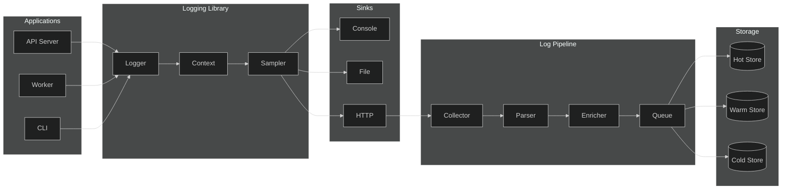
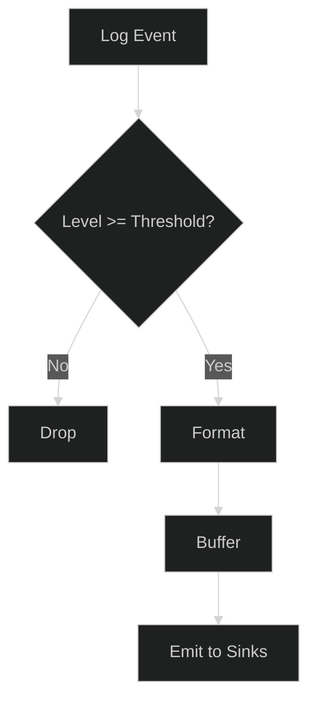
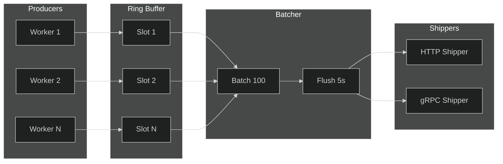
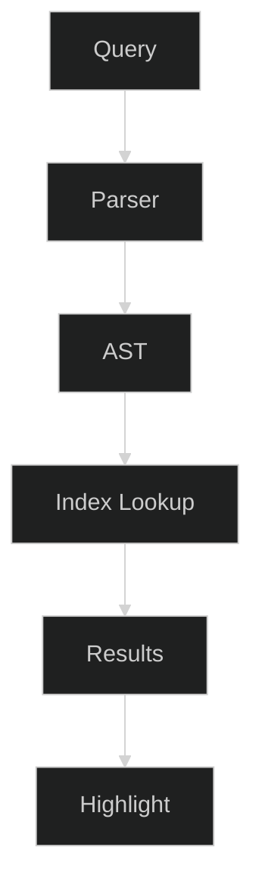
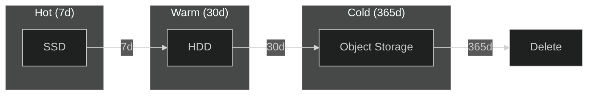

# Logging

## 1. Logging Architecture



## 2. Log Levels

| Level | Value | Use |
|-------|-------|-----|
| TRACE | 5 | Function entry/exit, loop iterations |
| DEBUG | 10 | Detailed diagnostics, state dumps |
| INFO | 20 | Normal operations, lifecycle events |
| WARN | 30 | Recoverable issues, deprecated usage |
| ERROR | 40 | Operation failed, exception caught |
| FATAL | 50 | Unrecoverable, process exiting |



## 3. Log Aggregation



- **Batch size**: 100 events or 5s flush interval
- **Compression**: gzip for HTTP, zstd for gRPC
- **Retry**: exponential backoff, max 3 attempts
- **Backpressure**: drop oldest when buffer full

## 4. Log Search



**Query syntax:**

```
level:error service:api after:2026-10-01 "connection refused"
```

| Operator | Example | Description |
|----------|---------|-------------|
| `field:value` | `level:error` | Exact match |
| `field:>value` | `duration:>1000` | Range |
| `"text"` | `"timeout"` | Full-text |
| `AND` / `OR` | `level:error AND service:api` | Boolean |
| `NOT` | `NOT level:debug` | Negation |

## 5. Log Retention



| Tier | Age | Storage | Compression |
|------|-----|---------|-------------|
| Hot | 0–7d | Local SSD | None |
| Warm | 7–30d | HDD | zstd |
| Cold | 30–365d | S3/GCS | zstd |
| Archive | >365d | Glacier | zstd |

- **Sampling**: 100% ERROR, 10% INFO, 1% DEBUG after 7d
- **PII**: redacted at collector before storage
- **Compliance**: immutable cold tier with WORM lock
