# Macro-to-Modular Migration Guide

## 1. Macro Architecture Overview

```mermaid
%%{init: {'theme': 'dark'}}%%
graph TD
    subgraph Macro["Monolithic Macro Architecture"]
        UI[Presentation Layer]
        BLL[Business Logic Layer]
        DAL[Data Access Layer]
        SVC[Shared Services]
        CFG[Configuration]
        UI --> BLL
        BLL --> DAL
        BLL --> SVC
        DAL --> CFG
        SVC --> CFG
    end
    style Macro fill:#1a1a2e,stroke:#e94560,stroke-width:2px
    style UI fill:#16213e,stroke:#0f3460
    style BLL fill:#16213e,stroke:#0f3460
    style DAL fill:#16213e,stroke:#0f3460
    style SVC fill:#16213e,stroke:#0f3460
    style CFG fill:#16213e,stroke:#0f3460
```

## 2. Modular Decomposition

```mermaid
%%{init: {'theme': 'dark'}}%%
graph TD
    subgraph Modular["Modular Architecture"]
        API[API Gateway]
        subgraph Core["Core Modules"]
            AUTH[Auth Module]
            USER[User Module]
            BILL[Billing Module]
            RPT[Reporting Module]
        end
        subgraph Shared["Shared Kernel"]
            EVT[Event Bus]
            CFG[Config Store]
            LOG[Logging]
        end
        API --> AUTH
        API --> USER
        API --> BILL
        API --> RPT
        AUTH --> EVT
        USER --> EVT
        BILL --> EVT
        RPT --> EVT
        EVT --> CFG
        EVT --> LOG
    end
    style Modular fill:#1a1a2e,stroke:#e94560,stroke-width:2px
    style API fill:#16213e,stroke:#0f3460
    style Core fill:#0f3460,stroke:#533483
    style Shared fill:#0f3460,stroke:#533483
    style AUTH fill:#16213e,stroke:#e94560
    style USER fill:#16213e,stroke:#e94560
    style BILL fill:#16213e,stroke:#e94560
    style RPT fill:#16213e,stroke:#e94560
    style EVT fill:#16213e,stroke:#0f3460
    style CFG fill:#16213e,stroke:#0f3460
    style LOG fill:#16213e,stroke:#0f3460
```

## 3. Module Boundaries

| Module | Responsibility | Owns Data | Depends On | Exposes |
|--------|---------------|-----------|------------|---------|
| Auth | Authentication, authorization, session management | users, roles, sessions, tokens | Config Store | `authenticate()`, `authorize()`, `validateToken()` |
| User | User profile, preferences, settings | profiles, preferences, settings | Auth, Event Bus | `getProfile()`, `updateProfile()`, `listUsers()` |
| Billing | Invoicing, payments, subscriptions | invoices, payments, plans | Auth, Event Bus | `createInvoice()`, `processPayment()`, `getSubscription()` |
| Reporting | Analytics, exports, dashboards | reports, snapshots | Auth, User, Billing | `generateReport()`, `exportData()`, `getDashboard()` |
| Event Bus | Inter-module communication, event sourcing | event log, subscriptions | Config Store | `publish()`, `subscribe()`, `replay()` |
| Config Store | Centralized configuration, feature flags | config entries, flags | — | `get()`, `set()`, `watch()` |
| Logging | Structured logging, audit trail | log entries, audit records | Config Store | `log()`, `audit()`, `query()` |

## 4. Interface Contracts

| Contract | Provider | Consumer | Method | Schema |
|----------|----------|----------|--------|--------|
| `AuthService.authenticate()` | Auth | API Gateway | gRPC/REST | `{ username, password } → { token, expiresAt }` |
| `AuthService.authorize()` | Auth | All modules | Internal | `{ token, resource, action } → bool` |
| `UserService.getProfile()` | User | API Gateway, Reporting | gRPC/REST | `{ userId } → { profile }` |
| `BillingService.createInvoice()` | Billing | API Gateway | gRPC/REST | `{ customerId, items[] } → { invoiceId }` |
| `EventBus.publish()` | Event Bus | All modules | Internal | `{ topic, payload, metadata }` |
| `EventBus.subscribe()` | Event Bus | All modules | Internal | `{ topic, handler }` |
| `ConfigStore.get()` | Config Store | All modules | Internal | `{ key } → { value }` |
| `Logging.audit()` | Logging | All modules | Internal | `{ actor, action, target, timestamp }` |

## 5. Migration Path

### Phase 1: Preparation (Weeks 1–2)
- [ ] Audit existing macro codebase for coupling points
- [ ] Define module boundaries using the table above
- [ ] Set up Event Bus and Config Store infrastructure
- [ ] Establish interface contract schemas (OpenAPI/Protobuf)

### Phase 2: Strangler Fig (Weeks 3–6)
- [ ] Implement Auth Module behind facade
- [ ] Route authentication calls through new module
- [ ] Implement User Module behind facade
- [ ] Route user profile calls through new module
- [ ] Validate parity with macro implementation

### Phase 3: Core Extraction (Weeks 7–10)
- [ ] Extract Billing Module with full test coverage
- [ ] Migrate payment processing to new module
- [ ] Extract Reporting Module
- [ ] Migrate analytics queries to new module
- [ ] Decommission macro billing/reporting paths

### Phase 4: Decommission (Weeks 11–12)
- [ ] Remove dead code from macro layers
- [ ] Migrate remaining data to module-owned stores
- [ ] Update documentation and runbooks
- [ ] Full regression test suite
- [ ] Archive macro architecture diagrams

### Risk Mitigation
- **Feature flags**: Toggle between macro and modular paths
- **Shadow traffic**: Run both paths in parallel, compare outputs
- **Rollback plan**: Maintain macro path until modular is stable for 2 weeks
- **Data consistency**: Use dual-write pattern during transition
