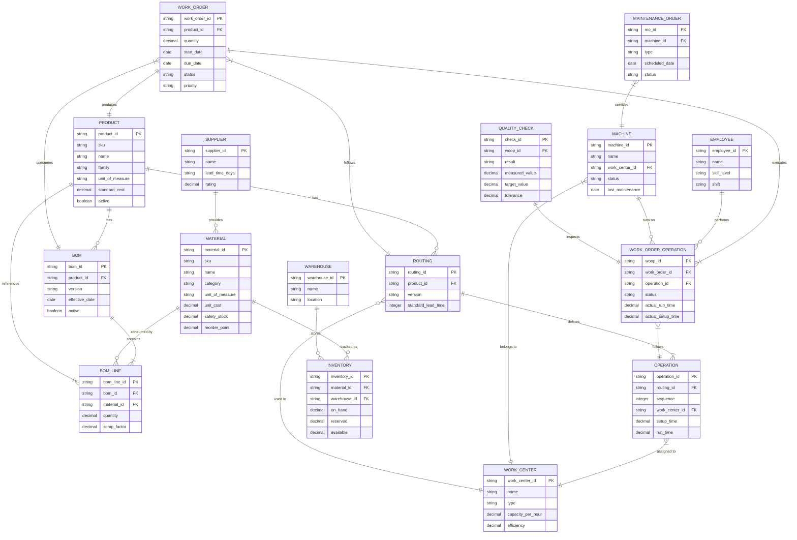
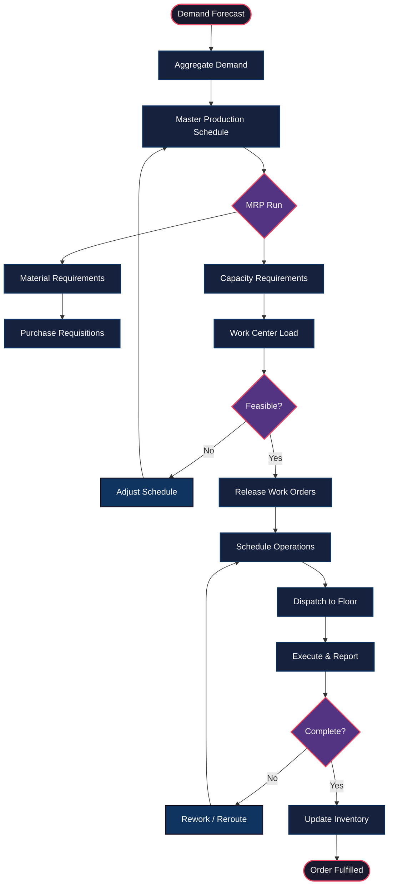
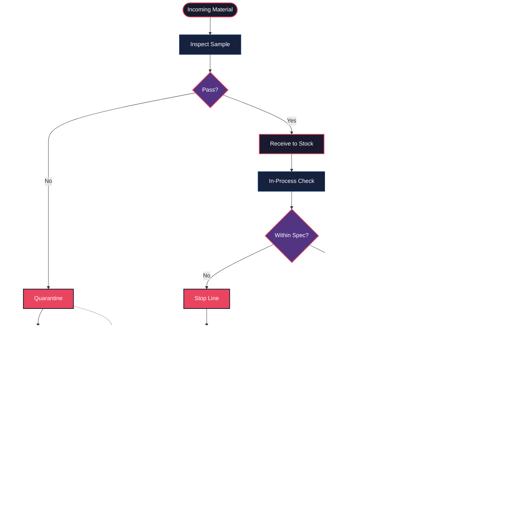
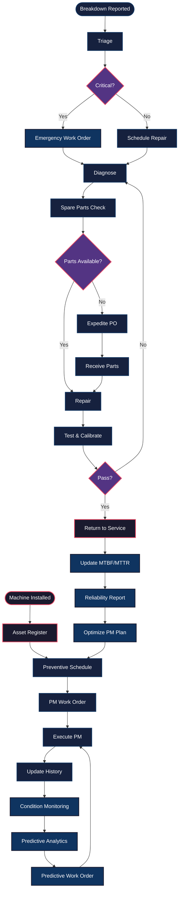
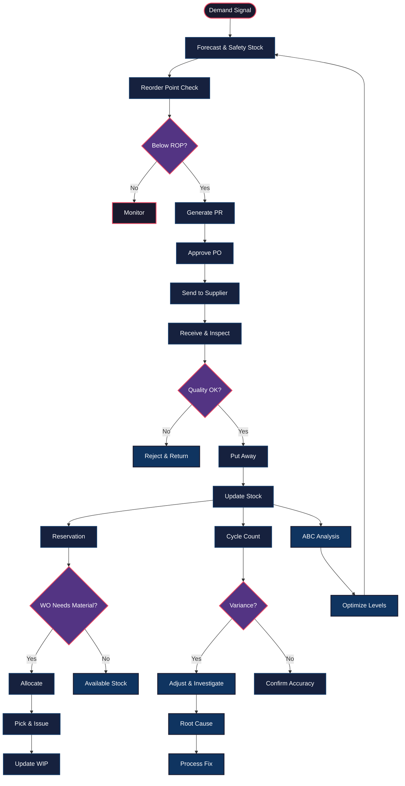

# Manufacturing Architecture

## 1. Manufacturing Data Model

```mermaid
erDiagram
    PRODUCT ||--o{ BOM : "has"
    BOM ||--|{ BOM_LINE : "contains"
    BOM_LINE }|--|| PRODUCT : "references"
    WORK_CENTER ||--o{ ROUTING : "used in"
    ROUTING ||--|{ OPERATION : "defines"
    OPERATION }|--|| WORK_CENTER : "assigned to"
    PRODUCT ||--o{ ROUTING : "has"
    MATERIAL ||--o{ BOM_LINE : "consumed by"
    MATERIAL ||--o{ INVENTORY : "tracked as"
    WAREHOUSE ||--o{ INVENTORY : "stores"
    SUPPLIER ||--o{ MATERIAL : "provides"
    WORK_ORDER ||--|| PRODUCT : "produces"
    WORK_ORDER ||--|{ WORK_ORDER_OPERATION : "executes"
    WORK_ORDER_OPERATION }|--|| OPERATION : "follows"
    WORK_ORDER }|--|| BOM : "consumes"
    WORK_ORDER }|--|| ROUTING : "follows"
    EMPLOYEE ||--o{ WORK_ORDER_OPERATION : "performs"
    MACHINE ||--o{ WORK_ORDER_OPERATION : "runs on"
    MACHINE }|--|| WORK_CENTER : "belongs to"
    QUALITY_CHECK ||--|| WORK_ORDER_OPERATION : "inspects"
    MAINTENANCE_ORDER }|--|| MACHINE : "services"
    PRODUCT {
        string product_id PK
        string sku
        string name
        string family
        string unit_of_measure
        decimal standard_cost
        boolean active
    }
    BOM {
        string bom_id PK
        string product_id FK
        string version
        date effective_date
        boolean active
    }
    BOM_LINE {
        string bom_line_id PK
        string bom_id FK
        string material_id FK
        decimal quantity
        decimal scrap_factor
    }
    ROUTING {
        string routing_id PK
        string product_id FK
        string version
        integer standard_lead_time
    }
    OPERATION {
        string operation_id PK
        string routing_id FK
        integer sequence
        string work_center_id FK
        decimal setup_time
        decimal run_time
    }
    WORK_CENTER {
        string work_center_id PK
        string name
        string type
        decimal capacity_per_hour
        decimal efficiency
    }
    MATERIAL {
        string material_id PK
        string sku
        string name
        string category
        string unit_of_measure
        decimal unit_cost
        decimal safety_stock
        decimal reorder_point
    }
    INVENTORY {
        string inventory_id PK
        string material_id FK
        string warehouse_id FK
        decimal on_hand
        decimal reserved
        decimal available
    }
    WAREHOUSE {
        string warehouse_id PK
        string name
        string location
    }
    SUPPLIER {
        string supplier_id PK
        string name
        string lead_time_days
        decimal rating
    }
    WORK_ORDER {
        string work_order_id PK
        string product_id FK
        decimal quantity
        date start_date
        date due_date
        string status
        string priority
    }
    WORK_ORDER_OPERATION {
        string woop_id PK
        string work_order_id FK
        string operation_id FK
        string status
        decimal actual_run_time
        decimal actual_setup_time
    }
    EMPLOYEE {
        string employee_id PK
        string name
        string skill_level
        string shift
    }
    MACHINE {
        string machine_id PK
        string name
        string work_center_id FK
        string status
        date last_maintenance
    }
    QUALITY_CHECK {
        string check_id PK
        string woop_id FK
        string result
        decimal measured_value
        decimal target_value
        decimal tolerance
    }
    MAINTENANCE_ORDER {
        string mo_id PK
        string machine_id FK
        string type
        date scheduled_date
        string status
    }
```

## 2. Production Planning

```mermaid
flowchart TD
    classDef startEnd fill:#1a1a2e,stroke:#e94560,stroke-width:2px,color:#fff
    classDef process fill:#16213e,stroke:#0f3460,stroke-width:2px,color:#fff
    classDef decision fill:#533483,stroke:#e94560,stroke-width:2px,color:#fff
    classDef data fill:#0f3460,stroke:#1a1a2e,stroke-width:2px,color:#fff

    A([Demand Forecast]) --> B[Aggregate Demand]
    B --> C[Master Production Schedule]
    C --> D{MRP Run}
    D --> E[Material Requirements]
    D --> F[Capacity Requirements]
    E --> G[Purchase Requisitions]
    F --> H[Work Center Load]
    H --> I{Feasible?}
    I -->|No| J[Adjust Schedule]
    J --> C
    I -->|Yes| K[Release Work Orders]
    K --> L[Schedule Operations]
    L --> M[Dispatch to Floor]
    M --> N[Execute & Report]
    N --> O{Complete?}
    O -->|No| P[Rework / Reroute]
    P --> L
    O -->|Yes| Q[Update Inventory]
    Q --> R([Order Fulfilled])

    class A,R startEnd
    class B,C,E,F,G,H,K,L,M,N,Q process
    class D,I,O decision
    class J,P data
```

## 3. Quality Control

```mermaid
flowchart TD
    classDef startEnd fill:#1a1a2e,stroke:#e94560,stroke-width:2px,color:#fff
    classDef process fill:#16213e,stroke:#0f3460,stroke-width:2px,color:#fff
    classDef decision fill:#533483,stroke:#e94560,stroke-width:2px,color:#fff
    classDef alert fill:#e94560,stroke:#1a1a2e,stroke-width:2px,color:#fff

    A([Incoming Material]) --> B[Inspect Sample]
    B --> C{Pass?}
    C -->|No| D[Quarantine]
    D --> E[Supplier NCR]
    E --> F[Return / Rework]
    C -->|Yes| G[Receive to Stock]

    G --> H[In-Process Check]
    H --> I{Within Spec?}
    I -->|No| J[Stop Line]
    J --> K[Root Cause Analysis]
    K --> L{Correctable?}
    L -->|Yes| M[Adjust & Resume]
    L -->|No| N[Scrap / Rework]
    I -->|Yes| O[Continue Production]

    O --> P[Final Inspection]
    P --> Q{Pass?}
    Q -->|No| R[Sort / Rework]
    R --> P
    Q -->|Yes| S[Certificate of Conformance]
    S --> T([Release to Customer])

    D -.-> U[Trend Analysis]
    E -.-> U
    K -.-> U
    U --> V[Preventive Action]
    V --> W[Update Control Plan]

    class A,G,T startEnd
    class B,H,M,O,P,R,S process
    class C,I,L,Q decision
    class D,E,F,J,K,N alert
    class U,V,W data
```

## 4. Maintenance Management

```mermaid
flowchart TD
    classDef startEnd fill:#1a1a2e,stroke:#e94560,stroke-width:2px,color:#fff
    classDef process fill:#16213e,stroke:#0f3460,stroke-width:2px,color:#fff
    classDef decision fill:#533483,stroke:#e94560,stroke-width:2px,color:#fff
    classDef data fill:#0f3460,stroke:#1a1a2e,stroke-width:2px,color:#fff

    A([Machine Installed]) --> B[Asset Register]
    B --> C[Preventive Schedule]
    C --> D[PM Work Order]
    D --> E[Execute PM]
    E --> F[Update History]

    G([Breakdown Reported]) --> H[Triage]
    H --> I{Critical?}
    I -->|Yes| J[Emergency Work Order]
    I -->|No| K[Schedule Repair]
    J --> L[Diagnose]
    K --> L
    L --> M[Spare Parts Check]
    M --> N{Parts Available?}
    N -->|No| O[Expedite PO]
    O --> P[Receive Parts]
    N -->|Yes| Q[Repair]
    P --> Q
    Q --> R[Test & Calibrate]
    R --> S{Pass?}
    S -->|No| L
    S -->|Yes| T[Return to Service]
    T --> U[Update MTBF/MTTR]

    F --> V[Condition Monitoring]
    V --> W[Predictive Analytics]
    W --> X[Predictive Work Order]
    X --> E

    U --> Y[Reliability Report]
    Y --> Z[Optimize PM Plan]
    Z --> C

    class A,B,T startEnd
    class C,D,E,F,G,H,K,L,M,O,P,Q,R process
    class I,N,S decision
    class J,U,V,W,X,Y,Z data
```

## 5. Inventory Management

```mermaid
flowchart TD
    classDef startEnd fill:#1a1a2e,stroke:#e94560,stroke-width:2px,color:#fff
    classDef process fill:#16213e,stroke:#0f3460,stroke-width:2px,color:#fff
    classDef decision fill:#533483,stroke:#e94560,stroke-width:2px,color:#fff
    classDef data fill:#0f3460,stroke:#1a1a2e,stroke-width:2px,color:#fff

    A([Demand Signal]) --> B[Forecast & Safety Stock]
    B --> C[Reorder Point Check]
    C --> D{Below ROP?}
    D -->|No| E[Monitor]
    D -->|Yes| F[Generate PR]
    F --> G[Approve PO]
    G --> H[Send to Supplier]
    H --> I[Receive & Inspect]
    I --> J{Quality OK?}
    J -->|No| K[Reject & Return]
    J -->|Yes| L[Put Away]
    L --> M[Update Stock]

    M --> N[Reservation]
    N --> O{WO Needs Material?}
    O -->|Yes| P[Allocate]
    P --> Q[Pick & Issue]
    Q --> R[Update WIP]
    O -->|No| S[Available Stock]

    M --> T[Cycle Count]
    T --> U{Variance?}
    U -->|Yes| V[Adjust & Investigate]
    U -->|No| W[Confirm Accuracy]
    V --> X[Root Cause]
    X --> Y[Process Fix]

    M --> Z[ABC Analysis]
    Z --> AA[Optimize Levels]
    AA --> B

    class A,E startEnd
    class B,C,F,G,H,I,L,M,N,P,Q,R,T,W process
    class D,J,O,U decision
    class K,S,V,X,Y,Z,AA data
```
