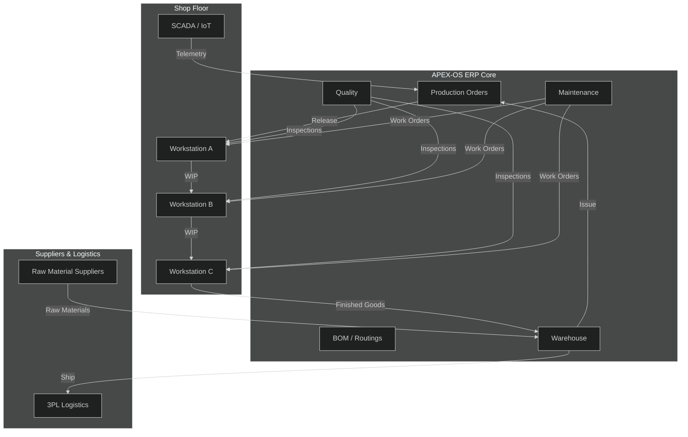
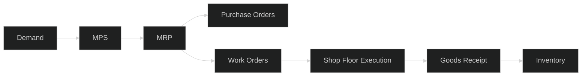
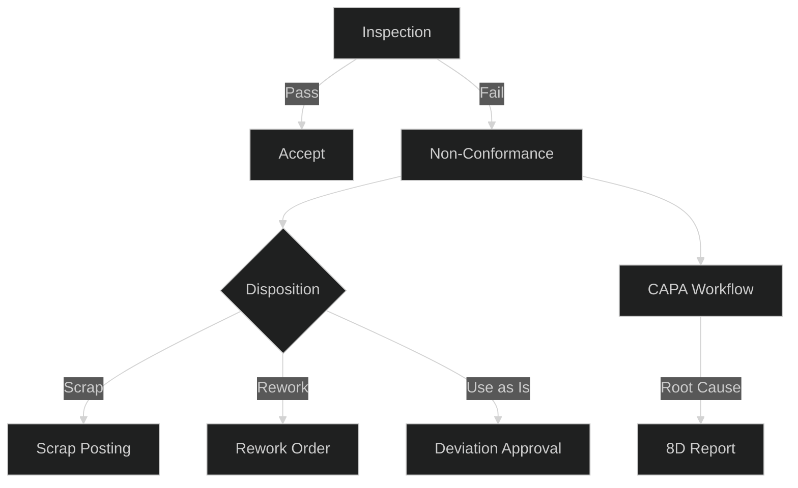
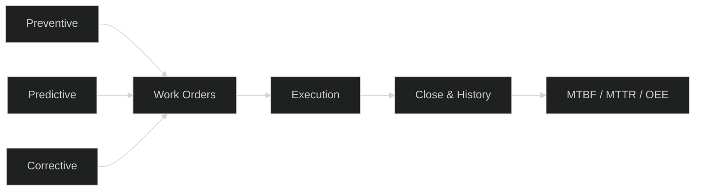

# Manufacturing Module

## 1. Manufacturing Architecture



## 2. Production Planning

- **Demand Forecasting** — rolling 12-week forecast from sales history and open orders.
- **Master Production Schedule (MPS)** — weekly buckets by product family; capacity-checked against routings.
- **Material Requirements Planning (MRP)** — nightly run; netting of on-hand, in-transit, and allocated stock.
- **Capacity Planning** — workstation-level load; finite scheduling with changeover matrices.
- **Order Lifecycle**: Draft → Confirmed → Released → In Progress → Completed → Closed.



## 3. Quality Control

- **Inspection Plans** — per-routing operation; sampling rules (AQL-based).
- **Non-Conformance (NCR)** — defect logging, disposition (scrap / rework / use-as-is).
- **Statistical Process Control (SPC)** — control charts on critical dimensions; alerts on rule violations.
- **Traceability** — lot/serial genealogy from raw material to finished good.
- **CAPA** — corrective and preventive actions linked to NCRs.



## 4. Maintenance

- **Preventive (PM)** — calendar or meter-based schedules per asset.
- **Predictive (PdM)** — vibration, temperature, current monitoring via SCADA thresholds.
- **Corrective (CM)** — breakdown work orders with downtime tracking.
- **Asset Registry** — equipment hierarchy, BOM for spares, serial numbers.
- **KPIs** — MTBF, MTTR, OEE, schedule compliance.



## 5. Inventory

- **Stock Valuation** — moving average or standard cost; monthly revaluation.
- **Warehouse Bins** — zone / aisle / bin hierarchy; putaway and pick strategies.
- **Cycle Counting** — ABC classification; A-items counted monthly, C-items annually.
- **Lot & Serial Control** — FEFO for perishables; serial tracking for regulated items.
- **Stock Aging** — >90-day aging report; obsolescence reserve.

```mermaid
%%{init: {'theme':'dark'}}%%
flowchart TD
    GR[Goods Receipt] --> QC_IN[QC Hold]
    QC_IN -->|Pass| PUT[Putaway]
    PUT --> STK[Stock]
    STK -->|Issue| WO_ISS[Work Order Issue]
    STK -->|Transfer] TR[Bin Transfer]
    STK -->|Ship] SO[Sales Order]
    STK --> CC[Cycle Count]
    CC --> ADJ[Adjustment]
    ADJ --> STK
```
