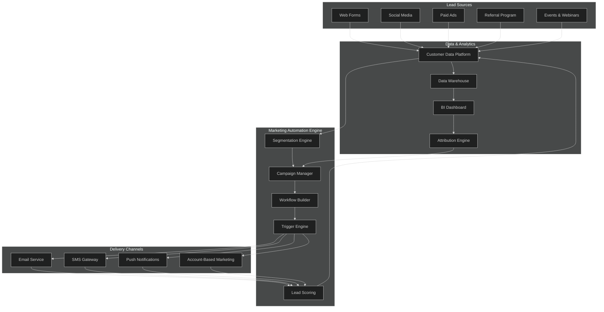
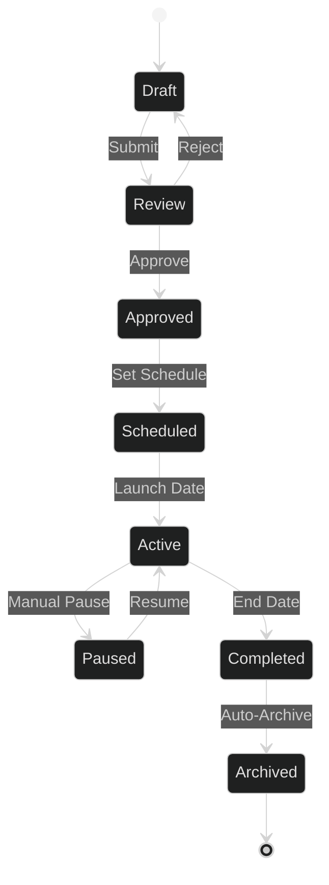
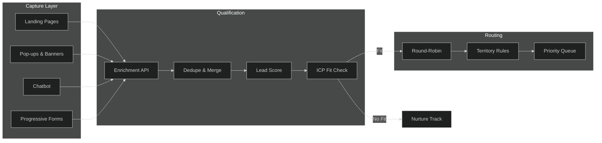
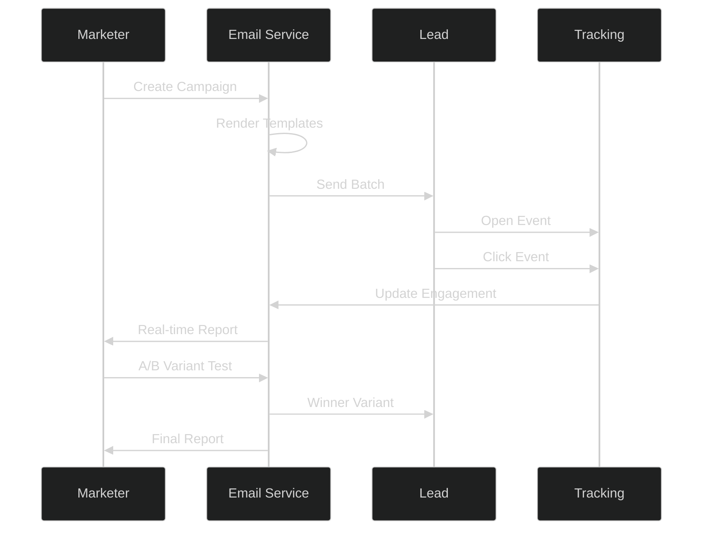
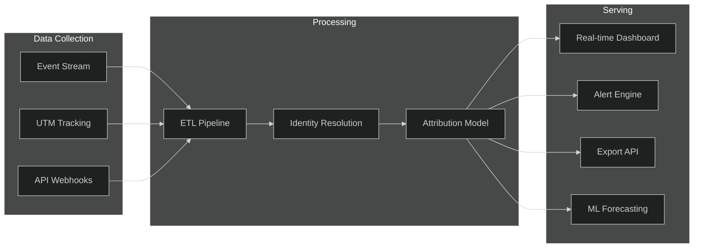

# APEX-OS Marketing Module

## 1. Marketing Architecture

## 2. Campaign Management

### Campaign Lifecycle

| Phase | Owner | Duration | Exit Criteria |
|-------|-------|----------|---------------|
| Planning | Marketing Manager | 1–2 weeks | Budget approved |
| Content Creation | Creative Team | 1–3 weeks | Assets approved |
| QA & Review | Marketing Ops | 2–3 days | Zero defects |
| Launch | Campaign Manager | Day 0 | All channels green |
| Optimization | Growth Team | Ongoing | KPI targets met |
| Retrospective | All Stakeholders | Post-completion | Report filed |

### Campaign Types

- **Awareness** — Broad reach, brand messaging
- **Nurture** — Drip sequences for warm leads
- **Conversion** — Bottom-funnel, offer-driven
- **Retention** — Post-purchase engagement
- **Re-engagement** — Win-back for dormant contacts

## 3. Lead Generation

### Lead Scoring Model

| Signal | Points | Decay |
|--------|--------|-------|
| Email open | +1 | 30 days |
| Link click | +3 | 30 days |
| Pricing page visit | +10 | 14 days |
| Demo request | +25 | No decay |
| Content download | +5 | 60 days |
| Webinar attendance | +15 | 45 days |
| Unsubscribe | -50 | Immediate |

### Score Tiers

- **Cold (0–24)** — Nurture track
- **Warm (25–49)** — Marketing qualified
- **Hot (50–74)** — Sales accepted
- **Ready (75+)** — Immediate SLA routing

## 4. Email Marketing

### Email Types & Cadence

| Type | Frequency | Goal | KPI |
|------|-----------|------|-----|
| Newsletter | Weekly | Engagement | Open rate > 25% |
| Drip Sequence | Triggered | Nurture | CTR > 3% |
| Promotional | Bi-weekly | Conversion | CVR > 2% |
| Transactional | On-demand | Delivery | 99.9% deliverability |
| Re-engagement | Monthly | Win-back | 5% reactivation |

### Deliverability Checklist

- [ ] SPF, DKIM, DMARC configured
- [ ] Dedicated sending domain
- [ ] List hygiene (bounce < 2%)
- [ ] Unsubscribe link in every email
- [ ] Plain-text fallback included
- [ ] Mobile-responsive templates
- [ ] A/B subject line testing

## 5. Analytics

### Key Metrics Dashboard

| Category | Metric | Target | Frequency |
|----------|--------|--------|-----------|
| Reach | Unique visitors | +15% MoM | Daily |
| Engagement | Avg. session duration | > 3 min | Daily |
| Conversion | Lead-to-MQL rate | > 12% | Weekly |
| Pipeline | MQL-to-SQL rate | > 30% | Weekly |
| Revenue | Marketing-sourced ARR | $X M | Monthly |
| Efficiency | CAC | < $Y | Monthly |
| Retention | Email churn | < 0.5%/send | Weekly |

### Attribution Models

- **First-Touch** — Credits originating channel
- **Last-Touch** — Credits closing channel
- **Linear** — Equal credit to all touchpoints
- **Time-Decay** — More credit to recent touches
- **Position-Based** — 40% first, 40% last, 20% middle

### Reporting Cadence

- **Daily** — Campaign performance snapshot
- **Weekly** — Funnel health & lead flow
- **Monthly** — Full-funnel ROI & pipeline contribution
- **Quarterly** — Strategic review & budget reallocation
