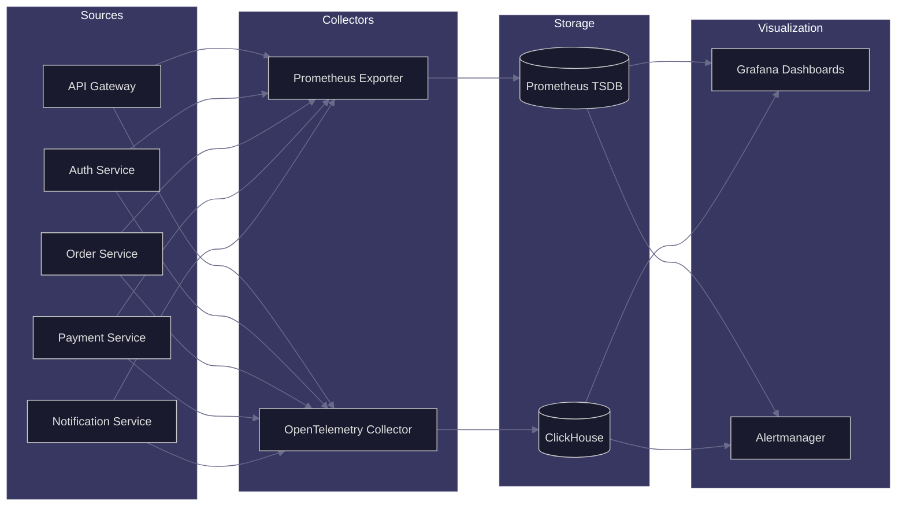

# APEX-OS Metrics

## Architecture



## Counter Metrics

Monotonically increasing values. Reset on process restart.

| Metric | Labels | Description |
|--------|--------|-------------|
| `apex_requests_total` | `service`, `method`, `route`, `status` | Total HTTP requests served |
| `apex_auth_attempts_total` | `provider`, `result` | Authentication attempts (success/failure) |
| `apex_orders_created_total` | `tenant_id`, `currency` | Orders created per tenant |
| `apex_payments_processed_total` | `gateway`, `status`, `currency` | Payment transactions processed |
| `apex_notifications_sent_total` | `channel`, `template` | Notifications dispatched |
| `apex_errors_total` | `service`, `error_type`, `severity` | Errors by category and severity |
| `apex_rate_limit_hits_total` | `tenant_id`, `endpoint` | Rate limit rejections |
| `apex_cache_hits_total` | `cache_name`, `operation` | Cache hit count |
| `apex_cache_misses_total` | `cache_name`, `operation` | Cache miss count |
| `apex_db_connections_acquired_total` | `pool_name` | DB connections acquired from pool |

### Example

```promql
# Request rate per second by service
sum by (service) (rate(apex_requests_total[5m]))

# Error ratio
sum(rate(apex_errors_total[5m])) / sum(rate(apex_requests_total[5m]))
```

## Gauge Metrics

Arbitrary values that can go up or down. Point-in-time measurement.

| Metric | Labels | Description |
|--------|--------|-------------|
| `apex_active_sessions` | `tenant_id` | Currently active user sessions |
| `apex_queue_depth` | `queue_name` | Messages waiting in queue |
| `apex_db_connections_active` | `pool_name` | Currently open DB connections |
| `apex_db_connections_idle` | `pool_name` | Idle DB connections in pool |
| `apex_memory_usage_bytes` | `service`, `type` | Heap/stack memory usage |
| `apex_cpu_usage_percent` | `service` | CPU utilization percentage |
| `apex_disk_usage_bytes` | `mount`, `type` | Disk space used |
| `apex_latency_p99_ms` | `service`, `endpoint` | Current p99 latency |
| `apex_feature_flag_enabled` | `flag_name` | Feature flag state (0/1) |
| `apex_circuit_breaker_state` | `service`, `dependency` | Circuit breaker (0=closed, 1=open) |
| `apex_worker_pool_size` | `pool_name` | Current worker pool size |
| `apex_worker_pool_utilization` | `pool_name` | Pool utilization ratio (0-1) |

### Example

```promql
# High memory alert
apex_memory_usage_bytes{type="heap"} > 1073741824

# Circuit breakers open
apex_circuit_breaker_state == 1
```

## Histogram Metrics

Sampled observations bucketed by value. Used for distributions.

| Metric | Labels | Buckets (ms) | Description |
|--------|--------|--------------|-------------|
| `apex_request_duration_seconds` | `service`, `route`, `method` | 0.01–10.0 | HTTP request latency distribution |
| `apex_db_query_duration_seconds` | `service`, `operation`, `table` | 0.001–5.0 | Database query latency |
| `apex_external_call_duration_seconds` | `service`, `provider`, `operation` | 0.01–30.0 | Third-party API call latency |
| `apex_message_processing_seconds` | `queue_name`, `priority` | 0.001–60.0 | Queue message processing time |
| `apex_payment_processing_seconds` | `gateway`, `method` | 0.1–30.0 | Payment processing duration |
| `apex_search_query_duration_seconds` | `index`, `complexity` | 0.01–10.0 | Search query latency |
| `apex_file_upload_seconds` | `file_type`, `size_bucket` | 0.1–120.0 | File upload duration |
| `apex_cache_operation_seconds` | `cache_name`, `operation` | 0.0001–1.0 | Cache read/write latency |

### Example

```promql
# p95 latency by route
histogram_quantile(0.95, sum by (le, route) (rate(apex_request_duration_duration_seconds_bucket[5m])))

# SLO: 99% of requests under 500ms
histogram_quantile(0.99, sum by (le) (rate(apex_request_duration_seconds_bucket[1h]))) < 0.5
```

## Timer Metrics

Specialized histograms for code execution timing. Track start/end internally.

| Metric | Labels | Description |
|--------|--------|-------------|
| `apex_handler_duration_seconds` | `service`, `handler` | Request handler execution time |
| `apex_middleware_duration_seconds` | `service`, `middleware` | Middleware chain execution time |
| `apex_serialization_duration_seconds` | `service`, `format` | JSON/protobuf serialization time |
| `apex_deserialization_duration_seconds` | `service`, `format` | JSON/protobuf deserialization time |
| `apex_auth_token_validation_seconds` | `provider` | Token validation duration |
| `apex_permission_check_seconds` | `service`, `resource_type` | Authorization check duration |
| `apex_event_publish_duration_seconds` | `topic`, `priority` | Event bus publish duration |
| `apex_event_consume_duration_seconds` | `topic`, `consumer_group` | Event consumption duration |
| `apex_scheduled_job_duration_seconds` | `job_name`, `schedule` | Cron/scheduled job execution time |
| `apex_health_check_duration_seconds` | `check_name` | Health probe execution time |

### Example

```promql
# Slowest handlers
topk(10, sum by (handler) (rate(apex_handler_duration_seconds_sum[5m])))

# Middleware overhead ratio
sum(rate(apex_middleware_duration_seconds_sum[5m])) / sum(rate(apex_handler_duration_seconds_sum[5m]))
```

## Label Conventions

| Label | Values | Description |
|-------|--------|-------------|
| `service` | `api-gateway`, `auth`, `orders`, `payments`, `notifications` | Service identifier |
| `tenant_id` | UUID | Multi-tenant isolation key |
| `status` | `2xx`, `3xx`, `4xx`, `5xx` | HTTP status class |
| `severity` | `low`, `medium`, `high`, `critical` | Error severity |
| `environment` | `dev`, `staging`, `prod` | Deployment environment |

## Retention & Cardinality

- **Prometheus**: 15s scrape interval, 15-day retention
- **ClickHouse**: 1s granularity, 90-day retention
- **Max cardinality**: 10,000 active series per metric
- **Label values**: Enforced via relabeling rules
