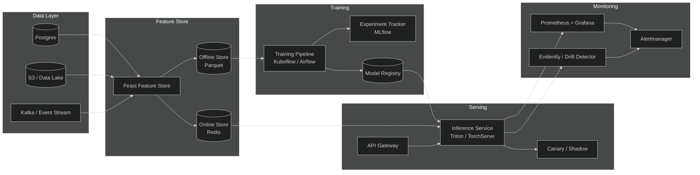
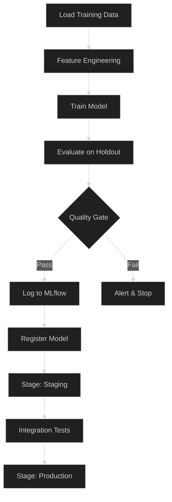
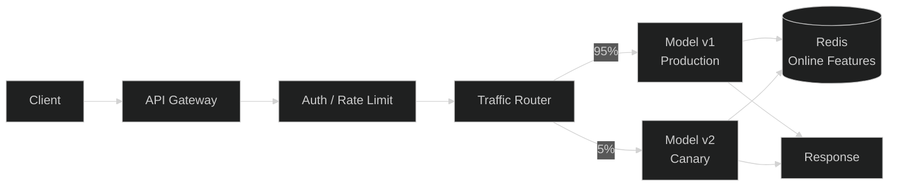
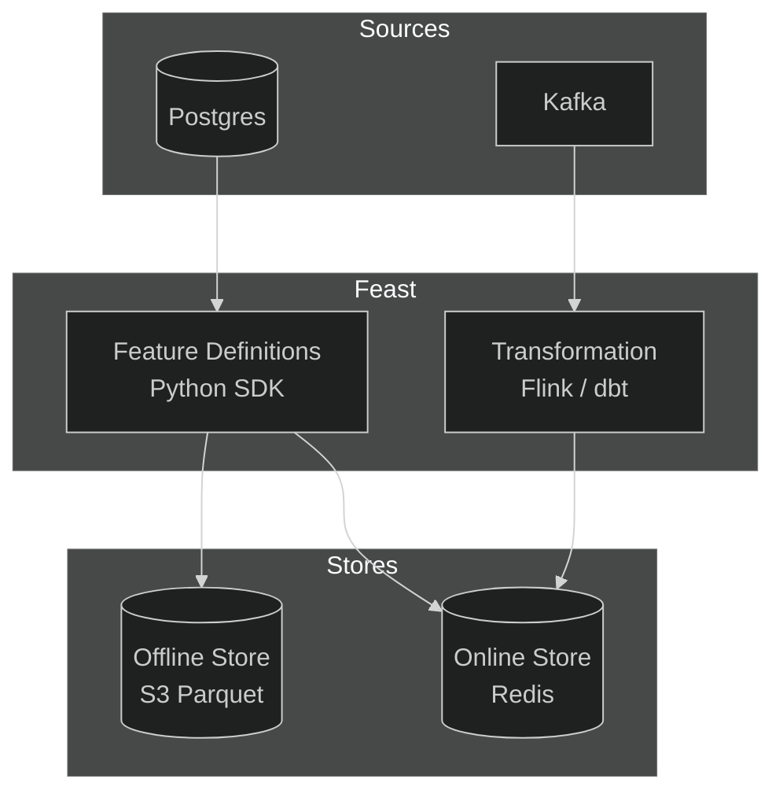
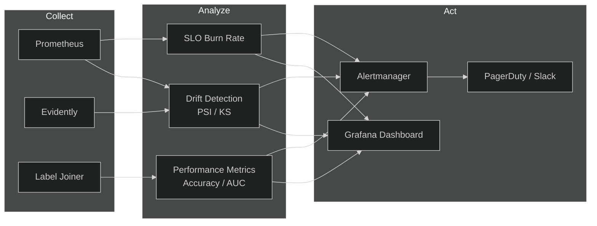

# ML Platform

## 1. ML Architecture

## 2. Model Training

- **Orchestration**: Kubeflow Pipelines / Airflow DAGs for reproducible training runs.
- **Experiment Tracking**: MLflow tracks parameters, metrics, artifacts, and model versions.
- **Data**: Training datasets pulled from the offline feature store (Parquet on S3).
- **Validation**: Each run is evaluated against a holdout set; metrics logged to MLflow.
- **Registration**: Models that pass quality gates are promoted to the Model Registry with stage labels (`Staging` → `Production`).
- **Reproducibility**: Every training run pins data snapshot, code commit, and dependency versions.

## 3. Model Serving

- **Inference Server**: Triton Inference Server or TorchServe for GPU-accelerated batch/real-time inference.
- **API Gateway**: REST/gRPC endpoints with auth, rate limiting, and request validation.
- **Online Features**: Low-latency feature lookup from Redis-backed online store.
- **Deployment Strategy**: Canary releases — 5% traffic to new model, auto-promote if error rate < threshold.
- **Shadow Mode**: New model receives traffic but responses are discarded; used for pre-launch validation.
- **Scaling**: Horizontal pod autoscaling based on GPU utilization and request queue depth.

## 4. Feature Store

- **Framework**: Feast — open-source feature store for managing, storing, and serving features.
- **Offline Store**: Parquet files on S3 — used for training data generation and batch scoring.
- **Online Store**: Redis — sub-millisecond feature lookup for real-time inference.
- **Feature Definitions**: Versioned, declarative feature definitions in code (Python SDK).
- **Point-in-Time Correctness**: Training datasets generated with `get_historical_features()` prevent label leakage.
- **Streaming Features**: Kafka → Flink → online store for real-time aggregations (e.g., session counts).

## 5. Model Monitoring

- **Infrastructure Metrics**: Prometheus scrapes GPU utilization, latency (p50/p95/p99), throughput, and error rates.
- **Data Drift**: Evidently / custom detectors compare training vs. production feature distributions (PSI, KS test).
- **Prediction Drift**: Monitor output distribution shifts and confidence score degradation.
- **Model Performance**: Ground truth joined back to predictions for accuracy/F1/AUC tracking.
- **Alerting**: Alertmanager routes to Slack/PagerDuty with severity-based escalation.
- **Dashboards**: Grafana dashboards per model version with SLO burn-rate alerts.

