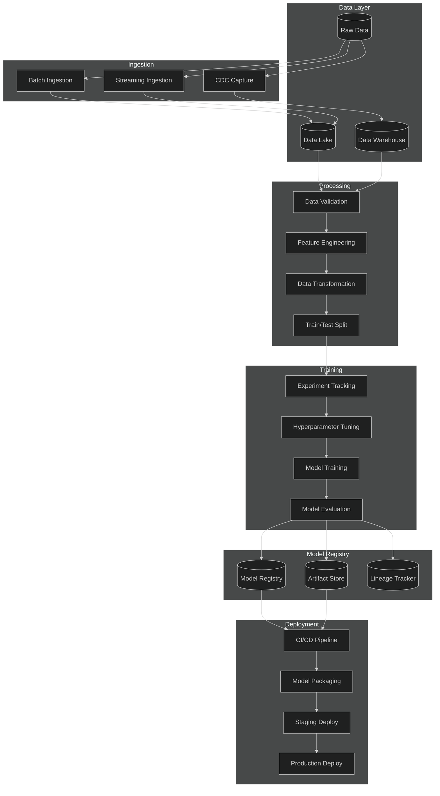
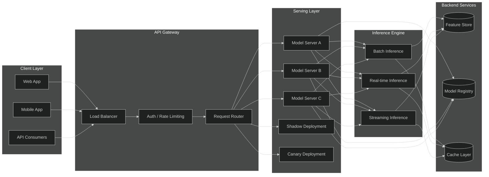
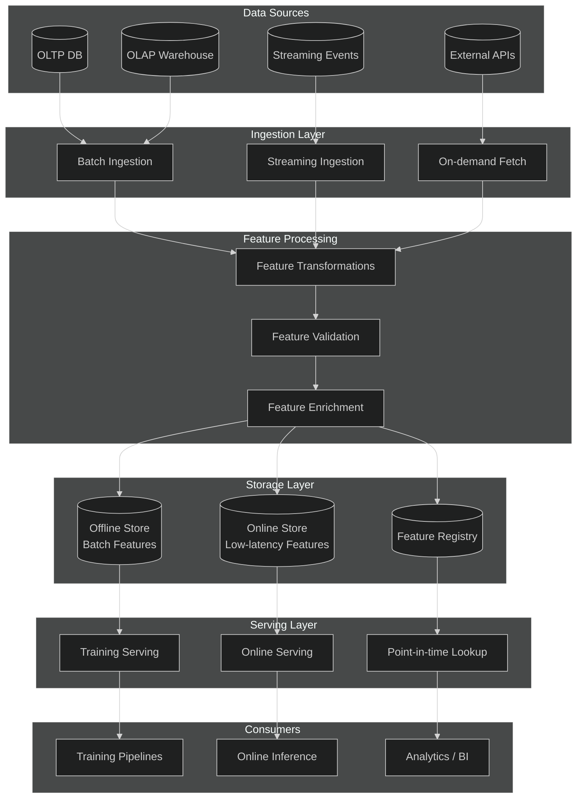
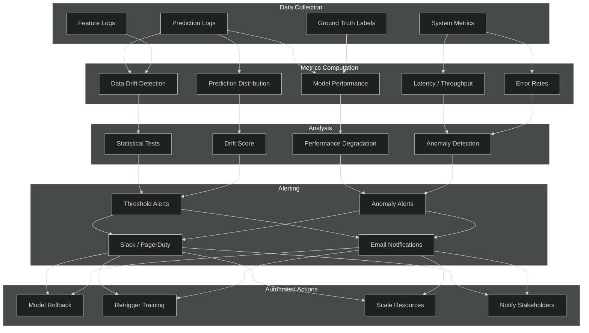
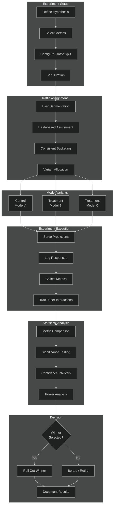

# MLOps Architecture

## 1. ML Pipeline Architecture

```mermaid
%%{init: {'theme': 'dark'}}%%
flowchart TD
    subgraph Data["Data Layer"]
        D1[(Raw Data)]
        D2[(Data Lake)]
        D3[(Data Warehouse)]
    end

    subgraph Ingestion["Ingestion"]
        I1[Batch Ingestion]
        I2[Streaming Ingestion]
        I3[CDC Capture]
    end

    subgraph Processing["Processing"]
        P1[Data Validation]
        P2[Feature Engineering]
        P3[Data Transformation]
        P4[Train/Test Split]
    end

    subgraph Training["Training"]
        T1[Experiment Tracking]
        T2[Hyperparameter Tuning]
        T3[Model Training]
        T4[Model Evaluation]
    end

    subgraph Registry["Model Registry"]
        R1[(Model Registry)]
        R2[(Artifact Store)]
        R3[(Lineage Tracker)]
    end

    subgraph Deployment["Deployment"]
        V1[CI/CD Pipeline]
        V2[Model Packaging]
        V3[Staging Deploy]
        V4[Production Deploy]
    end

    D1 --> I1
    D1 --> I2
    D1 --> I3
    I1 --> D2
    I2 --> D2
    I3 --> D3
    D2 --> P1
    D3 --> P1
    P1 --> P2
    P2 --> P3
    P3 --> P4
    P4 --> T1
    T1 --> T2
    T2 --> T3
    T3 --> T4
    T4 --> R1
    T4 --> R2
    T4 --> R3
    R1 --> V1
    R2 --> V1
    V1 --> V2
    V2 --> V3
    V3 --> V4
```

## 2. Model Serving Architecture

```mermaid
%%{init: {'theme': 'dark'}}%%
flowchart LR
    subgraph Clients["Client Layer"]
        C1[Web App]
        C2[Mobile App]
        C3[API Consumers]
    end

    subgraph Gateway["API Gateway"]
        G1[Load Balancer]
        G2[Auth / Rate Limiting]
        G3[Request Router]
    end

    subgraph Serving["Serving Layer"]
        S1[Model Server A]
        S2[Model Server B]
        S3[Model Server C]
        S4[Shadow Deployment]
        S5[Canary Deployment]
    end

    subgraph Inference["Inference Engine"]
        I1[Batch Inference]
        I2[Real-time Inference]
        I3[Streaming Inference]
    end

    subgraph Backend["Backend Services"]
        B1[(Feature Store)]
        B2[(Model Registry)]
        B3[(Cache Layer)]
    end

    C1 --> G1
    C2 --> G1
    C3 --> G1
    G1 --> G2
    G2 --> G3
    G3 --> S1
    G3 --> S2
    G3 --> S3
    G3 --> S4
    G3 --> S5
    S1 --> I1
    S1 --> I2
    S1 --> I3
    S2 --> I1
    S2 --> I2
    S2 --> I3
    S3 --> I1
    S3 --> I2
    S3 --> I3
    I1 --> B1
    I2 --> B1
    I3 --> B1
    I1 --> B3
    I2 --> B3
    I3 --> B3
    S1 --> B2
    S2 --> B2
    S3 --> B2
```

## 3. Feature Store Architecture

```mermaid
%%{init: {'theme': 'dark'}}%%
flowchart TD
    subgraph Sources["Data Sources"]
        S1[(OLTP DB)]
        S2[(OLAP Warehouse)]
        S3[(Streaming Events)]
        S4[(External APIs)]
    end

    subgraph Ingestion["Ingestion Layer"]
        I1[Batch Ingestion]
        I2[Streaming Ingestion]
        I3[On-demand Fetch]
    end

    subgraph Processing["Feature Processing"]
        P1[Feature Transformations]
        P2[Feature Validation]
        P3[Feature Enrichment]
    end

    subgraph Storage["Storage Layer"]
        ST1[(Offline Store\nBatch Features)]
        ST2[(Online Store\nLow-latency Features)]
        ST3[(Feature Registry)]
    end

    subgraph Serving["Serving Layer"]
        SV1[Training Serving]
        SV2[Online Serving]
        SV3[Point-in-time Lookup]
    end

    subgraph Consumers["Consumers"]
        C1[Training Pipelines]
        C2[Online Inference]
        C3[Analytics / BI]
    end

    S1 --> I1
    S2 --> I1
    S3 --> I2
    S4 --> I3
    I1 --> P1
    I2 --> P1
    I3 --> P1
    P1 --> P2
    P2 --> P3
    P3 --> ST1
    P3 --> ST2
    P3 --> ST3
    ST1 --> SV1
    ST2 --> SV2
    ST3 --> SV3
    SV1 --> C1
    SV2 --> C2
    SV3 --> C3
```

## 4. Model Monitoring

```mermaid
%%{init: {'theme': 'dark'}}%%
flowchart TD
    subgraph Data["Data Collection"]
        D1[Prediction Logs]
        D2[Ground Truth Labels]
        D3[Feature Logs]
        D4[System Metrics]
    end

    subgraph Metrics["Metrics Computation"]
        M1[Data Drift Detection]
        M2[Model Performance]
        M3[Prediction Distribution]
        M4[Latency / Throughput]
        M5[Error Rates]
    end

    subgraph Analysis["Analysis"]
        A1[Statistical Tests]
        A2[Drift Score]
        A3[Performance Degradation]
        A4[Anomaly Detection]
    end

    subgraph Alerting["Alerting"]
        AL1[Threshold Alerts]
        AL2[Anomaly Alerts]
        AL3[Slack / PagerDuty]
        AL4[Email Notifications]
    end

    subgraph Actions["Automated Actions"]
        AC1[Model Rollback]
        AC2[Retrigger Training]
        AC3[Scale Resources]
        AC4[Notify Stakeholders]
    end

    D1 --> M1
    D1 --> M2
    D1 --> M3
    D2 --> M2
    D3 --> M1
    D4 --> M4
    D4 --> M5
    M1 --> A1
    M2 --> A3
    M3 --> A2
    M4 --> A4
    M5 --> A4
    A1 --> AL1
    A2 --> AL1
    A3 --> AL2
    A4 --> AL2
    AL1 --> AL3
    AL1 --> AL4
    AL2 --> AL3
    AL2 --> AL4
    AL3 --> AC1
    AL3 --> AC2
    AL3 --> AC3
    AL3 --> AC4
    AL4 --> AC1
    AL4 --> AC2
    AL4 --> AC3
    AL4 --> AC4
```

## 5. A/B Testing Framework

```mermaid
%%{init: {'theme': 'dark'}}%%
flowchart TD
    subgraph Setup["Experiment Setup"]
        E1[Define Hypothesis]
        E2[Select Metrics]
        E3[Configure Traffic Split]
        E4[Set Duration]
    end

    subgraph Assignment["Traffic Assignment"]
        T1[User Segmentation]
        T2[Hash-based Assignment]
        T3[Consistent Bucketing]
        T4[Variant Allocation]
    end

    subgraph Variants["Model Variants"]
        V1[Control\nModel A]
        V2[Treatment\nModel B]
        V3[Treatment\nModel C]
    end

    subgraph Execution["Experiment Execution"]
        X1[Serve Predictions]
        X2[Log Responses]
        X3[Collect Metrics]
        X4[Track User Interactions]
    end

    subgraph Analysis["Statistical Analysis"]
        SA1[Metric Comparison]
        SA2[Significance Testing]
        SA3[Confidence Intervals]
        SA4[Power Analysis]
    end

    subgraph Decision["Decision"]
        DC1{Winner\nSelected?}
        DC2[Roll Out Winner]
        DC3[Iterate / Retire]
        DC4[Document Results]
    end

    E1 --> E2
    E2 --> E3
    E3 --> E4
    E4 --> T1
    T1 --> T2
    T2 --> T3
    T3 --> T4
    T4 --> V1
    T4 --> V2
    T4 --> V3
    V1 --> X1
    V2 --> X1
    V3 --> X1
    X1 --> X2
    X2 --> X3
    X3 --> X4
    X4 --> SA1
    SA1 --> SA2
    SA2 --> SA3
    SA3 --> SA4
    SA4 --> DC1
    DC1 -->|Yes| DC2
    DC1 -->|No| DC3
    DC2 --> DC4
    DC3 --> DC4
```
