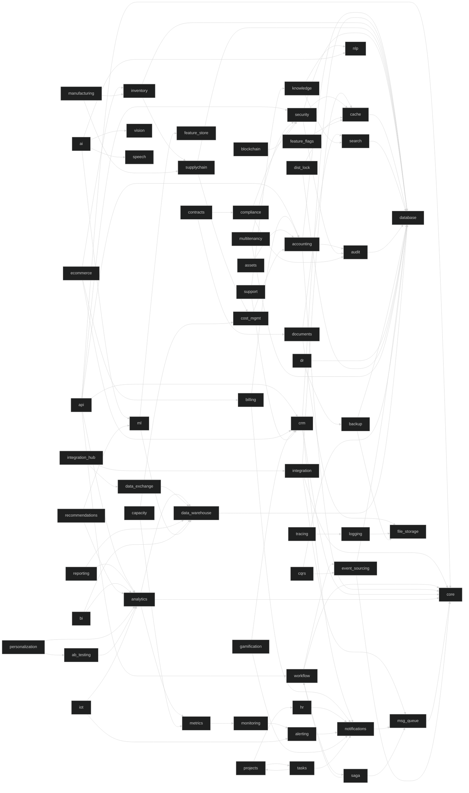

# APEX-OS Business Platform — Module Map

> **Version:** 0.1.0 | **Generated:** 2026-10-02 | **Modules:** 64 | **Tests:** 5,814

---

## 1. Module Hierarchy

```mermaid
%%{init: {'theme':'dark'}}%%
flowchart TD
    subgraph Core["Core Layer"]
        core[core: config, event_bus]
        api[api: FastAPI, routes, middleware]
        security[security: auth, vault, jwt, rbac]
        workflow[workflow: engine]
        integration[integration: gateway, kafka, redis, webhooks]
    end
    subgraph Business["Business Layer"]
        accounting[accounting: ledger, invoices, tax]
        crm[crm: contacts, deals, pipeline]
        analytics[analytics: metrics, dashboards, forecasting]
        billing[billing: subscriptions, payments, dunning]
        ecommerce[ecommerce: catalog, cart, checkout]
        inventory[inventory: stock, valuation, purchase]
        supplychain[supplychain: suppliers, logistics, demand]
        manufacturing[manufacturing: BOM, production, QC]
        projects[projects: engine, models]
        hr[hr: employees, payroll, leave]
        assets[assets: depreciation, maintenance]
        cost_mgmt[cost_management: budget, allocation, tracking]
        contracts[contracts: creation, approval, renewal]
        documents[documents: storage, versioning, search]
        knowledge[knowledge: KB, graph, recommendations]
    end
    subgraph Platform["Platform Layer"]
        cache[cache: memory, redis, invalidation]
        database[database: pool, migrations, transactions]
        file_storage[file_storage: s3, gcp, azure, local]
        msg_queue[message_queue: priority, delayed, dead-letter]
        notifications[notifications: channels, templates]
        search[search: full-text, faceted, autocomplete]
        logging[logging: structured, aggregation, retention]
        metrics[metrics: counter, gauge, histogram]
        monitoring[monitoring: dashboards, alerting]
        tracing[tracing: distributed, sampling, spans]
        alerting[alerting: rules, routing, escalation]
        audit[audit: trail, compliance, retention]
        backup[backup: full, incremental, differential]
        dr[disaster_recovery: failover, replication, testing]
        dist_lock[distributed_lock: redis, database, deadlock]
        multitenancy[multitenancy: isolation, provisioning, billing]
        compliance[compliance: policies, risk, tracking]
        feature_flags[feature_flags: rollout, targeting, analytics]
        event_sourcing[event_sourcing: store, replay, snapshot]
        cqrs[cqrs: commands, queries, handlers]
        saga[saga: orchestrator, compensation, retry]
        data_exchange[data_exchange: csv, excel, json]
        data_warehouse[data_warehouse: etl, catalog, quality]
        reporting[reporting: builder, scheduler, exporter]
        bi[bi: kpi, executive, predictive]
    end
    subgraph AIML["AI / ML Layer"]
        ai[ai: orchestrator, planner, tools]
        ml[ml: training, serving, feature_store]
        nlp[nlp: sentiment, entities, generation]
        vision[vision: detection, ocr, face]
        speech[speech: stt, tts, emotion]
        recommendations[recommendations: collaborative, content, hybrid]
        personalization[personalization: profiles, rules, behavior]
        ab_testing[ab_testing: experiments, traffic, statistics]
        gamification[gamification: points, badges, leaderboards]
        blockchain[blockchain: wallet, contracts, tokens]
        iot[iot: devices, ingestion, control]
        capacity[capacity_planning: forecasting, scaling, cost]
        integration_hub[integration_hub: orchestration, mapping, routing]
        support[support: tickets, chat, sla]
        tasks[tasks: creation, assignment, scheduling]
    end
    Core --> Business
    Core --> Platform
    Core --> AIML
    Business --> Platform
    AIML --> Platform
```

---

## 2. Module Dependencies

---

## 3. Module Descriptions

| Module | Package | Description |
|--------|---------|-------------|
| core | `apex_os_bp.core` | Configuration management and in-process event bus |
| api | `apex_os_bp.api` | FastAPI application, REST routes, middleware (auth, rate-limit) |
| security | `apex_os_bp.security` | Authentication, JWT, RBAC, encryption, vault, rate limiting, audit |
| workflow | `apex_os_bp.workflow` | Workflow engine with step-based orchestration |
| integration | `apex_os_bp.integration` | API gateway, Kafka connector, Redis rate limiter, REST client, webhooks |
| accounting | `apex_os_bp.accounting` | General ledger, invoices, journal entries, tax, reconciliation, recurring |
| crm | `apex_os_bp.crm` | Contacts, deals, pipeline, lead scoring, segmentation, deduplication |
| analytics | `apex_os_bp.analytics` | Metrics tracking, dashboards, forecasting, funnels, cohorts, anomaly detection |
| billing | `apex_os_bp.billing` | Subscriptions, invoicing, payments, dunning, usage-based billing |
| ecommerce | `apex_os_bp.ecommerce` | Product catalog, cart, checkout, orders, payment processing |
| inventory | `apex_os_bp.inventory` | Stock management, valuation, purchase orders, sales orders |
| supplychain | `apex_os_bp.supplychain` | Suppliers, logistics, demand forecasting, purchase orders, warehouse |
| manufacturing | `apex_os_bp.manufacturing` | BOM, production planning, quality control, shop floor, maintenance |
| projects | `apex_os_bp.projects` | Project engine and data models |
| hr | `apex_os_bp.hr` | Employees, leave, payroll, performance, recruitment |
| assets | `apex_os_bp.assets` | Asset tracking, depreciation, disposal, maintenance, valuation |
| cost_management | `apex_os_bp.cost_management` | Budgeting, cost allocation, tracking, forecasting, optimization |
| contracts | `apex_os_bp.contracts` | Contract creation, approval, compliance, renewal, templates |
| documents | `apex_os_bp.documents` | Document storage, versioning, search, sharing, upload |
| knowledge | `apex_os_bp.knowledge` | Knowledge base, document search, expert finder, knowledge graph |
| cache | `apex_os_bp.cache` | In-memory and Redis caching, invalidation, warming, statistics |
| database | `apex_os_bp.database` | Connection pooling, migrations, query builder, transactions |
| file_storage | `apex_os_bp.file_storage` | Multi-cloud file storage (S3, GCP, Azure, local), versioning |
| message_queue | `apex_os_bp.message_queue` | Priority, delayed, dead-letter queues, batching, monitoring |
| notifications | `apex_os_bp.notifications` | Multi-channel notifications, templates, delivery management |
| search | `apex_os_bp.search` | Full-text search, faceted search, autocomplete, suggestions, analytics |
| logging | `apex_os_bp.logging` | Structured logging, aggregation, search, retention, analytics |
| metrics | `apex_os_bp.metrics` | Counter, gauge, histogram, timer metric types |
| monitoring | `apex_os_bp.monitoring` | Dashboards, alerting, metrics aggregation, log aggregation |
| tracing | `apex_os_bp.tracing` | Distributed tracing, sampling, span management, visualization |
| alerting | `apex_os_bp.alerting` | Alert rules, routing, escalation, suppression, history |
| audit | `apex_os_bp.audit` | Audit trail, compliance logging, retention, search |
| backup | `apex_os_bp.backup` | Full, incremental, differential backups, restoration, verification |
| disaster_recovery | `apex_os_bp.disaster_recovery` | DR planning, failover, replication, monitoring, testing |
| distributed_lock | `apex_os_bp.distributed_lock` | Redis and database distributed locks, deadlock detection, renewal |
| multitenancy | `apex_os_bp.multitenancy` | Tenant isolation, provisioning, billing, security, monitoring |
| compliance | `apex_os_bp.compliance` | Compliance policies, risk assessment, tracking, reporting |
| feature_flags | `apex_os_bp.feature_flags` | Feature rollout, targeting, dependencies, analytics |
| event_sourcing | `apex_os_bp.event_sourcing` | Event store, replay, projections, snapshots, versioning |
| cqrs | `apex_os_bp.cqrs` | Command/query separation, handlers, event store, read/write models |
| saga | `apex_os_bp.saga` | Saga orchestration, compensation, retry, state machine, timeout |
| data_exchange | `apex_os_bp.data_exchange` | CSV, Excel, JSON data import/export |
| data_warehouse | `apex_os_bp.data_warehouse` | ETL, data catalog, modeling, quality, governance |
| reporting | `apex_os_bp.reporting` | Report builder, scheduler, exporter, templates, distributor |
| bi | `apex_os_bp.bi` | KPI tracking, executive dashboards, predictive analytics, visualization |
| ai | `apex_os_bp.ai` | AI orchestrator, planner, reflection, tools, memory |
| ml | `apex_os_bp.ml` | ML training, serving, feature store, monitoring, A/B testing |
| nlp | `apex_os_bp.nlp` | Sentiment analysis, entity extraction, text generation, translation |
| vision | `apex_os_bp.vision` | Object detection, OCR, face recognition, image generation |
| speech | `apex_os_bp.speech` | STT, TTS, emotion detection, speaker ID, voice cloning |
| recommendations | `apex_os_bp.recommendations` | Collaborative filtering, content-based, hybrid, real-time |
| personalization | `apex_os_bp.personalization` | User profiles, behavior tracking, rules, analytics |
| ab_testing | `apex_os_bp.ab_testing` | Experiments, traffic splitting, statistics, auto-optimization |
| gamification | `apex_os_bp.gamification` | Points, badges, challenges, leaderboards, rewards |
| blockchain | `apex_os_bp.blockchain` | Wallet, smart contracts, tokens, transactions, consensus |
| iot | `apex_os_bp.iot` | Device management, data ingestion, control, analytics, alerts |
| capacity_planning | `apex_os_bp.capacity_planning` | Forecasting, modeling, scaling, cost optimization, alerts |
| integration_hub | `apex_os_bp.integration_hub` | API orchestration, data mapping, event routing, error handling |
| support | `apex_os_bp.support` | Tickets, live chat, knowledge base, satisfaction, SLA |
| tasks | `apex_os_bp.tasks` | Task creation, assignment, scheduling, tracking, notifications |

---

## 4. Module API Endpoints

| Module | Endpoint | Methods | Description |
|--------|----------|---------|-------------|
| Health | `/api/v1/health` | GET | Health check |
| Auth | `/api/v1/auth/login` | POST | User login |
| Auth | `/api/v1/auth/register` | POST | User registration |
| Auth | `/api/v1/auth/logout` | POST | User logout |
| Auth | `/api/v1/auth/me` | GET | Current user info |
| CRM | `/api/v1/crm/contacts` | GET, POST | List/create contacts |
| CRM | `/api/v1/crm/contacts/{id}` | GET, PUT, DELETE | Contact CRUD |
| CRM | `/api/v1/crm/deals` | GET, POST | List/create deals |
| CRM | `/api/v1/crm/deals/{id}` | GET, PUT, DELETE | Deal CRUD |
| CRM | `/api/v1/crm/pipeline` | GET | Pipeline report |
| Accounting | `/api/v1/accounting/accounts` | GET, POST | List/create accounts |
| Accounting | `/api/v1/accounting/accounts/{id}` | GET, PUT, DELETE | Account CRUD |
| Accounting | `/api/v1/accounting/invoices` | GET, POST | List/create invoices |
| Accounting | `/api/v1/accounting/invoices/{id}` | GET | Get invoice |
| Accounting | `/api/v1/accounting/invoices/{id}/post` | POST | Post invoice to ledger |
| Accounting | `/api/v1/accounting/journal-entries` | GET, POST | List/create journal entries |
| Accounting | `/api/v1/accounting/trial-balance` | GET | Trial balance |
| Analytics | `/api/v1/analytics/metrics` | GET, POST | List/track metrics |
| Analytics | `/api/v1/analytics/metrics/{name}` | GET | Metric history |
| Analytics | `/api/v1/analytics/report` | GET | Analytics report |
| Analytics | `/api/v1/analytics/dashboards` | GET, POST | List/create dashboards |
| Analytics | `/api/v1/analytics/dashboards/{name}` | GET | Get dashboard |
| Analytics | `/api/v1/analytics/dashboards/{name}/metrics` | POST | Add metric to dashboard |
| Workflow | `/api/v1/workflows` | GET, POST | List/create workflows |
| Workflow | `/api/v1/workflows/{name}` | GET, DELETE | Get/delete workflow |
| Workflow | `/api/v1/workflows/{name}/execute` | POST | Execute workflow |
| Workflow | `/api/v1/workflows/{name}/steps` | POST | Add step to workflow |

---

## 5. Module Test Coverage

| Module | Test File(s) | Tests |
|--------|-------------|-------|
| ab_testing | test_ab_testing.py | 139 |
| accounting | test_accounting.py, test_accounting_deep.py | 190 |
| ai | test_ai.py | 83 |
| alerting | test_alerting.py | 136 |
| analytics | test_analytics.py, test_analytics_deep.py | 106 |
| api | test_api.py | 73 |
| assets | test_assets.py | 95 |
| audit | test_audit.py | 65 |
| backup | test_backup.py | 48 |
| bi | test_bi.py | 84 |
| billing | test_billing.py | 97 |
| blockchain | test_blockchain.py | 138 |
| cache | test_cache.py | 81 |
| capacity_planning | test_capacity_planning.py | 60 |
| compliance | test_compliance.py | 129 |
| contracts | test_contracts.py | 99 |
| core | test_core_config.py, test_core_event_bus.py | 18 |
| cost_management | test_cost_management.py | 131 |
| cqrs | test_cqrs.py | 101 |
| crm | test_crm.py, test_crm_deep.py | 82 |
| data_exchange | test_data_exchange.py | 80 |
| data_warehouse | test_data_warehouse.py | 96 |
| database | test_database.py | 95 |
| disaster_recovery | test_disaster_recovery.py | 75 |
| distributed_lock | test_distributed_lock.py | 93 |
| documents | test_documents.py | 91 |
| ecommerce | test_ecommerce.py | 99 |
| event_sourcing | test_event_sourcing.py | 43 |
| feature_flags | test_feature_flags.py | 82 |
| file_storage | test_file_storage.py | 168 |
| gamification | test_gamification.py | 151 |
| hr | test_hr.py | 80 |
| integration | test_integration.py, test_integration_deep.py | 159 |
| integration_hub | test_integration_hub.py | 101 |
| inventory | test_inventory.py | 72 |
| iot | test_iot.py | 136 |
| knowledge | test_knowledge.py | 91 |
| logging | test_logging.py | 88 |
| manufacturing | test_manufacturing.py | 141 |
| marketing | test_marketing.py | 79 |
| message_queue | test_message_queue.py | 99 |
| metrics | test_metrics.py | 74 |
| ml | test_ml.py | 71 |
| monitoring | test_monitoring.py | 80 |
| multitenancy | test_multitenancy.py | 123 |
| nlp | test_nlp.py | 105 |
| notifications | test_notifications.py | 67 |
| personalization | test_personalization.py | 53 |
| projects | test_projects.py | 108 |
| recommendations | test_recommendations.py | 91 |
| reporting | test_reporting.py | 93 |
| saga | test_saga.py | 67 |
| search | test_search.py, test_search_analytics.py | 26 |
| security | test_security.py, test_security_deep.py | 64 |
| speech | test_speech.py | 120 |
| supplychain | test_supplychain.py | 255 |
| support | test_support.py | 89 |
| tasks | test_tasks.py | 58 |
| tracing | test_tracing.py | 101 |
| vision | test_vision.py | 68 |
| workflow | test_workflow.py, test_workflow_deep.py | 27 |
| **Total** | **72 files** | **5,814** |
