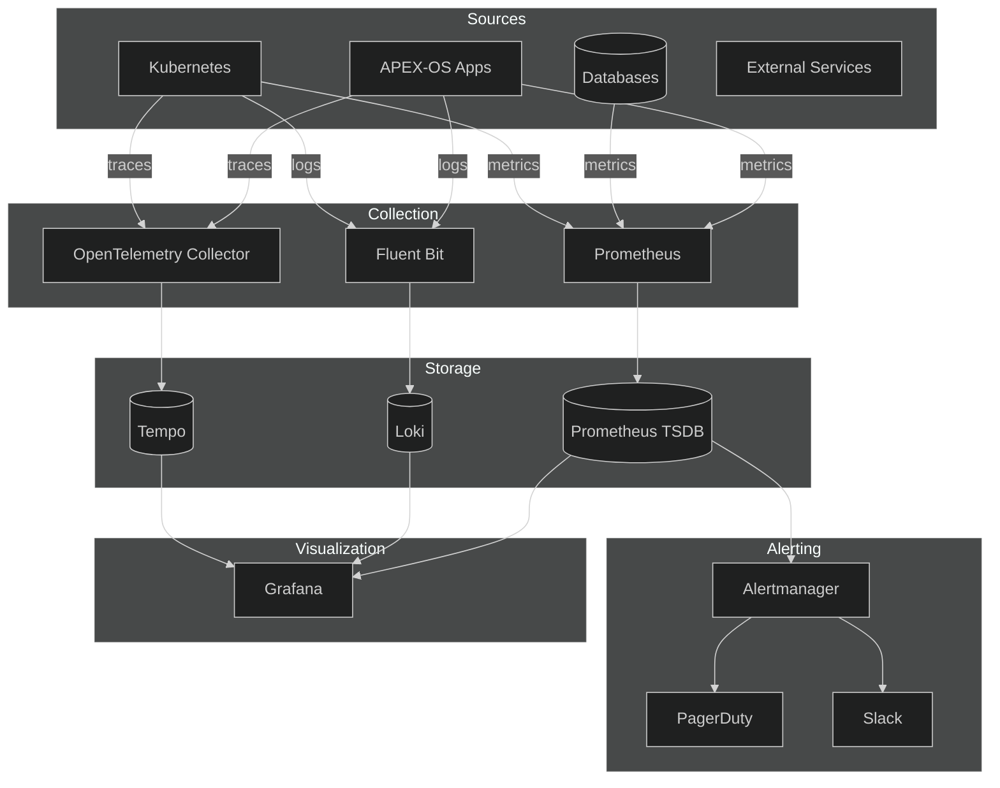
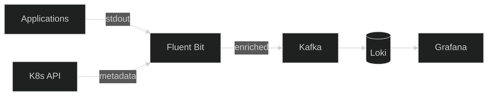

# APEX-OS Monitoring

## 1. Monitoring Architecture



## 2. Metrics Collection

| Source | Tool | Interval | Retention |
|--------|------|----------|-----------|
| Application | Prometheus client SDK | 15s | 15 days |
| Kubernetes | kube-state-metrics | 30s | 15 days |
| Databases | postgres_exporter | 15s | 15 days |
| External | Blackbox exporter | 30s | 15 days |
| Traces | OpenTelemetry SDK | sampled | 7 days |

**Key metric families:**
- `http_requests_total` — request rate, errors, duration (RED)
- `process_cpu_seconds_total` — CPU usage
- `process_resident_memory_bytes` — memory usage
- `db_connections_active` — connection pool saturation
- `queue_messages_ready` — backlog depth
- `grpc_server_handled_total` — RPC metrics

## 3. Alerting Strategy

### Severity Levels

| Level | Condition | Notification | Response |
|-------|-----------|--------------|----------|
| P1 | Service down > 1 min | PagerDuty + Slack | Immediate |
| P2 | Error rate > 5% for 5 min | PagerDuty | 15 min |
| P3 | Latency p99 > 2s for 10 min | Slack | 1 hour |
| P4 | Disk > 80% | Slack | Next business day |

### Alert Rules (Prometheus)

```yaml
groups:
  - name: apex-os
    rules:
      - alert: HighErrorRate
        expr: rate(http_requests_total{status=~"5.."}[5m]) / rate(http_requests_total[5m]) > 0.05
        for: 5m
        labels:
          severity: P2
        annotations:
          summary: "High error rate on {{ $labels.service }}"

      - alert: HighLatency
        expr: histogram_quantile(0.99, rate(http_request_duration_seconds_bucket[5m])) > 2
        for: 10m
        labels:
          severity: P3

      - alert: PodCrashLooping
        expr: rate(kube_pod_container_status_restarts_total[15m]) > 0
        for: 5m
        labels:
          severity: P1
```

### Routing

- P1/P2 → PagerDuty (on-call rotation)
- P3 → Slack `#alerts` channel
- P4 → Slack `#ops` channel
- Grouping by `service` and `severity`
- Inhibition: P1 suppresses P2/P3 for same service

## 4. Dashboard Strategy

### Dashboard Hierarchy

| Dashboard | Audience | Refresh | Time Range |
|-----------|----------|---------|------------|
| Executive Overview | Leadership | 1m | 24h |
| Service Health | SRE / On-call | 10s | 1h |
| Service Detail | Developers | 10s | 6h |
| Infrastructure | SRE | 30s | 24h |
| Business Metrics | Product | 1m | 7d |

### Key Panels

**Service Health (per service):**
- Request rate (req/s)
- Error rate (%)
- p50/p95/p99 latency
- Saturation (CPU, memory, connections)

**Infrastructure:**
- Node CPU/memory/disk
- Pod restarts
- Network I/O
- DB connection pools

**Business:**
- Active users
- Transaction volume
- Revenue per minute
- Feature adoption

### Design Principles
- One dashboard per audience — no mixed views
- Use variables for environment/service filtering
- Annotate deployments via Grafana annotations
- Color: green → yellow → red thresholds
- Every panel has a description

## 5. Log Aggregation

### Pipeline



### Log Format (JSON)

```json
{
  "ts": "2026-10-02T12:00:00Z",
  "level": "info",
  "service": "payment-svc",
  "trace_id": "abc123",
  "span_id": "def456",
  "msg": "payment processed",
  "duration_ms": 142,
  "user_id": "u_789"
}
```

### Retention

| Tier | Retention | Storage |
|------|-----------|---------|
| Hot | 7 days | SSD |
| Warm | 30 days | HDD |
| Cold | 90 days | Object storage |

### Labeling Strategy

- **Index labels** (low cardinality): `service`, `namespace`, `level`, `env`
- **Search labels** (high cardinality): `trace_id`, `user_id`, `request_id`
- Never index full log lines — use structured fields

### Query Examples

```logql
# Errors in payment service
{service="payment-svc", level="error"}

# Trace lookup
{service="order-svc"} |= "abc123"

# Latency outliers
{service="api-gateway"} | json | duration_ms > 2000
```
