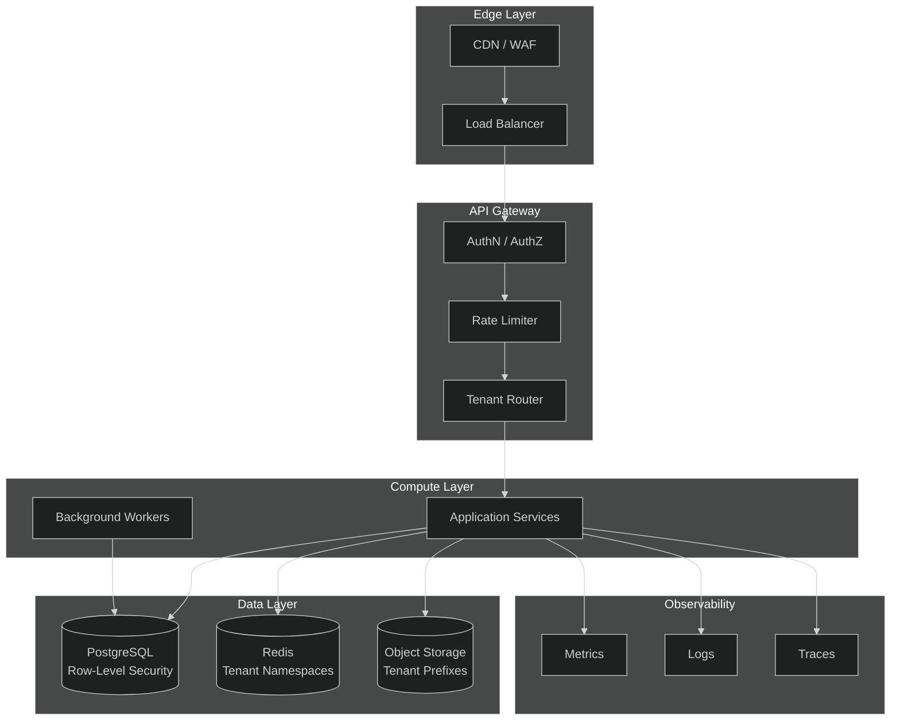
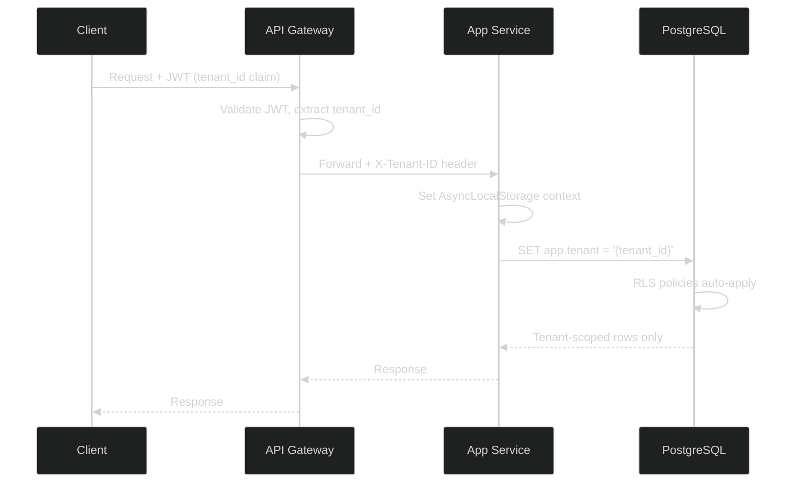
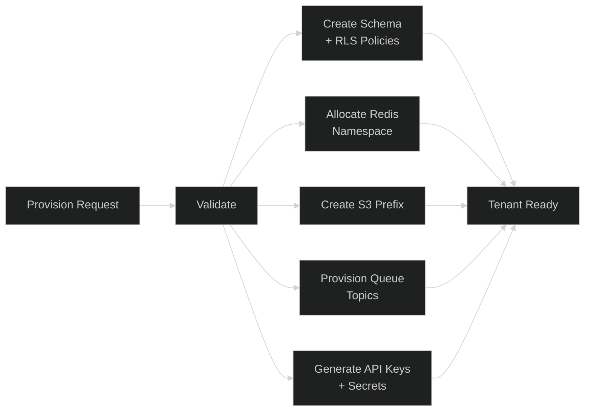
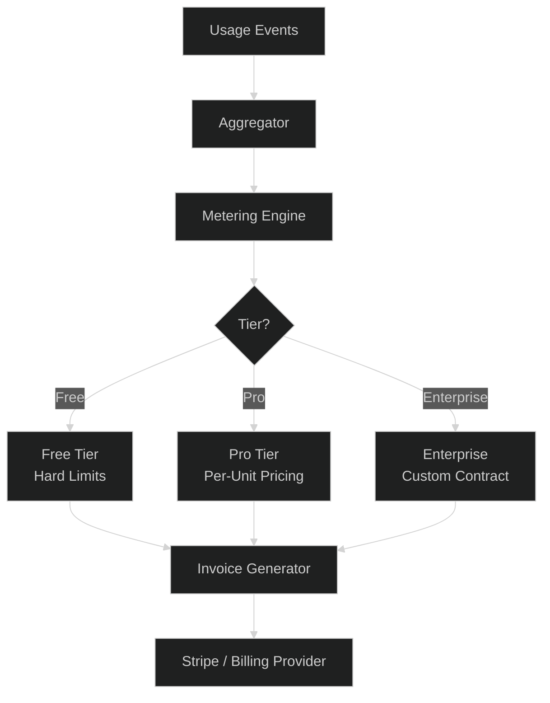
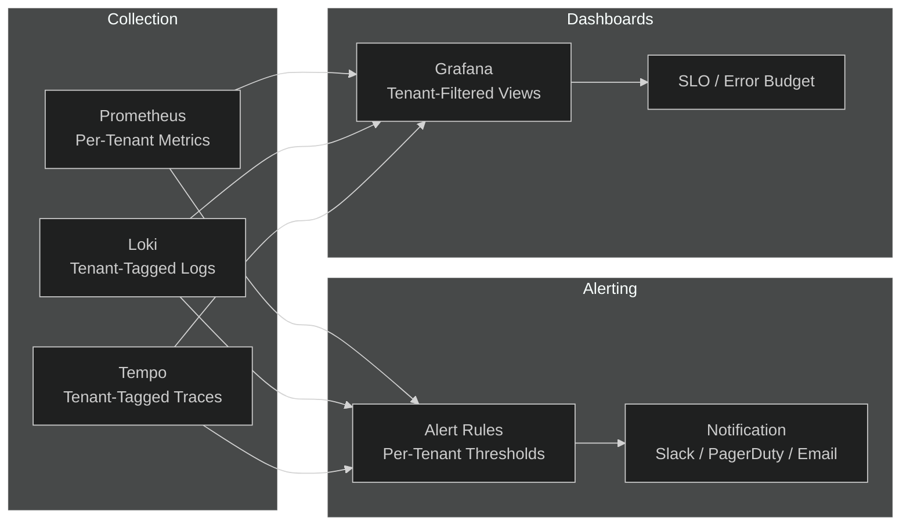

# Multi-Tenancy

## 1. Architecture

## 2. Tenant Isolation

| Layer | Strategy | Details |
|-------|----------|---------|
| **Database** | Shared schema, Row-Level Security | `tenant_id` column on every table; RLS policies enforce `USING (tenant_id = current_setting('app.tenant')::uuid)` |
| **Cache** | Key namespacing | `:{tenant_id}:` prefix on all Redis keys; separate Redis DB per tier |
| **Storage** | Bucket prefixing | `s3://bucket/{tenant_id}/{object}`; IAM policies scoped per prefix |
| **Queue** | Tenant-tagged messages | Message metadata carries `tenant_id`; workers filter by tenant |
| **Compute** | Shared pool, tenant context | Request context propagates `tenant_id` via async local storage |

### Tenant Context Propagation

## 3. Tenant Provisioning

### Provisioning Steps

1. **Validate** — check name uniqueness, tier eligibility, quota limits
2. **Database** — create tenant record, apply RLS policies, run migrations
3. **Cache** — allocate Redis namespace, set eviction policy
4. **Storage** — create S3 prefix, apply lifecycle policy
5. **Queue** — provision tenant-tagged topics/queues
6. **Secrets** — generate API keys, webhook secrets, encrypt at rest
7. **Notify** — emit `tenant.provisioned` event for downstream systems

### Deprovisioning

- Soft-delete: mark `deleted_at`, revoke API keys, drain queues
- Data retention: 30-day grace period, then purge per policy
- Hard-delete: drop RLS policies, remove S3 prefix, flush Redis namespace

## 4. Tenant Billing

### Billing Model

| Tier | Pricing | Limits | Overage |
|------|---------|--------|---------|
| **Free** | $0 | 1K API calls/day, 1 GB storage, 3 users | Hard stop |
| **Pro** | $49/mo base + usage | 100K API calls/day, 50 GB storage, 25 users | $0.001/1K calls, $0.10/GB |
| **Enterprise** | Custom | Unlimited (contractual) | Negotiated |

### Metering Dimensions

- API requests (per endpoint, weighted)
- Storage (GB-hours)
- Compute (worker minutes)
- Data transfer (egress GB)
- Active users (seats)

### Billing Flow

1. **Collect** — usage events streamed to aggregator (Kafka)
2. **Aggregate** — hourly rollups per tenant per dimension
3. **Rate** — apply tier pricing, compute overage
4. **Invoice** — generate invoice, apply credits/discounts
5. **Charge** — submit to Stripe; retry with exponential backoff
6. **Notify** — email receipt; alert on payment failure

## 5. Tenant Monitoring

### Per-Tenant Metrics

| Category | Metrics | Labels |
|----------|---------|--------|
| **Performance** | p50/p95/p99 latency, throughput, error rate | `tenant_id`, `endpoint`, `method` |
| **Usage** | API calls, storage used, active users, queue depth | `tenant_id`, `dimension` |
| **Health** | DB connections, cache hit ratio, worker lag | `tenant_id`, `component` |
| **Billing** | MRR, overage, credit balance | `tenant_id`, `tier` |

### Tenant Health Dashboard

- **Status page** — per-tenant uptime, incident history
- **Quota meters** — real-time usage vs. limits with alert thresholds
- **Cost breakdown** — spend by dimension, trend, forecast
- **Audit log** — tenant-scoped admin actions, API key usage

### Alerting Rules

| Condition | Severity | Action |
|-----------|----------|--------|
| Error rate > 5% for 5 min | Critical | Page on-call + tenant admin |
| p99 latency > 2× SLO for 10 min | Warning | Slack alert |
| Quota > 80% | Info | Email tenant admin |
| Quota > 95% | Warning | Email + Slack |
| Payment failed | Critical | Email + suspend after 3 retries |
| Unusual spike (> 5× baseline) | Warning | Flag for review |
