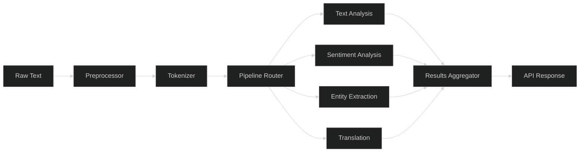
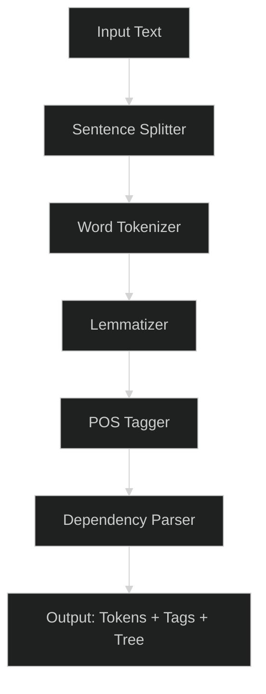
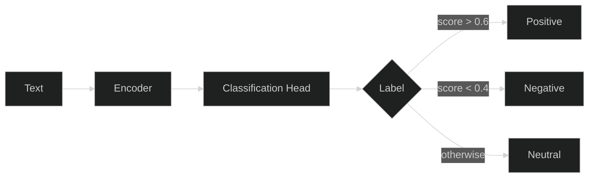
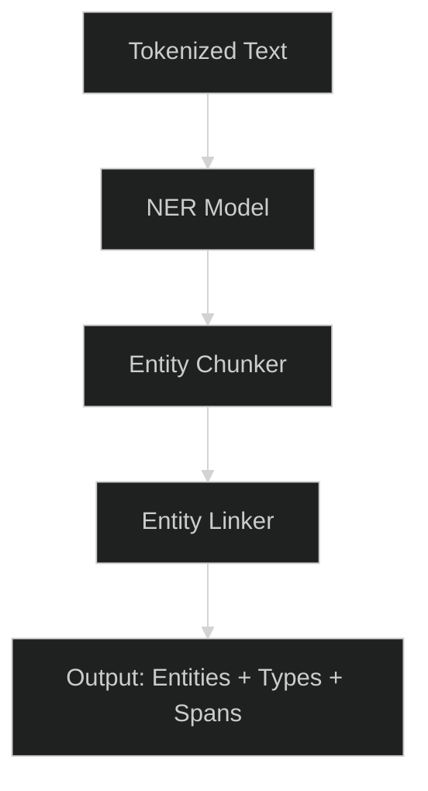
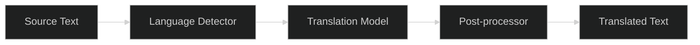

# NLP Module

## 1. Architecture

## 2. Text Analysis

Tokenization, lemmatization, POS tagging, and dependency parsing.

| Stage | Output |
|-------|--------|
| Sentence Split | `["Hello world.", "How are you?"]` |
| Tokenize | `["Hello", "world", "."]` |
| Lemmatize | `["hello", "world", "."]` |
| POS Tag | `[INTJ, NOUN, PUNCT]` |
| Parse | Dependency tree |

## 3. Sentiment Analysis

Classifies text polarity and intensity using a fine-tuned transformer.

- **Model**: `distilbert-base-uncased-emotion`
- **Labels**: positive, negative, neutral
- **Output**: `{ label, score, confidence }`

## 4. Entity Extraction

Named Entity Recognition (NER) for persons, organizations, locations, and custom domain entities.

| Entity Type | Example |
|-------------|---------|
| PER | "Alice Smith" |
| ORG | "Acme Corp" |
| LOC | "Berlin" |
| MISC | "Product X" |

## 5. Translation

Neural machine translation with language detection and batch support.

- **Engine**: Helsinki-NLP OPUS-MT
- **Languages**: 40+ language pairs
- **Batch**: Up to 32 segments per request
- **Fallback**: Pivot via English for unsupported pairs
