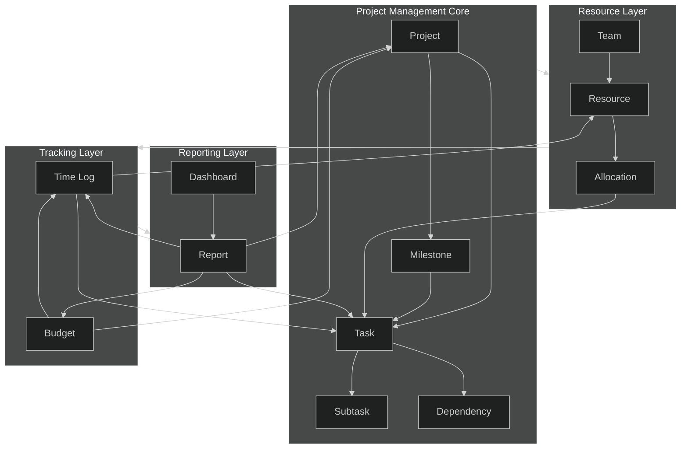
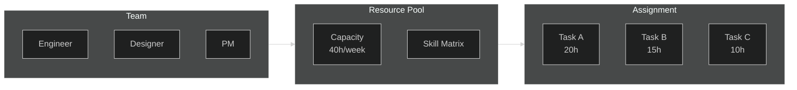

# Projects

## Architecture

## Task Management

| Field | Type | Description |
|-------|------|-------------|
| id | UUID | Unique identifier |
| title | string | Short task name |
| status | enum | `todo` / `in_progress` / `review` / `done` |
| priority | enum | `low` / `medium` / `high` / `critical` |
| assignee | FK → Resource | Owner of the task |
| project | FK → Project | Parent project |
| estimate | hours | Planned effort |
| due_date | date | Deadline |
| tags | string[] | Labels for filtering |

**Workflow:** `todo → in_progress → review → done`

- Tasks support subtrees (parent/child) for breakdown
- Dependencies block downstream tasks until resolved
- Milestones group tasks by deliverable deadlines

## Resource Allocation

- Each resource has a **capacity** (hours/week) and **skill tags**
- Allocation = sum of assigned task estimates per resource
- Over-allocation flagged when assigned > capacity
- Rebalancing moves tasks from overloaded to underloaded resources

## Time Tracking

| Field | Type | Description |
|-------|------|-------------|
| id | UUID | Log entry ID |
| task | FK → Task | Related task |
| resource | FK → Resource | Who logged time |
| date | date | Day of work |
| hours | decimal | Hours spent |
| billable | boolean | Billable or internal |
| description | text | What was done |

- Time logged rolls up to task → project → budget
- Budget burn = sum(logged hours × resource rate)
- Timesheets are weekly views filtered by resource

## Reporting

**Standard reports:**

- **Burndown** — remaining work vs. ideal trajectory
- **Velocity** — completed story points per sprint
- **Utilization** — logged hours / capacity per resource
- **Budget vs. Actual** — planned spend vs. logged cost
- **Gantt** — timeline view of tasks and milestones
