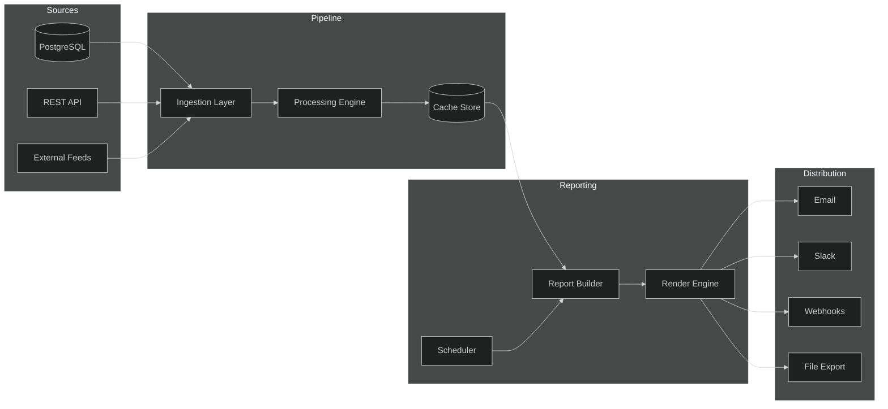
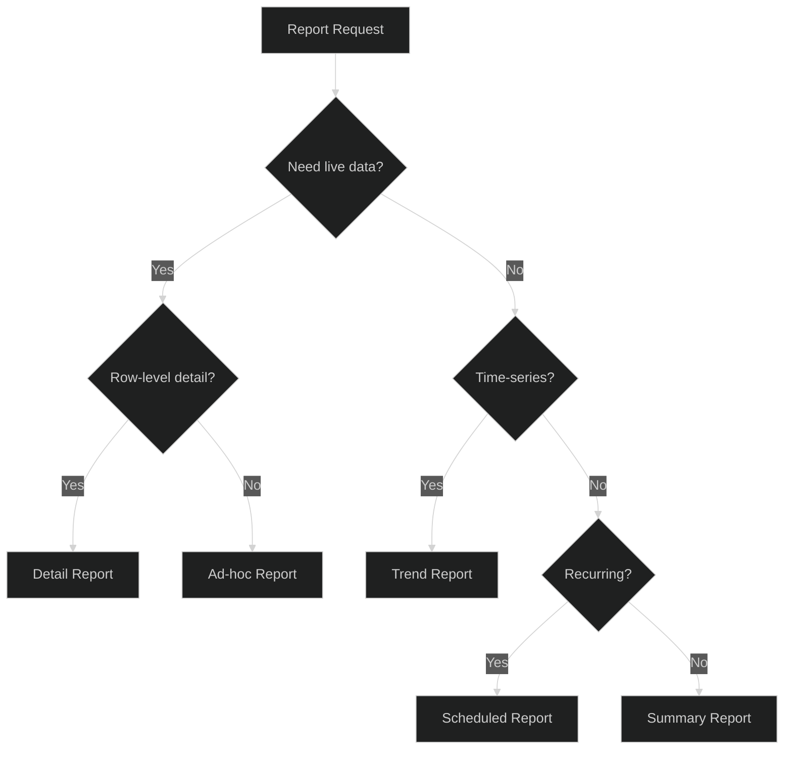
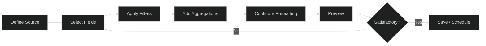
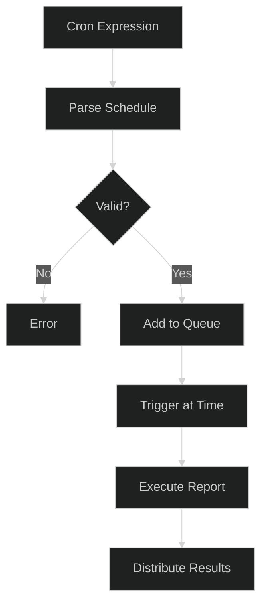
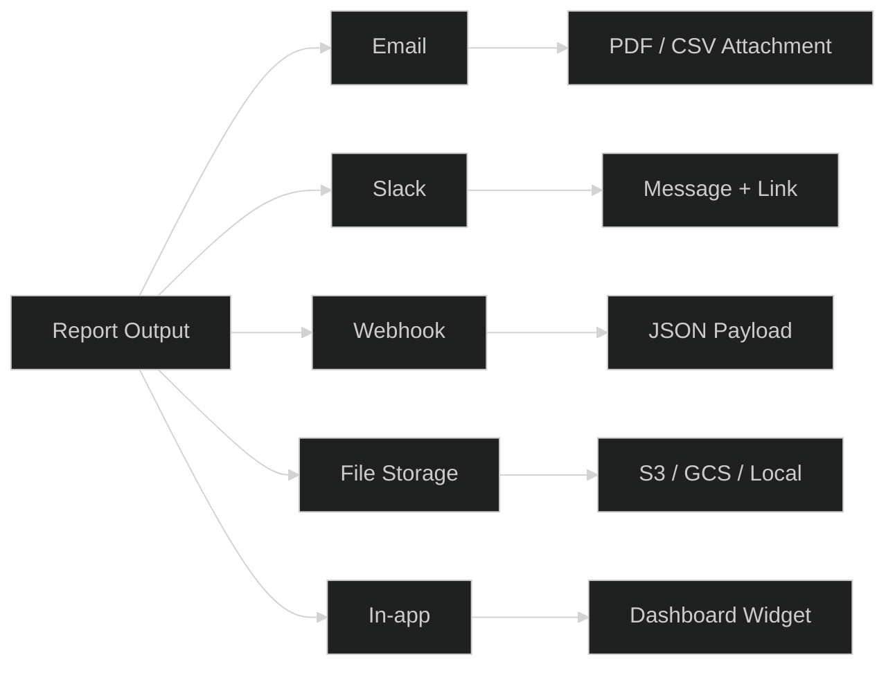

# Reporting

## 1. Reporting Architecture



## 2. Report Types

| Type | Description | Data Source | Refresh |
|------|-------------|-------------|---------|
| **Summary** | High-level KPIs and aggregates | Cached | Hourly |
| **Detail** | Row-level transactional data | Live DB | On-demand |
| **Trend** | Time-series with comparisons | Cached | Daily |
| **Ad-hoc** | User-defined queries | Live DB | On-demand |
| **Scheduled** | Recurring distribution reports | Cached | Cron-based |
| **Real-time** | Live dashboards and alerts | Streaming | Continuous |

### Report Type Selection



## 3. Report Builder

The Report Builder provides a programmatic and UI-driven interface for constructing reports.

### Builder Pipeline



### Builder API

```python
from apex.reporting import ReportBuilder

report = (
    ReportBuilder()
    .source("transactions")
    .fields(["id", "amount", "date", "status"])
    .filter(status="completed", date__gte="2026-01-01")
    .aggregate(total="sum(amount)", count="count(id)")
    .format("pdf")
    .schedule(cron="0 8 * * *")
    .distribute(["email:team@example.com", "slack:#reports"])
    .build()
)
```

### Builder Components

- **Source Selector** — Choose data source (table, view, API endpoint)
- **Field Picker** — Select and alias columns
- **Filter Engine** — Apply WHERE clauses with AND/OR logic
- **Aggregation** — SUM, COUNT, AVG, MIN, MAX, GROUP BY
- **Formatting** — Column widths, headers, number formats
- **Visualization** — Charts, tables, pivot grids

## 4. Report Scheduling

### Schedule Configuration



### Schedule Types

| Type | Cron Pattern | Use Case |
|------|-------------|----------|
| Hourly | `0 * * * *` | Operational dashboards |
| Daily | `0 8 * * *` | Morning summaries |
| Weekly | `0 8 * * 1` | Monday week-in-review |
| Monthly | `0 8 1 * *` | Month-end reports |
| Custom | User-defined | Special schedules |

### Scheduler Behavior

- **Timezone-aware** — All schedules respect the organization timezone
- **Retry logic** — Failed reports retry up to 3 times with exponential backoff
- **Concurrency limit** — Max 10 concurrent report executions
- **Missed run handling** — Catch-up execution for missed schedules within 24h

## 5. Report Distribution

### Distribution Channels



### Distribution Configuration

```yaml
distributions:
  - type: email
    recipients: ["team@example.com"]
    format: pdf
    subject: "Daily Report - {date}"

  - type: slack
    channel: "#reports"
    format: link
    message: "Report ready: {report_url}"

  - type: webhook
    url: "https://api.example.com/reports"
    format: json
    headers:
      Authorization: "Bearer ${WEBHOOK_TOKEN}"

  - type: s3
    bucket: "reports-bucket"
    prefix: "daily/{date}/"
    format: csv
```

### Delivery Guarantees

- **At-least-once delivery** — Failed deliveries are retried
- **Idempotency** — Duplicate deliveries are suppressed via dedup keys
- **Access control** — Recipients only see reports they are authorized for
- **Audit trail** — All distribution events are logged with timestamps and status
