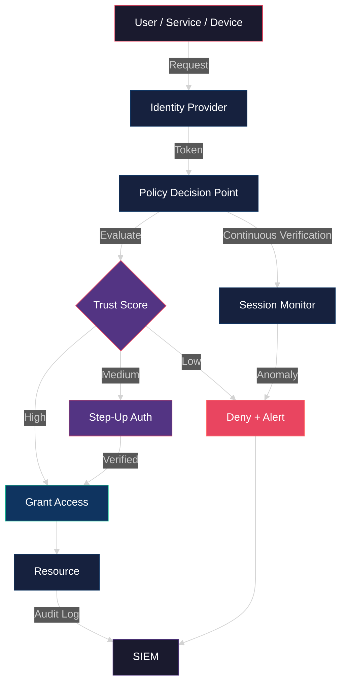
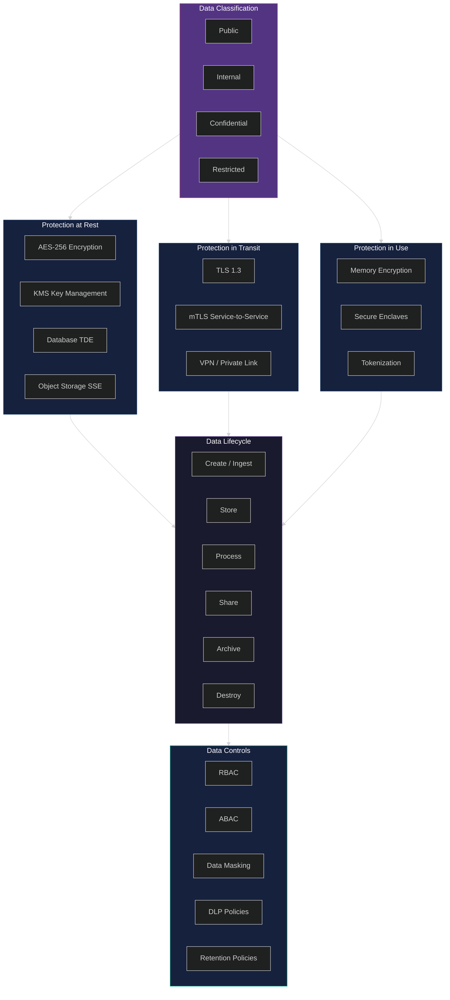
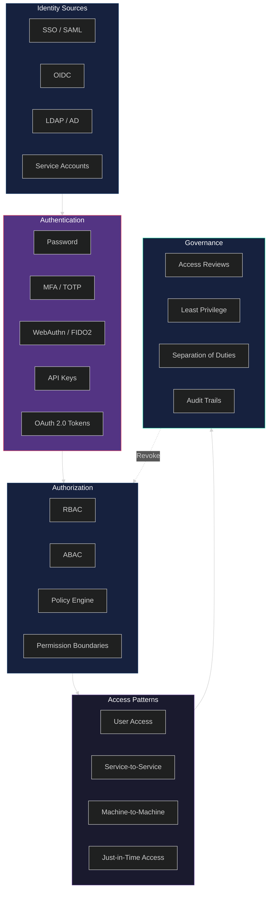

# APEX-OS Security Architecture

This document describes the security architecture of the APEX-OS Business Platform. It covers the zero trust model, defense-in-depth layers, data protection strategy, identity and access management, and security monitoring.

---

## 1. Zero Trust Architecture

Zero trust means "never trust, always verify." Every request — whether from inside or outside the network — is authenticated, authorized, and encrypted before access is granted.

**Key principles:**
- **No implicit trust** — network location does not grant access.
- **Least privilege** — users and services get the minimum permissions needed.
- **Continuous verification** — trust is re-evaluated throughout the session.
- **Assume breach** — design as if the perimeter is already compromised.

---

## 2. Defense in Depth

Multiple overlapping security layers protect the platform. If one layer fails, others still provide protection.

```mermaid
%%{init: {'theme': 'dark'}}%%
flowchart LR
    subgraph External["External Threats"]
        T1[Malware]
        T2[DDoS]
        T3[Phishing]
        T4[Insider Threat]
    end

    subgraph Layer1["Layer 1: Perimeter"]
        L1A[WAF]
        L1B[DDoS Protection]
        L1C[CDN]
    end

    subgraph Layer2["Layer 2: Network"]
        L2A[VPC Isolation]
        L2B[Security Groups]
        L2C[Network ACLs]
    end

    subgraph Layer3["Layer 3: Compute"]
        L3A[Hardened AMIs]
        L3B[Container Security]
        L3C[Patch Management]
    end

    subgraph Layer4["Layer 4: Application"]
        L4A[Input Validation]
        L4B[AuthN / AuthZ]
        L4C[Rate Limiting]
    end

    subgraph Layer5["Layer 5: Data"]
        L5A[Encryption at Rest]
        L5B[Encryption in Transit]
        L5C[Backup & Recovery]
    end

    subgraph Layer6["Layer 6: Monitoring"]
        L6A[SIEM]
        L6B[IDS/IPS]
        L6C[Log Aggregation]
    end

    T1 & T2 & T3 & T4 --> Layer1
    Layer1 --> Layer2
    Layer2 --> Layer3
    Layer3 --> Layer4
    Layer4 --> Layer5
    Layer5 --> Layer6
    Layer6 -.->|Alert| Layer1

    style External fill:#e94560,stroke:#ff6b6b,color:#fff
    style Layer1 fill:#16213e,stroke:#0f3460,color:#fff
    style Layer2 fill:#16213e,stroke:#0f3460,color:#fff
    style Layer3 fill:#16213e,stroke:#0f3460,color:#fff
    style Layer4 fill:#16213e,stroke:#0f3460,color:#fff
    style Layer5 fill:#16213e,stroke:#0f3460,color:#fff
    style Layer6 fill:#16213e,stroke:#0f3460,color:#fff
```

**Layers:**
1. **Perimeter** — WAF, DDoS mitigation, CDN edge filtering.
2. **Network** — VPC isolation, security groups, network ACLs, micro-segmentation.
3. **Compute** — hardened images, container scanning, automated patching.
4. **Application** — input validation, authentication/authorization, rate limiting.
5. **Data** — encryption at rest and in transit, backup and disaster recovery.
6. **Monitoring** — SIEM, intrusion detection, centralized logging.

---

## 3. Data Protection

Data is classified by sensitivity and protected accordingly throughout its lifecycle.

**Data protection measures:**
- **Encryption at rest** — AES-256 for databases, object storage, and backups.
- **Encryption in transit** — TLS 1.3 for external traffic, mTLS for internal service communication.
- **Key management** — centralized KMS with automatic key rotation.
- **Data loss prevention** — DLP policies scan for sensitive data in motion and at rest.
- **Retention & disposal** — automated retention policies with secure deletion.

---

## 4. Identity and Access Management

IAM ensures that the right entities have the right access to the right resources at the right time.

**IAM capabilities:**
- **Authentication** — SSO via SAML/OIDC, MFA with TOTP and WebAuthn/FIDO2, OAuth 2.0 for API access.
- **Authorization** — role-based (RBAC) and attribute-based (ABAC) access control with a centralized policy engine.
- **Access patterns** — user access, service-to-service (mTLS), machine-to-machine (API keys), and just-in-time privileged access.
- **Governance** — periodic access reviews, least privilege enforcement, separation of duties, and comprehensive audit trails.

---

## 5. Security Monitoring

Continuous monitoring detects, alerts, and responds to security events across the platform.

```mermaid
%%{init: {'theme': 'dark'}}%%
flowchart LR
    subgraph Sources["Log & Event Sources"]
        S1[Application Logs]
        S2[Infrastructure Logs]
        S3[Network Flow Logs]
        S4[Cloud Audit Logs]
        S5[Identity Logs]
        S6[Threat Intel Feeds]
    end

    subgraph Collection["Collection & Pipeline"]
        C1[Log Shipper]
        C2[Message Queue]
        C3[Stream Processor]
        C4[Enrichment]
    end

    subgraph Analytics["Detection & Analytics"]
        D1[Rule-Based Detection]
        D2[Anomaly Detection]
        D3[UEBA]
        D4[Threat Correlation]
    end

    subgraph Response["Response & Automation"]
        R1[Alerting]
        R2[SOAR Playbooks]
        R3[Auto-Remediation]
        R4[Incident Ticketing]
    end

    subgraph Reporting["Reporting & Compliance"]
        P1[Dashboards]
        P2[Compliance Reports]
        P3[Forensics]
        P4[Audit Trails]
    end

    Sources --> Collection
    Collection --> Analytics
    Analytics --> Response
    Response --> Reporting
    Reporting -.->|Feedback| Analytics

    style Sources fill:#16213e,stroke:#0f3460,color:#fff
    style Collection fill:#1a1a2e,stroke:#533483,color:#fff
    style Analytics fill:#533483,stroke:#e94560,color:#fff
    style Response fill:#e94560,stroke:#ff6b6b,color:#fff
    style Reporting fill:#16213e,stroke:#16c79a,color:#fff
```

**Monitoring capabilities:**
- **Log sources** — application, infrastructure, network, cloud audit, identity, and threat intelligence feeds.
- **Collection pipeline** — log shippers, message queues, stream processors, and enrichment layers.
- **Detection** — rule-based detection, anomaly detection, UEBA (User and Entity Behavior Analytics), and threat correlation.
- **Response** — alerting, SOAR playbooks, automated remediation, and incident ticketing.
- **Reporting** — real-time dashboards, compliance reports, forensic analysis, and audit trails.

---

## Summary

| Domain | Key Controls |
|--------|-------------|
| Zero Trust | Continuous verification, least privilege, assume breach |
| Defense in Depth | 6 overlapping layers from perimeter to monitoring |
| Data Protection | AES-256, TLS 1.3, KMS, DLP, retention policies |
| IAM | SSO, MFA, RBAC/ABAC, JIT access, access reviews |
| Monitoring | SIEM, UEBA, SOAR, anomaly detection, threat intel |

---

*Last updated: 2026-10-02*
