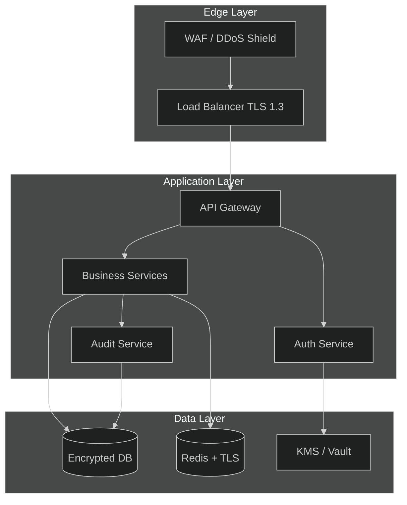

# APEX-OS Business Platform — Security Hardening

## 1. Security Architecture

**Principles:** zero-trust network, least-privilege access, defense in depth, fail-closed defaults, complete audit trail.

## 2. Authentication

- **Primary:** OIDC / OAuth 2.0 with PKCE for all user-facing flows.
- **MFA:** TOTP (RFC 6238) required for admin roles; optional for standard users.
- **Session:** Short-lived JWT access tokens (15 min) + rotating refresh tokens (7 d) with reuse detection.
- **Passwords:** Argon2id hashing (m=64 MiB, t=3, p=4); breached-password check via k-anonymity API.
- **Service-to-service:** mTLS with SPIFFE/SPIRE identities; no shared secrets.
- **Lockout:** Progressive backoff after 5 failures; CAPTCHA after 3.

## 3. Authorization

- **Model:** RBAC + ABAC hybrid. Roles define baseline permissions; attributes (tenant, department, clearance) refine.
- **Enforcement:** Policy Decision Point (PDP) at API gateway; service-level re-check for sensitive operations.
- **Tenant isolation:** Row-level security in Postgres; every query scoped by `tenant_id`.
- **Admin separation:** SoD enforced — no single role can approve and execute a payment.
- **Just-in-time:** Elevated access requires approval workflow with automatic expiry (max 4 h).

## 4. Encryption

| Layer | Algorithm | Key Management |
|-------|-----------|----------------|
| Transit | TLS 1.3 (ECDHE + AES-256-GCM) | ACME / auto-rotation |
| At-rest (DB) | AES-256-GCM per-tenant | KMS with 90-day rotation |
| At-rest (files) | AES-256-GCM + envelope encryption | KMS data keys |
| Passwords | Argon2id | N/A (hash) |
| Signatures | Ed25519 | HSM-backed |
| Backups | AES-256-GCM | Separate KMS key hierarchy |

- **Key hierarchy:** Root key (HSM) → tenant data keys → per-object keys.
- **Rotation:** Automatic, zero-downtime; old keys retained for decryption only.

## 5. Audit Logging

- **What:** All auth events, authorization decisions, data mutations, admin actions, key operations.
- **Format:** Structured JSON with `actor`, `action`, `resource`, `result`, `ip`, `user_agent`, `request_id`, `timestamp`.
- **Integrity:** Append-only log; hash-chained entries; daily Merkle root published to WORM storage.
- **Retention:** Hot 90 days (queryable), cold 7 years (compliance).
- **Alerting:** Real-time SIEM integration; alerts on privilege escalation, mass export, failed-auth spikes.
- **Privacy:** PII redacted in logs; separate consent-tracking log for GDPR.

---

*Last reviewed: 2026-10-02 · Owner: Security Team*
