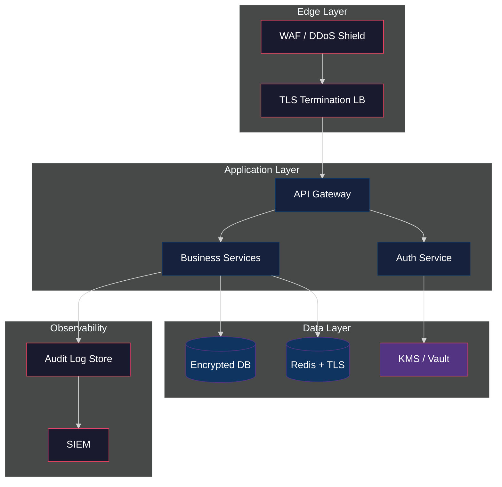
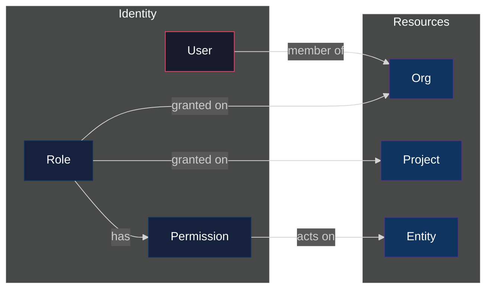
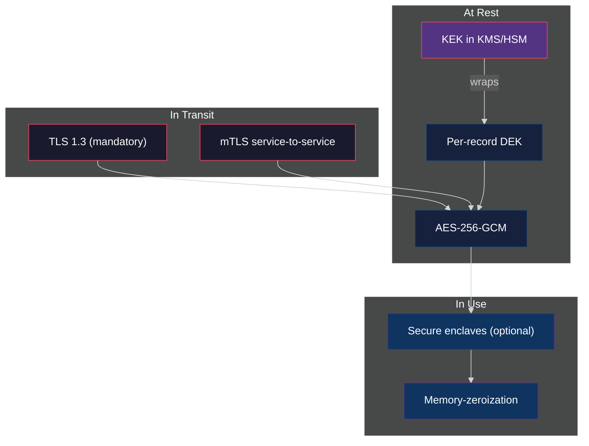
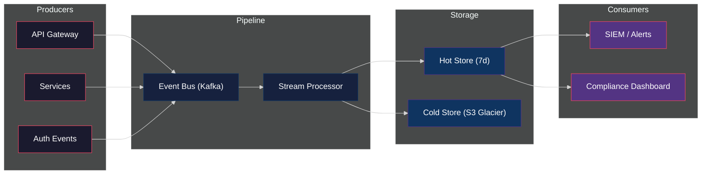

# APEX-OS Business Platform — Security

## 1. Security Architecture



**Principles:** zero-trust network, least-privilege access, defense in depth, encrypt-everything, audit-all-actions.

---

## 2. Authentication

```mermaid
%%{init: {'theme': 'dark'}}%%
sequenceDiagram
    participant U as User
    participant C as Client
    participant GW as API Gateway
    participant AS as Auth Service
    participant KMS as KMS/Vault
    U->>C: Enter credentials
    C->>GW: POST /auth/login
    GW->>AS: Forward request
    AS->>KMS: Fetch user secret
    KMS-->>AS: Secret material
    AS->>AS: Verify password (Argon2id)
    AS->>AS: Check MFA if enrolled
    AS-->>GW: JWT access + refresh tokens
    GW-->>C: Set HttpOnly cookies
    C-->>U: Authenticated session
    style U fill:#1a1a2e,stroke:#e94560,color:#fff
    style C fill:#1a1a2e,stroke:#e94560,color:#fff
    style GW fill:#16213e,stroke:#0f3460,color:#fff
    style AS fill:#16213e,stroke:#0f3460,color:#fff
    style KMS fill:#533483,stroke:#e94560,color:#fff
```

| Mechanism | Detail |
|---|---|
| Password hashing | Argon2id (memory=64MB, iterations=3, parallelism=4) |
| MFA | TOTP (RFC 6238) + WebAuthn/FIDO2 |
| Token format | JWT (RS256), 15-min access / 7-day refresh |
| Session storage | Redis with TLS, key = `sess:{user_id}` |
| Brute-force protection | Rate-limit 5 attempts / 15 min per IP+user |
| Password policy | Min 12 chars, zxcvbn score ≥ 3, breach-check via HIBP k-anon |

---

## 3. Authorization



**Model:** RBAC + ABAC hybrid. Roles define baseline permissions; attribute policies add contextual constraints (time, IP, resource ownership).

| Role | Scope | Key Permissions |
|---|---|---|
| `org_admin` | Organization | Full CRUD, member management, billing |
| `project_lead` | Project | Read/write project resources, invite members |
| `member` | Project | Read/write assigned entities |
| `viewer` | Project | Read-only |
| `auditor` | Organization | Read-only + audit log access |
| `service` | System | Scoped API keys, no UI access |

**Enforcement:** OPA (Open Policy Agent) sidecar evaluates every request. Policies stored as code in `policies/`.

---

## 4. Encryption



| Layer | Algorithm | Key Management |
|---|---|---|
| Transport | TLS 1.3, PFS (X25519) | Auto-renewed via ACME (Let's Encrypt) |
| Service mesh | mTLS (SPIFFE/SPIRE) | Short-lived SVIDs, 24h rotation |
| Data at rest | AES-256-GCM | DEK per record, KEK in cloud KMS |
| Backups | AES-256-GCM | Separate KEK, air-gapped copies |
| Passwords | Argon2id | Salted, pepper in KMS |
| API keys | HMAC-SHA256 | Hashed at rest, shown once |
| Key rotation | 90-day KEK, 30-day DEK | Automated via KMS |

---

## 5. Audit Logging



**Event schema (CloudEvents 1.0):**

```json
{
  "specversion": "1.0",
  "type": "com.apexos.audit.action",
  "source": "/services/billing",
  "id": "evt_01J...",
  "time": "2026-10-02T12:00:00Z",
  "datacontenttype": "application/json",
  "data": {
    "actor": { "type": "user", "id": "usr_123", "ip": "10.0.0.1" },
    "action": "invoice.delete",
    "resource": { "type": "invoice", "id": "inv_456" },
    "outcome": "success",
    "metadata": { "reason": "duplicate", "request_id": "req_789" }
  }
}
```

| Property | Detail |
|---|---|
| Immutability | Append-only, hash-chained (SHA-256 per batch) |
| Retention | Hot 7 days, warm 90 days, cold 7 years (WORM) |
| PII handling | Field-level redaction before ingestion |
| Alerting | Real-time SIEM rules for privilege escalation, mass export, failed auth spikes |
| Compliance | SOC 2, GDPR Art. 30, HIPAA §164.308(a)(1)(ii)(D) |
| Access | `auditor` role only; all access to audit logs is itself logged |
