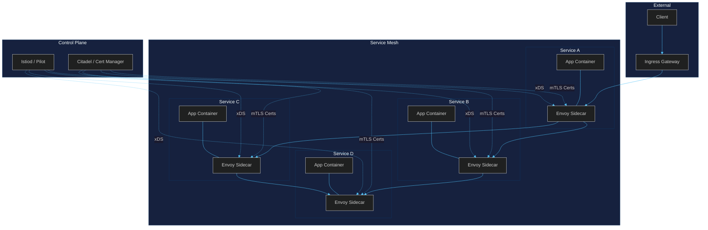
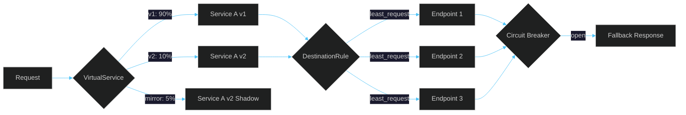
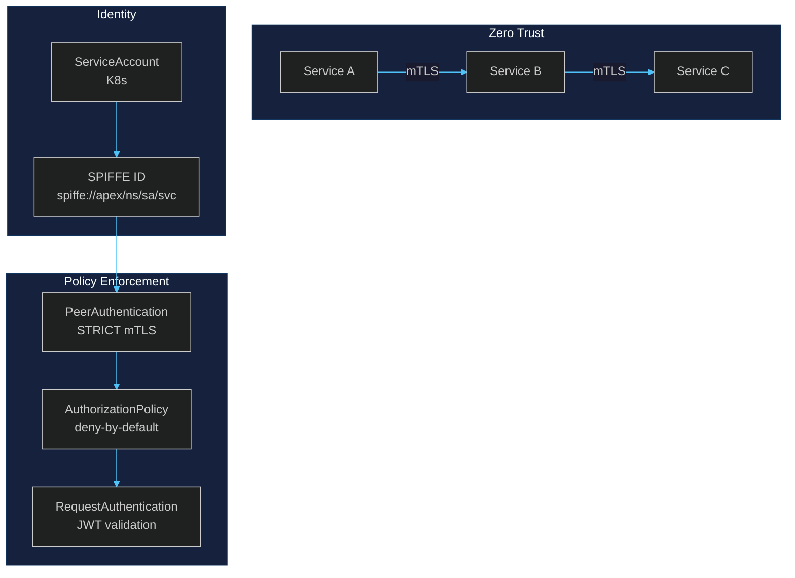
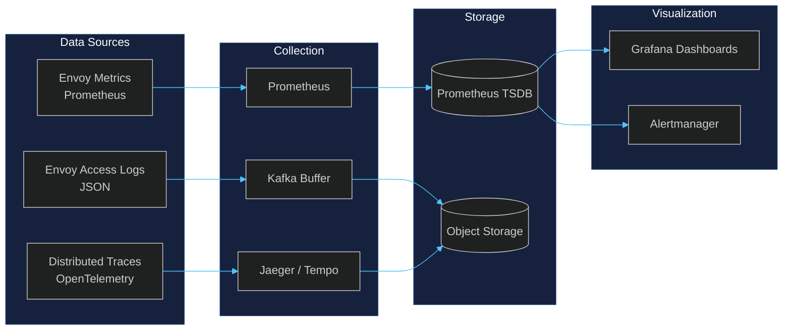
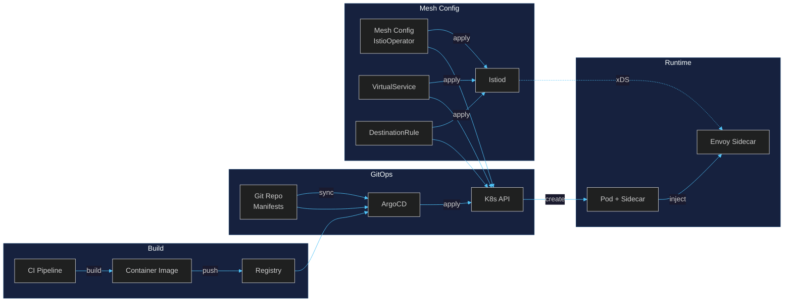

# Service Mesh

## 1. Architecture

APEX-OS uses a sidecar-based service mesh (Istio/Envoy) for all inter-service communication.



### Components

| Component | Role |
|-----------|------|
| **Envoy Sidecar** | L4/L7 proxy; handles routing, mTLS, retries, circuit breaking |
| **Istiod (Pilot)** | Service discovery, config distribution (xDS API) |
| **Citadel** | Certificate authority; issues and rotates mTLS certs |
| **Ingress Gateway** | North-south traffic entry point (Envoy-based) |

---

## 2. Traffic Management



### Routing Strategies

| Strategy | Use Case | Resource |
|----------|----------|----------|
| **Canary** | Gradual rollout by weight | `VirtualService` + `DestinationRule` |
| **Blue/Green** | Instant cutover | `VirtualService` subset swap |
| **A/B Testing** | Header/cookie-based routing | `VirtualService` match rules |
| **Traffic Mirroring** | Shadow testing | `VirtualService.mirror` |
| **Fault Injection** | Chaos testing | `VirtualService.fault` |

### Resilience Patterns

- **Retries**: 3 attempts with exponential backoff (base 25ms, max 1s)
- **Timeouts**: 500ms default, 5s max per hop
- **Circuit Breakers**: Ejection after 5 consecutive 5xx errors; 30s ejection window
- **Outlier Detection**: Automatic endpoint ejection on error rate > 50%

---

## 3. Security



### Security Layers

| Layer | Mechanism | Details |
|-------|-----------|---------|
| **Transport** | mTLS (STRICT) | All pod-to-pod traffic encrypted; certs rotated every 24h |
| **Identity** | SPIFFE / SPIRE | Workload identity via Kubernetes ServiceAccount |
| **Authorization** | AuthorizationPolicy | Deny-by-default; explicit allow rules per service |
| **Authentication** | RequestAuthentication | JWT validation at mesh edge (JWKS endpoint) |
| **Network** | NetworkPolicy | L3/L4 segmentation between namespaces |

### Certificate Lifecycle

1. Citadel issues X.509 cert with SPIFFE URI SAN
2. Envoy sidecar picks up cert via SDS (Secret Discovery Service)
3. Automatic rotation at 80% of cert lifetime
4. Old cert remains valid during 1h overlap window

---

## 4. Observability



### Metrics (RED Method)

| Metric | Type | Labels |
|--------|------|--------|
| `istio_requests_total` | Counter | `source`, `destination`, `response_code` |
| `istio_request_duration_milliseconds` | Histogram | `source`, `destination` |
| `istio_request_bytes` | Histogram | `source`, `destination` |
| `istio_response_bytes` | Histogram | `source`, `destination` |
| `istio_tcp_connections_opened_total` | Counter | `source`, `destination` |

### Tracing

- **Sampler**: 10% default, 100% for errors
- **Propagation**: W3C Trace Context (`traceparent` header)
- **Span Tags**: `service.name`, `k8s.pod.name`, `k8s.namespace`, `http.status_code`

### Alerting Rules

| Alert | Condition | Severity |
|-------|-----------|----------|
| HighErrorRate | `rate(5xx) > 5%` for 5m | critical |
| HighLatency | `p99 > 500ms` for 5m | warning |
| PodCrashLooping | `restart_count > 3` in 10m | warning |
| CertExpiring | `cert_expiry < 7d` | warning |

---

## 5. Deployment



### Deployment Stages

| Stage | Strategy | Mesh Config |
|-------|----------|-------------|
| **Dev** | Direct push | Permissive mTLS, no auth |
| **Staging** | GitOps sync | STRICT mTLS, JWT auth |
| **Canary** | Argo Rollouts | 5% → 25% → 50% → 100% |
| **Production** | Blue/Green | STRICT mTLS, full auth + authz |

### Sidecar Injection

```yaml
# Namespace label enables auto-injection
apiVersion: v1
kind: Namespace
metadata:
  name: apex-services
  labels:
    istio-injection: enabled
```

### Resource Budgets

| Resource | Request | Limit |
|----------|---------|-------|
| Envoy Sidecar CPU | 100m | 500m |
| Envoy Sidecar Memory | 128Mi | 256Mi |
| Istiod CPU | 500m | 2000m |
| Istiod Memory | 512Mi | 2Gi |

### Upgrade Procedure

1. **Istiod upgrade**: Rolling update; new pods serve xDS to new sidecars
2. **Sidecar upgrade**: Triggered by pod restart; `istioctl proxy-status` verifies sync
3. **Rollback**: `kubectl rollout undo` for control plane; restart pods for sidecars
