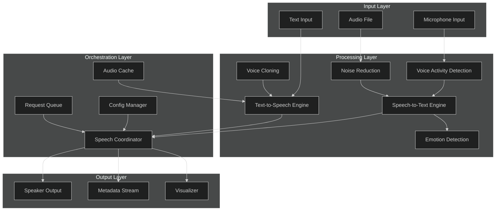
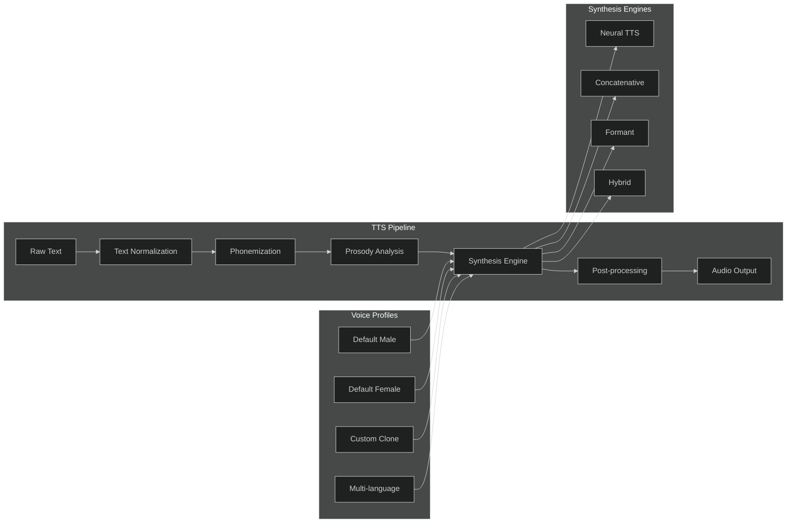
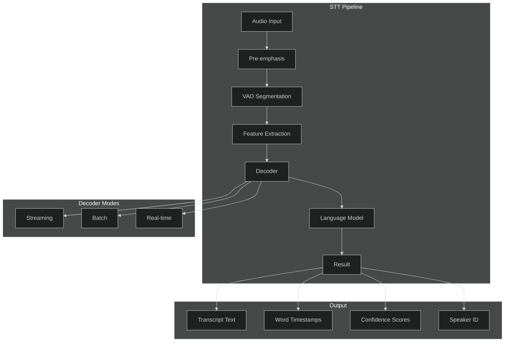
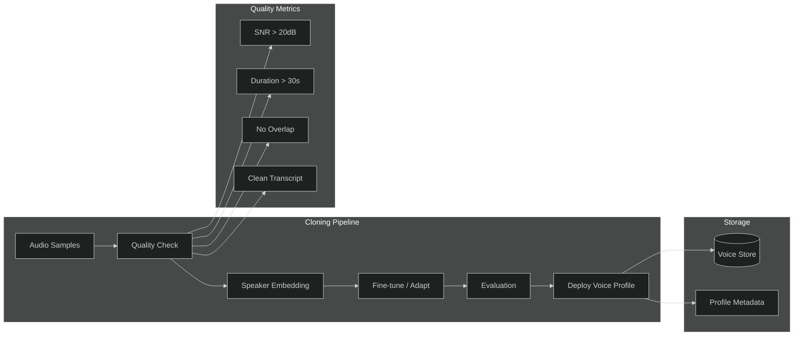
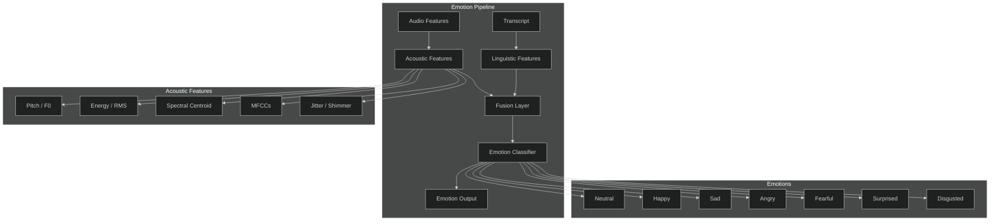
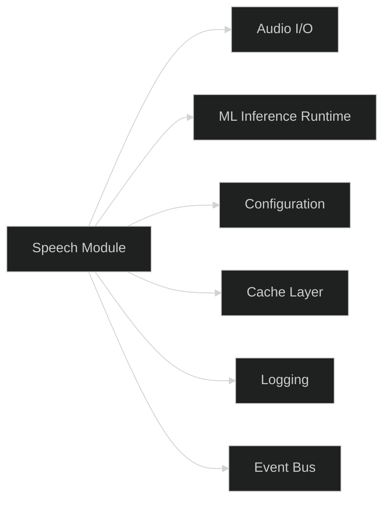

# Speech Module

## 1. Speech Architecture



## 2. Text-to-Speech (TTS)



### TTS Configuration

| Parameter | Type | Default | Description |
|-----------|------|---------|-------------|
| `voice_id` | string | `"default"` | Voice profile identifier |
| `speed` | float | `1.0` | Speech rate multiplier |
| `pitch` | float | `1.0` | Pitch shift factor |
| `volume` | float | `0.8` | Output gain (0–1) |
| `language` | string | `"en-US"` | BCP-47 language tag |
| `format` | string | `"wav"` | Output format (wav/mp3/ogg) |
| `sample_rate` | int | `22050` | Output sample rate (Hz) |
| `streaming` | bool | `true` | Enable chunked streaming output |

### TTS API

```python
from apex_speech import TTSEngine

tts = TTSEngine(voice_id="custom_clone_01", language="en-US")
audio = tts.synthesize(
    text="Hello, welcome to Apex OS.",
    speed=1.0,
    pitch=1.0,
    emotion="neutral"
)
audio.play()
audio.save("output.wav")
```

## 3. Speech-to-Text (STT)



### STT Configuration

| Parameter | Type | Default | Description |
|-----------|------|---------|-------------|
| `model` | string | `"whisper-large-v3"` | STT model identifier |
| `language` | string | `"auto"` | Source language (auto-detect if set) |
| `beam_size` | int | `5` | Beam search width |
| `temperature` | float | `0.0` | Decoding temperature |
| `vad_threshold` | float | `0.5` | Voice activity sensitivity |
| `chunk_duration` | float | `30.0` | Max segment length (seconds) |
| `diarization` | bool | `false` | Enable speaker separation |

### STT API

```python
from apex_speech import STTEngine

stt = STTEngine(model="whisper-large-v3", language="auto")
result = stt.transcribe("meeting.wav", diarization=True)

print(result.text)
for word in result.words:
    print(f"{word.start:.2f}s – {word.end:.2f}s  {word.text} ({word.confidence:.2f})")
```

## 4. Voice Cloning



### Voice Cloning Configuration

| Parameter | Type | Default | Description |
|-----------|------|---------|-------------|
| `min_samples` | int | `3` | Minimum audio samples required |
| `min_duration` | float | `30.0` | Minimum total duration (seconds) |
| `embedding_model` | string | `"resemblyzer"` | Speaker encoder model |
| `finetune_epochs` | int | `100` | Adaptation training epochs |
| `similarity_threshold` | float | `0.85` | Acceptance cosine similarity |
| `max_profiles` | int | `50` | Max stored voice profiles |

### Voice Cloning API

```python
from apex_speech import VoiceCloner

cloner = VoiceCloner(embedding_model="resemblyzer")
profile = cloner.clone(
    name="Executive Voice",
    samples=["sample1.wav", "sample2.wav", "sample3.wav"],
    transcript="Transcript of spoken samples..."
)
print(f"Voice profile created: {profile.id} (similarity: {profile.similarity:.2f})")
```

## 5. Emotion Detection



### Emotion Detection Configuration

| Parameter | Type | Default | Description |
|-----------|------|---------|-------------|
| `model` | string | `"wav2vec2-emotion"` | Emotion model identifier |
| `fusion` | string | `"late"` | Fusion strategy (early/late/hybrid) |
| `granularity` | string | `"utterance"` | Analysis window (frame/utterance) |
| `num_emotions` | int | `7` | Number of emotion classes |
| `confidence_threshold` | float | `0.6` | Minimum confidence for output |
| `temporal_smoothing` | int | `5` | Moving-average window size |

### Emotion Detection API

```python
from apex_speech import EmotionDetector

detector = EmotionDetector(model="wav2vec2-emotion", fusion="hybrid")
result = detector.detect("speech.wav")

print(f"Dominant: {result.dominant_emotion} ({result.confidence:.2f})")
for emotion, score in result.distribution.items():
    print(f"  {emotion}: {score:.3f}")
```

---

## Module Dependencies



## Error Handling

| Error Code | Description | Recovery |
|------------|-------------|----------|
| `SPH-001` | Audio device unavailable | Retry with fallback device |
| `SPH-002` | Model load failure | Fall back to lighter model |
| `SPH-003` | Synthesis timeout | Reduce text chunk size |
| `SPH-004` | Cloning quality reject | Request more samples |
| `SPH-005` | Emotion confidence low | Return neutral + flag |
