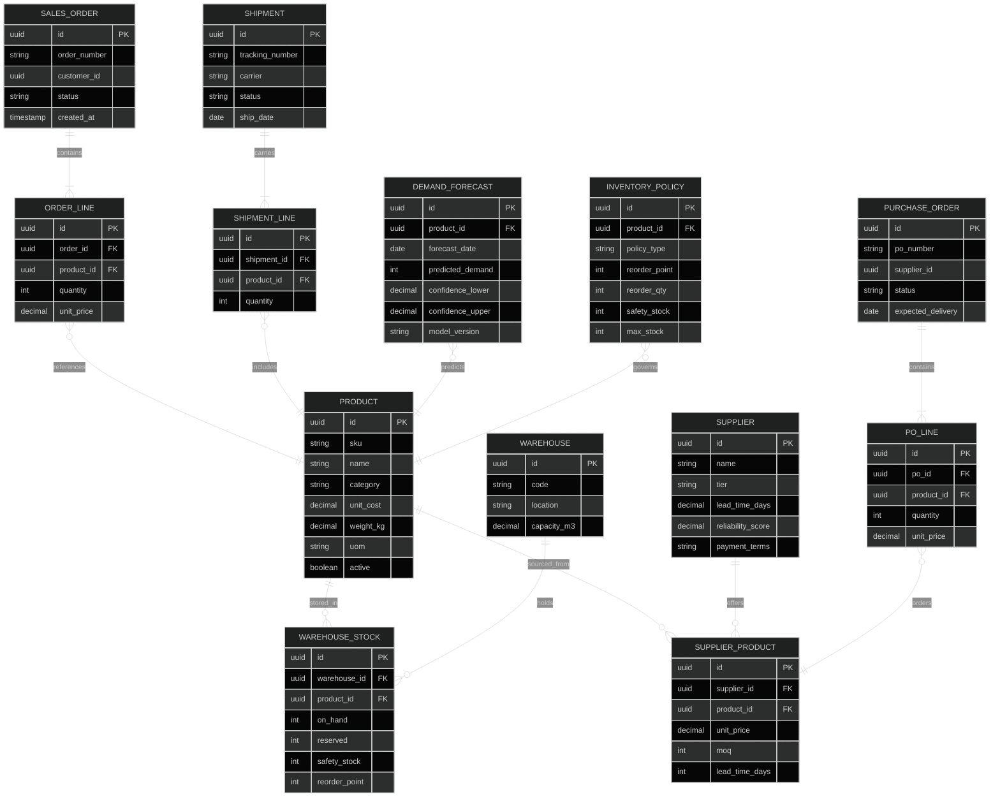
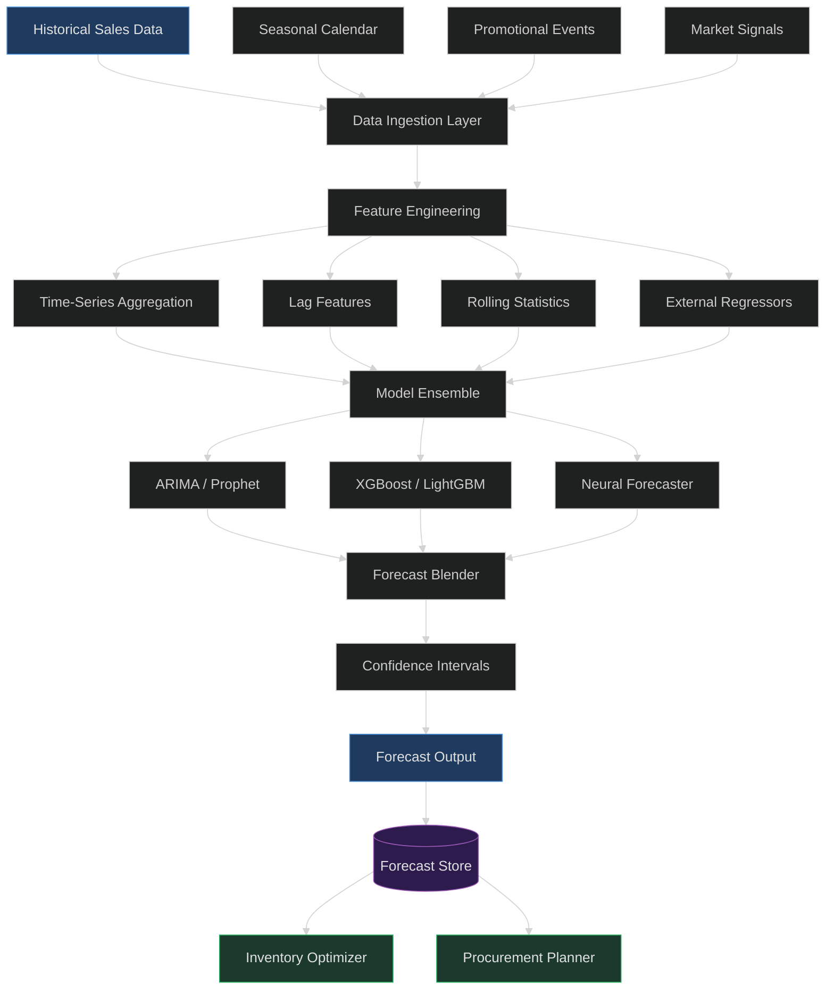
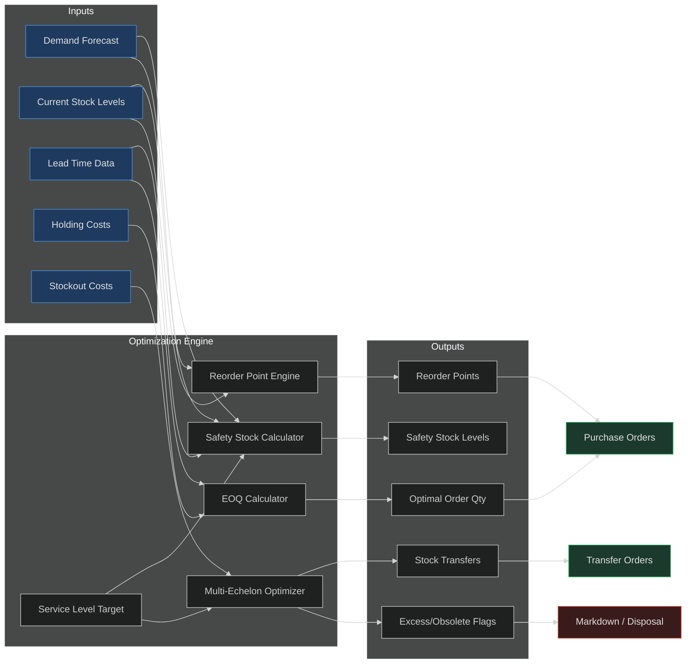
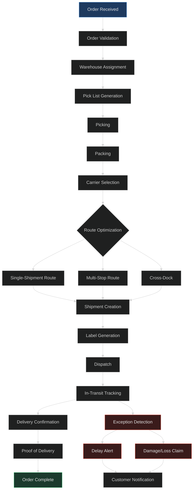
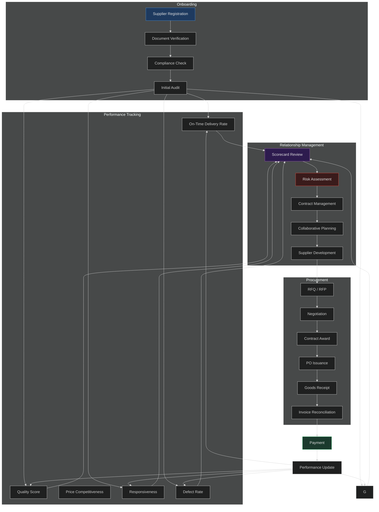

# Supply Chain Architecture

## 1. Supply Chain Data Model

```mermaid
%%{init: {'theme': 'dark'}}%%
erDiagram
    PRODUCT ||--o{ WAREHOUSE_STOCK : stored_in
    PRODUCT ||--o{ SUPPLIER_PRODUCT : sourced_from
    SUPPLIER ||--o{ SUPPLIER_PRODUCT : offers
    WAREHOUSE ||--o{ WAREHOUSE_STOCK : holds
    SALES_ORDER ||--|{ ORDER_LINE : contains
    ORDER_LINE }o--|| PRODUCT : references
    PURCHASE_ORDER ||--|{ PO_LINE : contains
    PO_LINE }o--|| SUPPLIER_PRODUCT : orders
    SHIPMENT ||--|{ SHIPMENT_LINE : carries
    SHIPMENT_LINE }o--|| PRODUCT : includes
    DEMAND_FORECAST }o--|| PRODUCT : predicts
    INVENTORY_POLICY }o--|| PRODUCT : governs

    PRODUCT {
        uuid id PK
        string sku
        string name
        string category
        decimal unit_cost
        decimal weight_kg
        string uom
        boolean active
    }
    SUPPLIER {
        uuid id PK
        string name
        string tier
        decimal lead_time_days
        decimal reliability_score
        string payment_terms
    }
    SUPPLIER_PRODUCT {
        uuid id PK
        uuid supplier_id FK
        uuid product_id FK
        decimal unit_price
        int moq
        int lead_time_days
    }
    WAREHOUSE {
        uuid id PK
        string code
        string location
        decimal capacity_m3
    }
    WAREHOUSE_STOCK {
        uuid id PK
        uuid warehouse_id FK
        uuid product_id FK
        int on_hand
        int reserved
        int safety_stock
        int reorder_point
    }
    SALES_ORDER {
        uuid id PK
        string order_number
        uuid customer_id
        string status
        timestamp created_at
    }
    ORDER_LINE {
        uuid id PK
        uuid order_id FK
        uuid product_id FK
        int quantity
        decimal unit_price
    }
    PURCHASE_ORDER {
        uuid id PK
        string po_number
        uuid supplier_id
        string status
        date expected_delivery
    }
    PO_LINE {
        uuid id PK
        uuid po_id FK
        uuid product_id FK
        int quantity
        decimal unit_price
    }
    SHIPMENT {
        uuid id PK
        string tracking_number
        string carrier
        string status
        date ship_date
    }
    SHIPMENT_LINE {
        uuid id PK
        uuid shipment_id FK
        uuid product_id FK
        int quantity
    }
    DEMAND_FORECAST {
        uuid id PK
        uuid product_id FK
        date forecast_date
        int predicted_demand
        decimal confidence_lower
        decimal confidence_upper
        string model_version
    }
    INVENTORY_POLICY {
        uuid id PK
        uuid product_id FK
        string policy_type
        int reorder_point
        int reorder_qty
        int safety_stock
        int max_stock
    }
```

## 2. Demand Forecasting Pipeline

```mermaid
%%{init: {'theme': 'dark'}}%%
flowchart TD
    A[Historical Sales Data] --> B[Data Ingestion Layer]
    C[Seasonal Calendar] --> B
    D[Promotional Events] --> B
    E[Market Signals] --> B

    B --> F[Feature Engineering]
    F --> G[Time-Series Aggregation]
    F --> H[Lag Features]
    F --> I[Rolling Statistics]
    F --> J[External Regressors]

    G --> K[Model Ensemble]
    H --> K
    I --> K
    J --> K

    K --> L[ARIMA / Prophet]
    K --> M[XGBoost / LightGBM]
    K --> N[Neural Forecaster]

    L --> O[Forecast Blender]
    M --> O
    N --> O

    O --> P[Confidence Intervals]
    P --> Q[Forecast Output]
    Q --> R[(Forecast Store)]
    R --> S[Inventory Optimizer]
    R --> T[Procurement Planner]

    style A fill:#1e3a5f,stroke:#4a90d9,color:#e0e0e0
    style Q fill:#1e3a5f,stroke:#4a90d9,color:#e0e0e0
    style R fill:#2d1b4e,stroke:#9b59b6,color:#e0e0e0
    style S fill:#1b3a2d,stroke:#27ae60,color:#e0e0e0
    style T fill:#1b3a2d,stroke:#27ae60,color:#e0e0e0
```

## 3. Inventory Optimization

```mermaid
%%{init: {'theme': 'dark'}}%%
flowchart LR
    subgraph Inputs
        A[Demand Forecast]
        B[Current Stock Levels]
        C[Lead Time Data]
        D[Holding Costs]
        E[Stockout Costs]
    end

    subgraph Optimization Engine
        F[Safety Stock Calculator]
        G[Reorder Point Engine]
        H[EOQ Calculator]
        I[Multi-Echelon Optimizer]
        J[Service Level Target]
    end

    subgraph Outputs
        K[Optimal Order Qty]
        L[Reorder Points]
        M[Safety Stock Levels]
        N[Stock Transfers]
        O[Excess/Obsolete Flags]
    end

    A --> F
    A --> G
    B --> F
    B --> G
    C --> F
    C --> H
    D --> H
    E --> I
    J --> F
    J --> I

    F --> M
    G --> L
    H --> K
    I --> N
    I --> O

    K --> P[Purchase Orders]
    L --> P
    N --> Q[Transfer Orders]
    O --> R[Markdown / Disposal]

    style A fill:#1e3a5f,stroke:#4a90d9,color:#e0e0e0
    style B fill:#1e3a5f,stroke:#4a90d9,color:#e0e0e0
    style C fill:#1e3a5f,stroke:#4a90d9,color:#e0e0e0
    style D fill:#1e3a5f,stroke:#4a90d9,color:#e0e0e0
    style E fill:#1e3a5f,stroke:#4a90d9,color:#e0e0e0
    style P fill:#1b3a2d,stroke:#27ae60,color:#e0e0e0
    style Q fill:#1b3a2d,stroke:#27ae60,color:#e0e0e0
    style R fill:#3a1b1b,stroke:#e74c3c,color:#e0e0e0
```

## 4. Logistics Management

```mermaid
%%{init: {'theme': 'dark'}}%%
flowchart TD
    A[Order Received] --> B[Order Validation]
    B --> C[Warehouse Assignment]
    C --> D[Pick List Generation]
    D --> E[Picking]
    E --> F[Packing]
    F --> G[Carrier Selection]

    G --> H{Route Optimization}
    H --> I[Single-Shipment Route]
    H --> J[Multi-Stop Route]
    H --> K[Cross-Dock]

    I --> L[Shipment Creation]
    J --> L
    K --> L

    L --> M[Label Generation]
    M --> N[Dispatch]
    N --> O[In-Transit Tracking]
    O --> P[Delivery Confirmation]
    P --> Q[Proof of Delivery]
    Q --> R[Order Complete]

    O --> S[Exception Detection]
    S --> T[Delay Alert]
    S --> U[Damage/Loss Claim]
    T --> V[Customer Notification]
    U --> V

    style A fill:#1e3a5f,stroke:#4a90d9,color:#e0e0e0
    style R fill:#1b3a2d,stroke:#27ae60,color:#e0e0e0
    style S fill:#3a1b1b,stroke:#e74c3c,color:#e0e0e0
    style T fill:#3a1b1b,stroke:#e74c3c,color:#e0e0e0
    style U fill:#3a1b1b,stroke:#e74c3c,color:#e0e0e0
```

## 5. Supplier Management

```mermaid
%%{init: {'theme': 'dark'}}%%
flowchart TD
    subgraph Onboarding
        A[Supplier Registration]
        B[Document Verification]
        C[Compliance Check]
        D[Initial Audit]
    end

    subgraph Performance Tracking
        E[On-Time Delivery Rate]
        F[Quality Score]
        P[Price Competitiveness]
        H[Responsiveness]
        I[Defect Rate]
    end

    subgraph Relationship Management
        J[Scorecard Review]
        K[Risk Assessment]
        L[Contract Management]
        M[Collaborative Planning]
        N[Supplier Development]
    end

    subgraph Procurement
        O[RFQ / RFP]
        P2[Negotiation]
        Q[Contract Award]
        R[PO Issuance]
        S[Goods Receipt]
        T[Invoice Reconciliation]
    end

    A --> B --> C --> D
    D --> E
    D --> F
    D --> G
    D --> H
    D --> I

    E --> J
    F --> J
    G --> J
    H --> J
    I --> J

    J --> K
    K --> L
    L --> M
    M --> N

    N --> O
    O --> P2 --> Q --> R --> S --> T

    T --> U[Payment]
    U --> V[Performance Update]
    V --> E
    V --> F
    V --> G
    V --> H
    V --> I

    style A fill:#1e3a5f,stroke:#4a90d9,color:#e0e0e0
    style J fill:#2d1b4e,stroke:#9b59b6,color:#e0e0e0
    style K fill:#3a1b1b,stroke:#e74c3c,color:#e0e0e0
    style U fill:#1b3a2d,stroke:#27ae60,color:#e0e0e0
```
