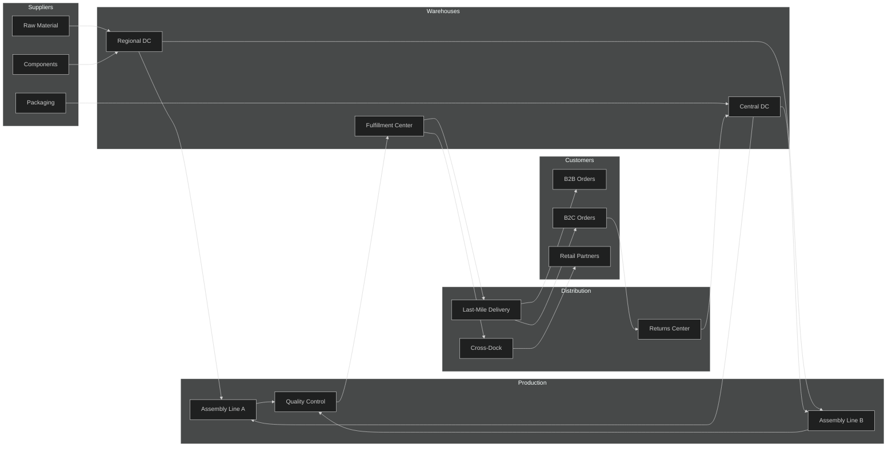
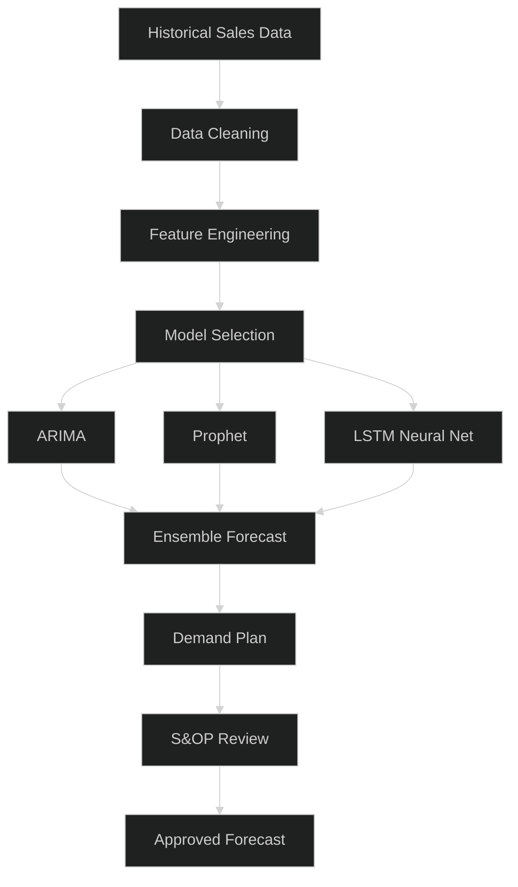
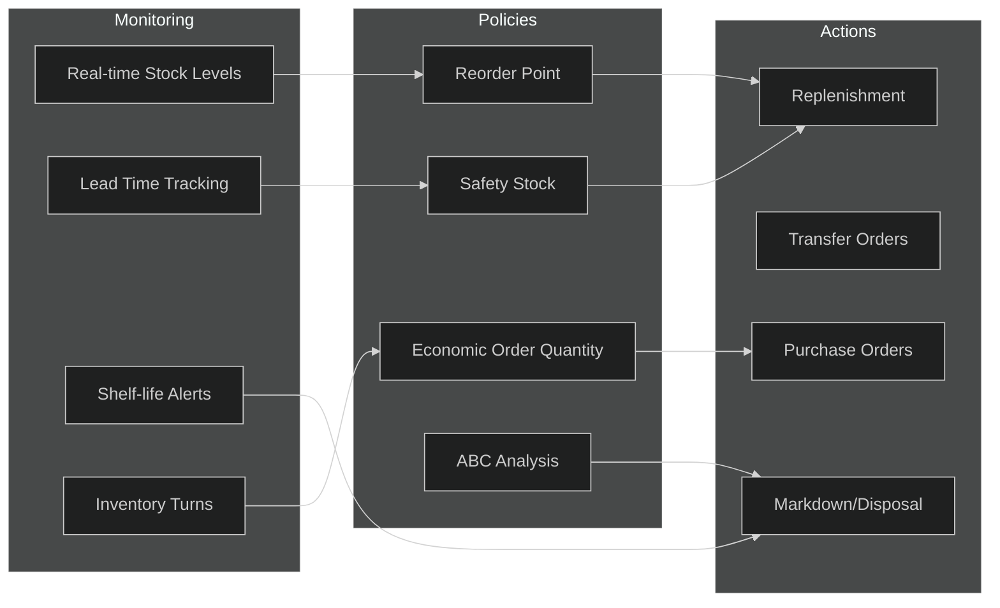
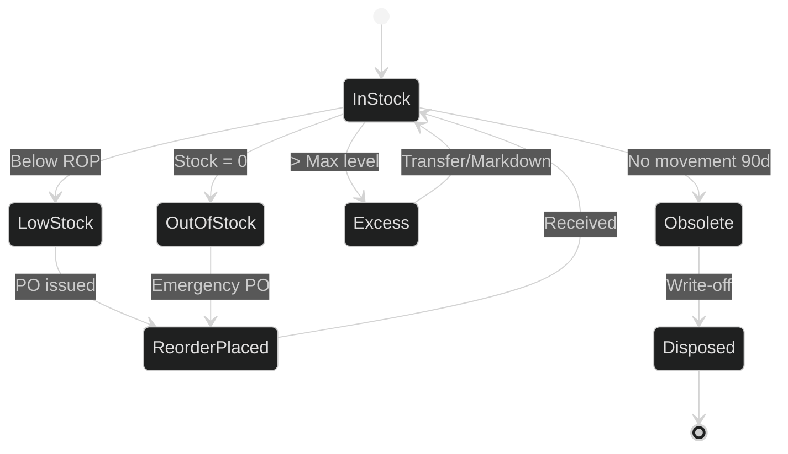
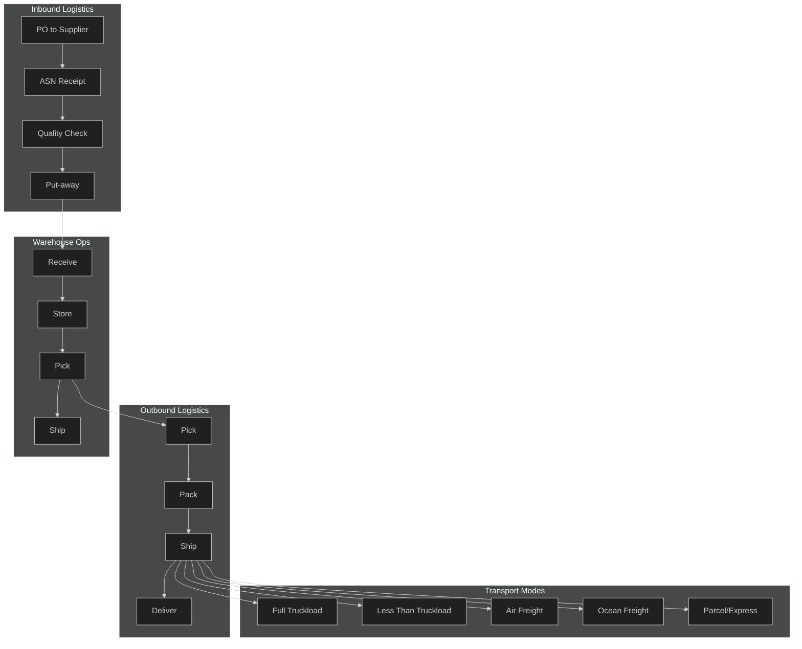
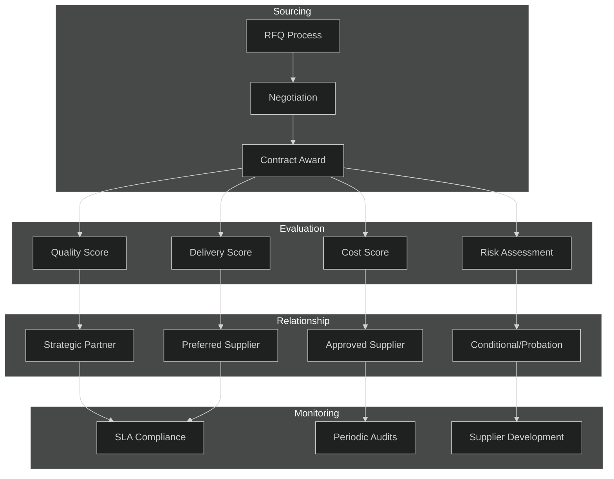

# Supply Chain Management

## 1. Supply Chain Architecture

## 2. Demand Forecasting

**Key Methods:**
- **Time-series models** (ARIMA, Prophet) for baseline seasonal patterns
- **ML models** (LSTM, XGBoost) for non-linear demand signals
- **Ensemble approach** combining multiple models for accuracy
- **External signals**: promotions, weather, economic indicators, social trends

**Forecast KPIs:**
| Metric | Target |
|--------|--------|
| MAPE | < 15% |
| Bias | ± 5% |
| Forecast Horizon | 13 weeks rolling |

## 3. Inventory Management

**Inventory Policies:**
- **ABC Classification**: A-items (top 20% by value) — tight control, daily review; B-items — weekly review; C-items — monthly review, bulk ordering
- **Safety Stock**: Calculated as `Z × σ_LT × √L` where Z = service factor, σ_LT = demand std dev during lead time, L = lead time
- **Reorder Point**: `ROP = (Avg Daily Demand × Lead Time) + Safety Stock`
- **EOQ**: `√(2DS/H)` where D = annual demand, S = ordering cost, H = holding cost

**Stock Status Flow:**

## 4. Logistics

**Logistics KPIs:**
| Metric | Target |
|--------|--------|
| On-time delivery | > 97% |
| Order accuracy | > 99.5% |
| Damage rate | < 0.5% |
| Cost per unit shipped | Reduce 5% YoY |
| Warehouse utilization | 75-85% |

**Routing Strategy:**
- **Milk runs** for frequent, small-volume supplier pickups
- **Cross-docking** for fast-moving items (no storage, direct transfer)
- **Zone skipping** to consolidate shipments to regional hubs before last-mile

## 5. Supplier Management

**Supplier Scorecard:**
| Category | Weight | Metrics |
|----------|--------|---------|
| Quality | 35% | Defect rate, return rate, ISO certification |
| Delivery | 30% | On-time %, lead time accuracy, fill rate |
| Cost | 20% | Price competitiveness, payment terms, TCO |
| Risk | 15% | Financial stability, geographic risk, single-source risk |

**Supplier Tiers:**
- **Strategic**: Joint planning, VMI, long-term contracts, quarterly business reviews
- **Preferred**: Volume commitments, annual contracts, performance reviews
- **Approved**: Standard terms, spot orders, monitored quarterly
- **Conditional**: Probationary period, increased inspection, development plan

**Risk Mitigation:**
- Dual-sourcing for critical components (A-items)
- Geographic diversification to avoid single-region disruption
- Safety stock buffers for long-lead-time items
- Supplier financial health monitoring via third-party ratings
