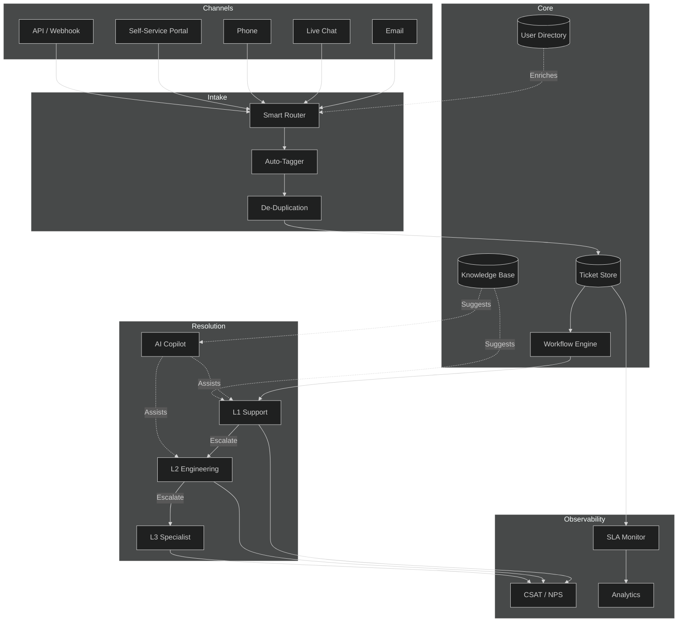
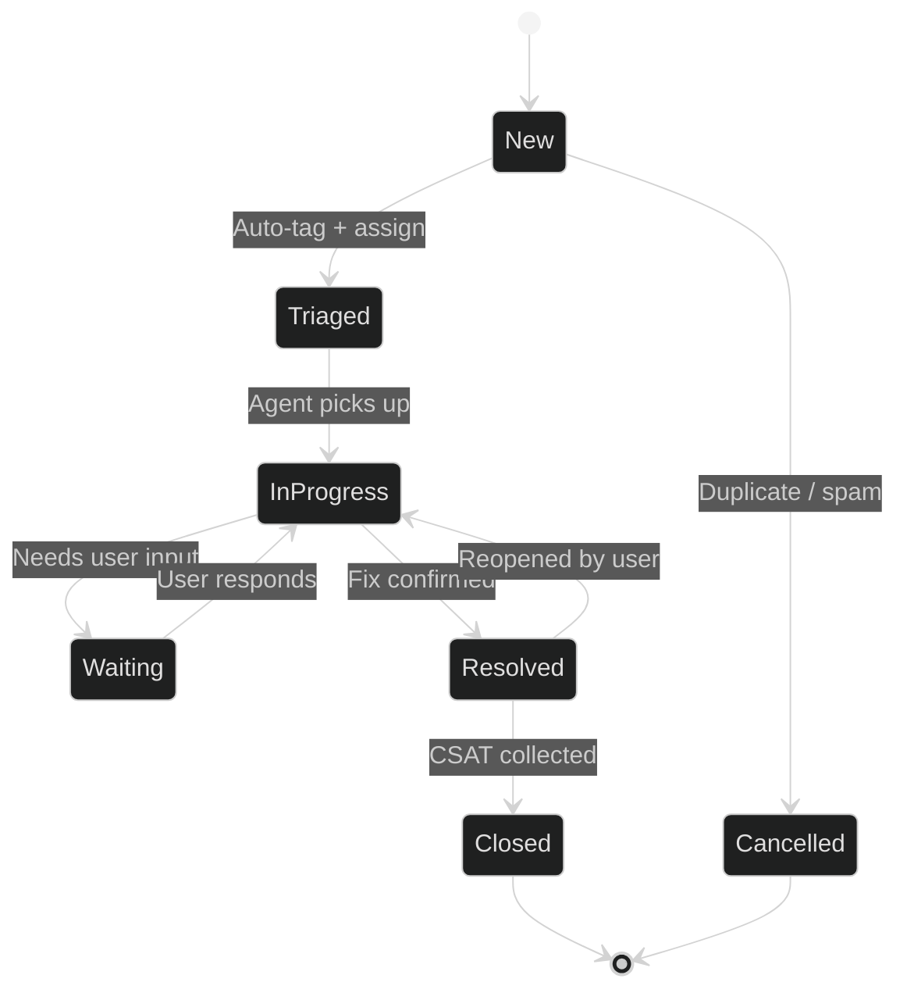
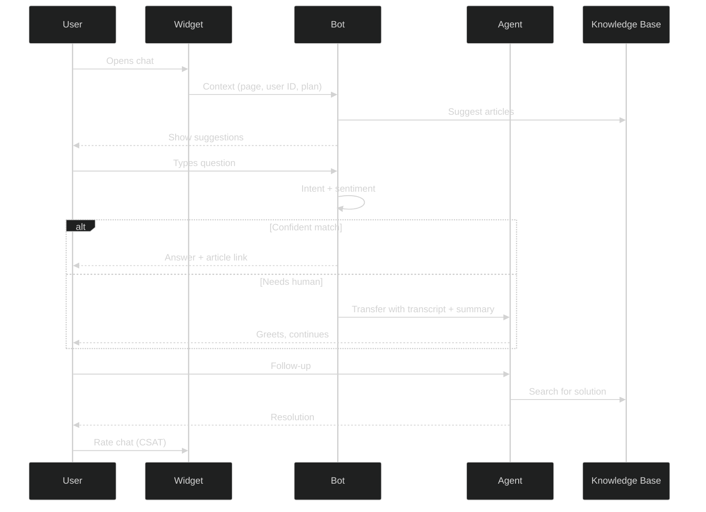
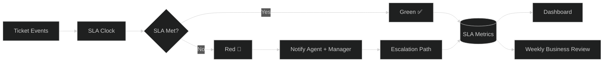

# APEX-OS Support

## 1. Support Architecture



## 2. Ticket Management

### Priority Matrix

| Priority | Description | Response Target | Resolution Target |
|----------|-------------|-----------------|-------------------|
| P1 – Critical | Service down / data loss | 15 min | 4 hours |
| P2 – High | Major feature broken | 1 hour | 8 hours |
| P3 – Medium | Partial degradation | 4 hours | 24 hours |
| P4 – Low | General question / cosmetic | 1 business day | 72 hours |

### Lifecycle



### Rules

- Auto-close after 7 days of user inactivity (with warning at day 5).
- Reopen window: 14 days post-closure.
- Merge duplicates; link related tickets.
- All internal notes flagged `[internal]` — never visible to customers.

## 3. Knowledge Base

### Structure

```
kb/
├── getting-started/       # Onboarding, quickstart
├── how-to/                # Task-oriented guides
├── troubleshooting/       # Symptom → cause → fix
├── api-reference/         # Endpoint docs, schemas
├── faq/                   # Top 50 questions
├── release-notes/         # Changelog per version
└── internal/              # Runbooks, escalation paths
```

### Article Standards

- Every article: **title**, **last-reviewed date**, **owner**, **tags**.
- Screenshots for UI steps; copy-paste snippets for CLI/API.
- Link related articles bidirectionally.
- Deprecate (don't delete) outdated content with redirect notice.

### Maintenance

- Monthly review cycle: flag articles with > 90 days since review.
- Auto-flag articles linked from resolved tickets with low CSAT.
- Community contributions via PR; L2 approves before publish.

## 4. Live Chat



### Guidelines

- Bot handles ~60 % of chats; seamless human handoff with full context.
- Max queue wait: 2 minutes (P1) / 5 minutes (P2+).
- Proactive trigger: user visits pricing page 3× in one session.
- Offline hours: chat captures email, creates P3 ticket.

## 5. SLA Management

### SLA Tiers by Plan

| Plan | Coverage | P1 Response | P2 Response | P3/P4 Response |
|------|----------|-------------|-------------|----------------|
| Community | Forum only | — | — | — |
| Starter | Business hours | 4 h | 8 h | 24 h |
| Business | 24 × 7 | 1 h | 4 h | 12 h |
| Enterprise | 24 × 7 + dedicated CSM | 15 min | 1 h | 4 h |

### SLA Clock Rules

- Pauses when status = **Waiting on Customer**.
- Pauses outside business hours (except Enterprise 24 × 7).
- Resumes on customer reply or internal status change.
- Breach warning at 80 % of target; escalate to manager at 90 %.

### Monitoring & Reporting



### Escalation Path

1. **Agent** — owns ticket, first responder.
2. **Team Lead** — breach risk or P1 unresolved > 2 h.
3. **Support Manager** — P1 breach or pattern of breaches.
4. **VP Engineering** — systemic outage, enterprise escalation.

### Metrics Tracked

- **FRT** — First Response Time
- **MTTR** — Mean Time to Resolution
- **SLA Achievement %** — target ≥ 95 %
- **CSAT** — target ≥ 4.5 / 5
- **Reopen Rate** — target < 8 %
