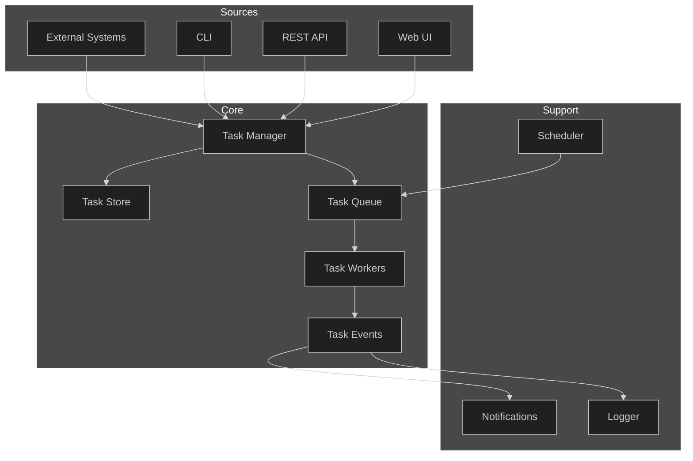
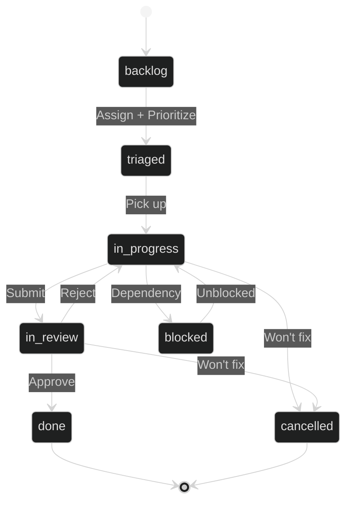
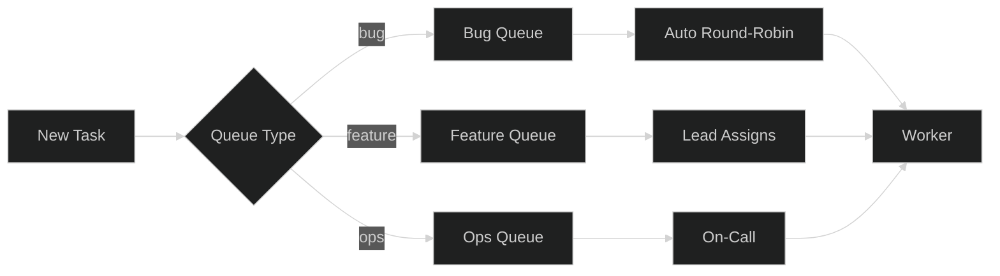
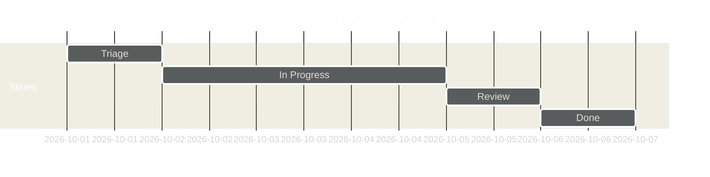

# Task Management

## 1. Architecture

## 2. Task Types

| Type | Description | Priority | SLA |
|------|-------------|----------|-----|
| `bug` | Defect or regression | P1–P4 | 24h–14d |
| `feature` | New capability | P2–P3 | Sprint |
| `improvement` | Enhancement to existing | P3–P4 | Sprint |
| `tech_debt` | Refactoring / cleanup | P3–P4 | Backlog |
| `research` | Investigation / spike | P3 | 3d |
| `ops` | Operational / infra work | P1–P2 | 4h–2d |

## 3. Task Workflow

## 4. Task Assignment

- **Auto-assign**: Round-robin within team based on capacity
- **Manual**: Lead or PM assigns directly
- **Self-assign**: Team member picks from triaged pool
- **Escalation**: Unassigned P1 tasks auto-escalate to on-call after 1h

## 5. Task Tracking

### Metrics

- **Cycle time**: Created → Done
- **Lead time**: Created → In Progress
- **WIP limit**: Max 3 active tasks per worker
- **SLA breach**: Alert when task exceeds SLA threshold
- **Throughput**: Tasks completed per sprint
