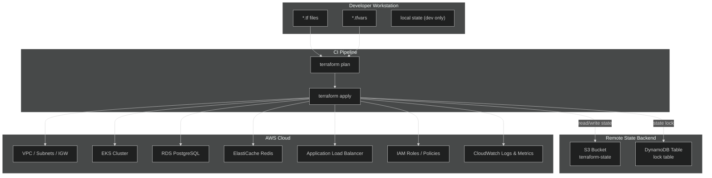
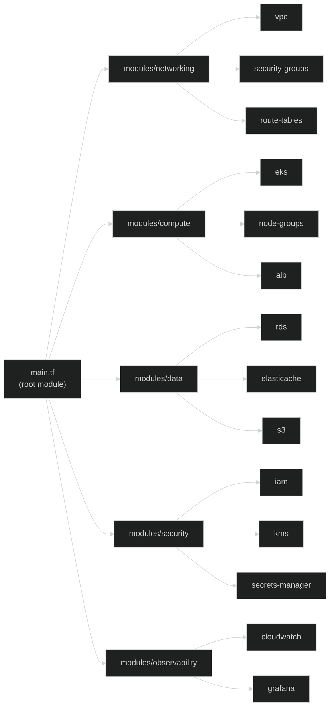
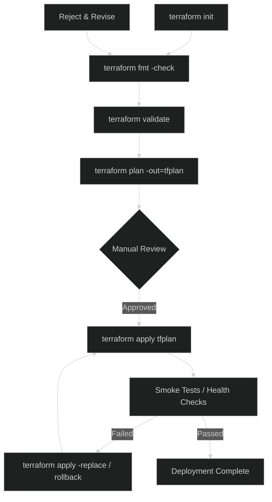
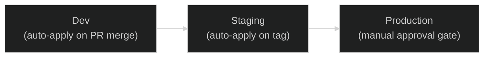
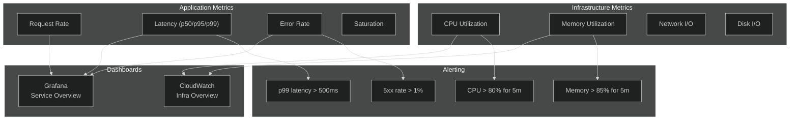

# Terraform — Infrastructure as Code

## 1. Architecture



## 2. Module Structure



### Module Layout

```
modules/
├── networking/
│   ├── main.tf
│   ├── variables.tf
│   ├── outputs.tf
│   └── versions.tf
├── compute/
│   ├── main.tf
│   ├── variables.tf
│   ├── outputs.tf
│   └── versions.tf
├── data/
│   ├── main.tf
│   ├── variables.tf
│   ├── outputs.tf
│   └── versions.tf
├── security/
│   ├── main.tf
│   ├── variables.tf
│   ├── outputs.tf
│   └── versions.tf
└── observability/
    ├── main.tf
    ├── variables.tf
    ├── outputs.tf
    └── versions.tf
```

## 3. State Management

```mermaid
%%{init: {'theme':'dark'}}%%
flowchart LR
    subgraph Locking["State Locking"]
        DDB["DynamoDB\nLockID item"]
        S3["S3\nstate file JSON"]
    end

    subgraph Environments["Environment Isolation"]
        DEV["dev/\nterraform.tfstate"]
        STAGING["staging/\nterraform.tfstate"]
        PROD["prod/\nterraform.tfstate"]
    end

    subgraph Backend["Backend Configuration"]
        BT["terraform {\n  backend \"s3\" {\n    bucket = \"...\"\n    key    = \"...\"\n    region = \"...\"\n    dynamodb_table = \"...\"\n  }\n}"]
    end

    BT --> S3
    BT --> DDB
    S3 --> DEV
    S3 --> STAGING
    S3 --> PROD
```

### Backend Configuration

```hcl
terraform {
  backend "s3" {
    bucket         = "apex-os-tf-state"
    key            = "env:/${var.environment}/terraform.tfstate"
    region         = "us-east-1"
    encrypt        = true
    dynamodb_table = "terraform-state-lock"
  }
}
```

### State Commands

| Command | Purpose |
|---------|---------|
| `terraform state list` | List resources in state |
| `terraform state show <resource>` | Inspect a single resource |
| `terraform state rm <resource>` | Remove resource from state |
| `terraform state mv <old> <new>` | Rename/move resource |
| `terraform import <resource> <id>` | Import existing infrastructure |
| `terraform force-unlock <LOCKID>` | Break stale lock (use with caution) |

## 4. Deployment



### Environment Promotion



### Deployment Commands

```bash
# Initialize with backend
terraform init -backend-config="environments/dev/backend.hcl"

# Plan with variable files
terraform plan -var-file="environments/dev/terraform.tfvars" -out=tfplan

# Apply saved plan
terraform apply tfplan

# Destroy (dev only)
terraform destroy -var-file="environments/dev/terraform.tfvars"
```

### CI/CD Integration

```yaml
# .github/workflows/terraform.yml (excerpt)
- name: Terraform Plan
  run: terraform plan -no-color -out=tfplan
- name: Terraform Apply
  if: github.ref == 'refs/heads/main'
  run: terraform apply -auto-approve tfplan
```

## 5. Monitoring



### Key Metrics

| Metric | Source | Threshold | Action |
|--------|--------|-----------|--------|
| Node CPU | CloudWatch | > 80% | Scale node group |
| Node Memory | CloudWatch | > 85% | Scale node group |
| RDS Connections | CloudWatch | > 80% max | Increase max_connections |
| ALB 5xx | ALB Access Log | > 1% | Page on-call |
| Request Latency | Grafana / Prometheus | p99 > 500ms | Investigate |
| Pod Restart | Kubernetes | > 3 in 10m | Alert + auto-rollback |

### Observability Stack

- **Metrics**: Prometheus + Grafana (app), CloudWatch (infra)
- **Logs**: CloudWatch Logs → Fluent Bit → OpenSearch
- **Tracing**: AWS X-Ray / OpenTelemetry
- **Alerting**: PagerDuty via Grafana / CloudWatch Alarms
