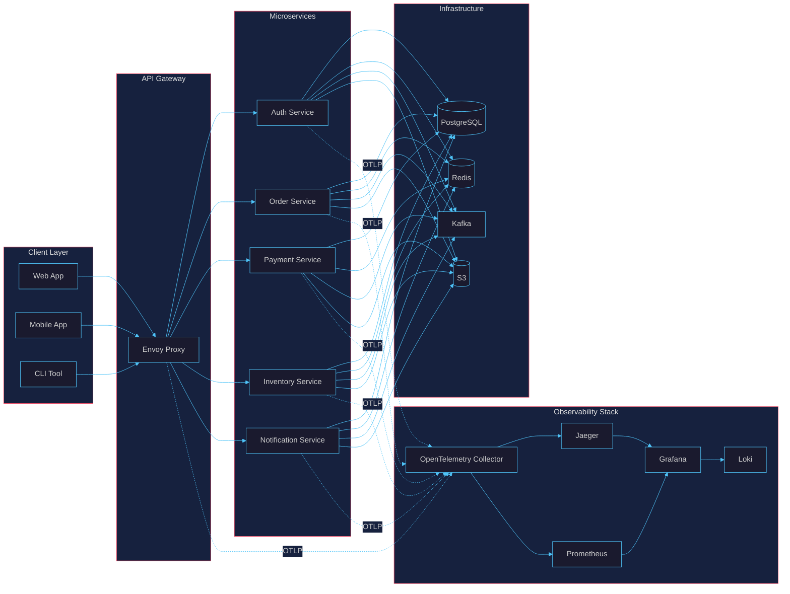
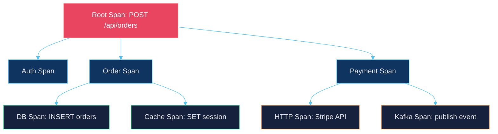
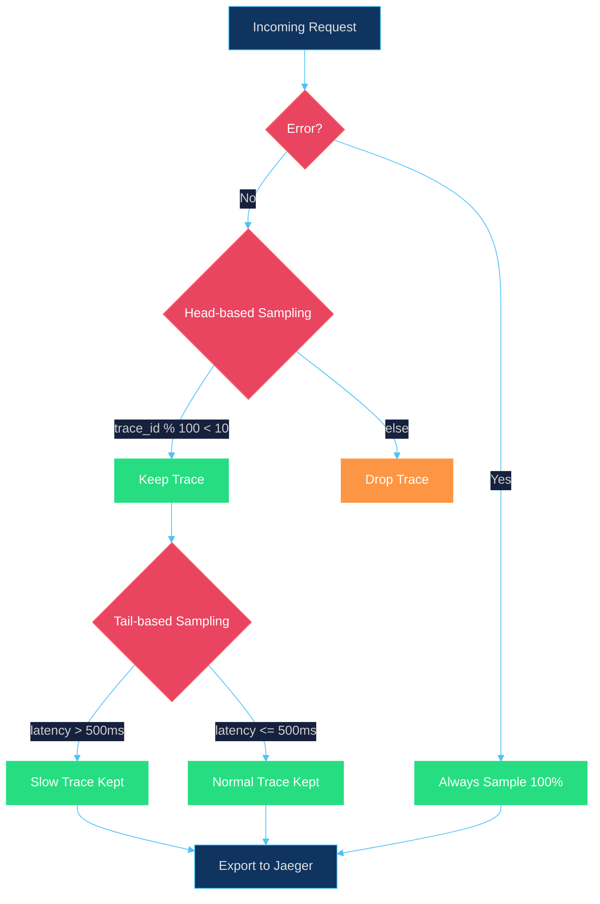
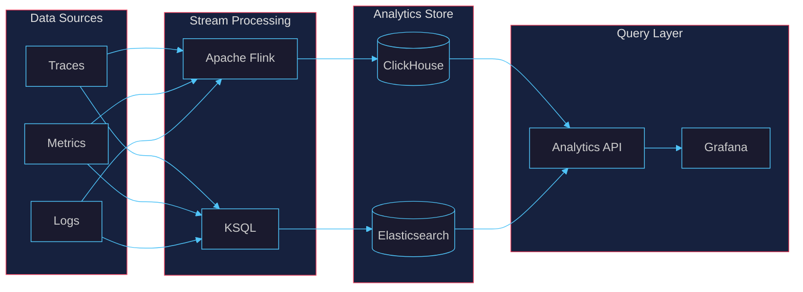
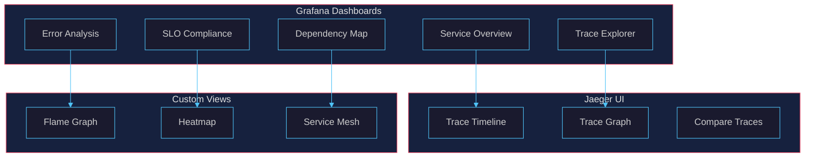

# APEX-OS Tracing Guide

## 1. Tracing Architecture



### Component Roles

| Component | Role |
|-----------|------|
| OpenTelemetry SDK | Instrumentation in each service |
| OTEL Collector | Receives, processes, exports telemetry |
| Jaeger | Distributed trace storage & query |
| Prometheus | Metrics aggregation |
| Grafana | Unified dashboards |
| Loki | Log correlation |

---

## 2. Span Management



### Span Lifecycle

1. **Creation** — Root span created at entry point (HTTP/gRPC handler)
2. **Context Propagation** — Trace context injected into headers (`traceparent`, `tracestate`)
3. **Child Spans** — Each downstream call creates a child span linked via `parentSpanId`
4. **Events & Attributes** — Key timestamps and metadata attached to spans
5. **Completion** — Span closed with status (OK/ERROR) and exported via OTLP

### Span Attributes Convention

| Attribute | Description | Example |
|-----------|-------------|---------|
| `http.method` | HTTP method | `POST` |
| `http.route` | Route path | `/api/orders` |
| `http.status_code` | Response code | `201` |
| `db.system` | Database type | `postgresql` |
| `db.statement` | Query (sampled) | `INSERT INTO orders...` |
| `messaging.system` | Message broker | `kafka` |
| `service.name` | Service identifier | `order-service` |
| `deployment.environment` | Environment | `production` |

---

## 3. Sampling Strategy



### Sampling Layers

| Layer | Strategy | Rate | Purpose |
|-------|----------|------|---------|
| Head-based | Deterministic (trace_id hash) | 10% | Baseline traffic coverage |
| Error-based | Always sample errors | 100% | Capture all failures |
| Slow-request | Latency threshold | 100% if >500ms | Debug performance issues |
| Tail-based | Post-decision in collector | Configurable | Retain interesting traces |

### Configuration

```yaml
processors:
  probabilistic_sampler:
    sampling_percentage: 10
  tail_sampling:
    decision_wait: 10s
    num_traces: 100000
    expected_new_traces_per_sec: 1000
    policies:
      - name: errors-policy
        type: status_code
        status_code: {status_codes: [ERROR]}
      - name: slow-requests-policy
        type: latency
        latency: {threshold_ms: 500}
```

---

## 4. Analytics



### Key Metrics Derived from Traces

| Metric | Calculation | Use Case |
|--------|-------------|----------|
| Request Rate | `count(spans) / time_window` | Traffic monitoring |
| Error Rate | `count(error spans) / count(all spans)` | SLA tracking |
| P50/P95/P99 Latency | Percentile of span durations | Performance SLOs |
| Dependency Graph | Service-to-service edge weights | Architecture analysis |
| Critical Path | Longest path in trace tree | Bottleneck identification |

### Alert Rules

```yaml
groups:
  - name: tracing-alerts
    rules:
      - alert: HighErrorRate
        expr: rate(spans_total{status="ERROR"}[5m]) / rate(spans_total[5m]) > 0.05
        for: 2m
        labels:
          severity: critical
      - alert: HighLatency
        expr: histogram_quantile(0.99, rate(span_duration_bucket[5m])) > 1000
        for: 5m
        labels:
          severity: warning
```

---

## 5. Visualization



### Dashboard Panels

| Panel | Type | Data Source | Refresh |
|-------|------|-------------|---------|
| Request Rate | Time series | Prometheus | 10s |
| Error Rate | Gauge | Prometheus | 10s |
| P99 Latency | Time series | Prometheus | 30s |
| Service Map | Node graph | Jaeger | 30s |
| Trace List | Table | Jaeger | On-demand |
| Flame Graph | Flamegraph | Jaeger | On-demand |

### Trace Waterfall View

```
┌─────────────────────────────────────────────────────────────────┐
│ POST /api/orders  [120ms]                                       │
├─────────────────────────────────────────────────────────────────┤
│ ├─ Auth Service  [8ms]                                          │
│ │   └─ DB Query  [3ms]                                          │
│ ├─ Order Service  [85ms]                                        │
│ │   ├─ DB INSERT  [12ms]                                        │
│ │   ├─ Cache SET  [2ms]                                         │
│ │   └─ Payment Service  [65ms]                                  │
│ │       ├─ Stripe API  [55ms]                                   │
│ │       └─ Kafka Publish  [5ms]                                 │
│ └─ Notification  [15ms]                                         │
└─────────────────────────────────────────────────────────────────┘
```

### Log–Trace Correlation

```json
{
  "timestamp": "2026-10-02T10:30:00Z",
  "trace_id": "abc123def456",
  "span_id": "span789",
  "service": "order-service",
  "message": "Order created successfully",
  "level": "info"
}
```

---

## Quick Reference

| Task | Command / Link |
|------|----------------|
| View traces | `http://jaeger.apexos.local:16686` |
| Dashboards | `http://grafana.apexos.local:3000` |
| OTLP endpoint | `http://otel-collector:4317` |
| Collector config | `/etc/otel-collector/config.yaml` |
| Sampling rate | `OTEL_TRACES_SAMPLER_ARG=0.1` |
