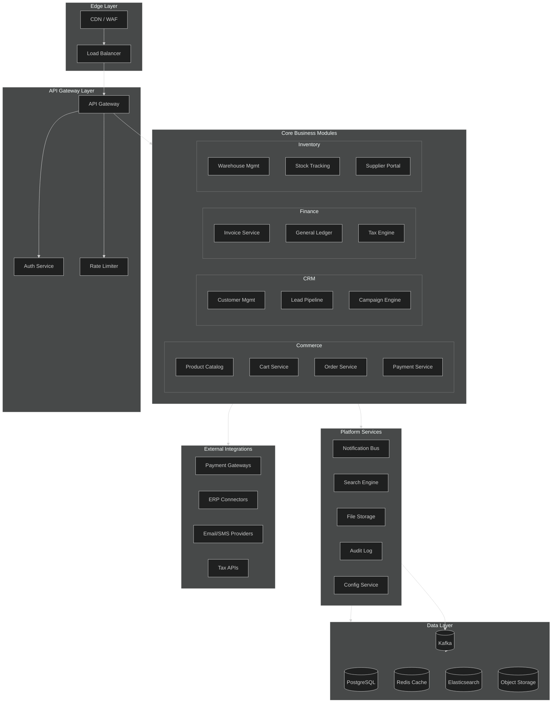
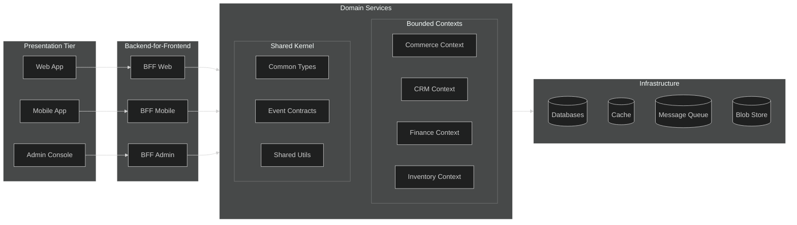
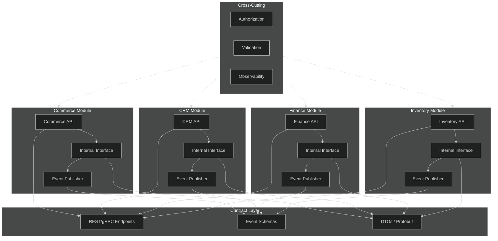
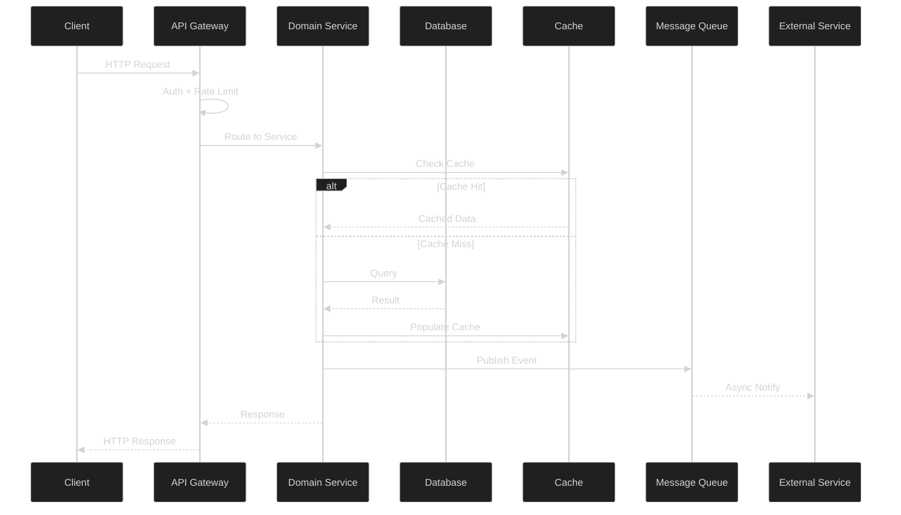
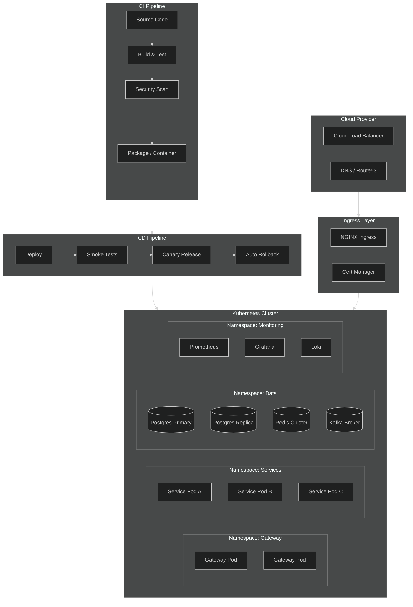
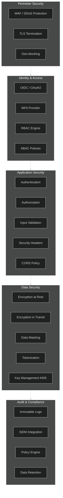
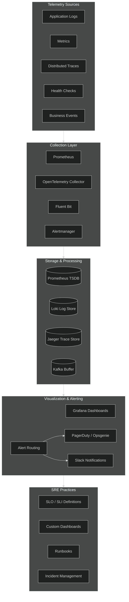

# APEX-OS Business Platform — Unified Architecture

## 1. Unified Macro Architecture

## 2. Modular Decomposition Strategy

## 3. Module Boundaries and Interfaces

## 4. Data Flow Architecture

## 5. Deployment Architecture

## 6. Security Architecture

## 7. Monitoring Architecture

