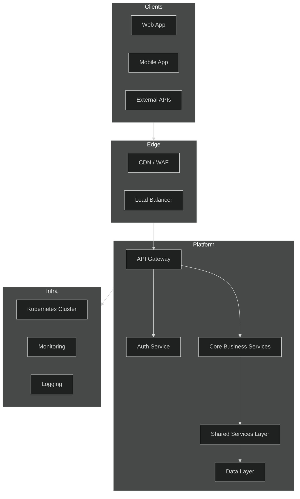
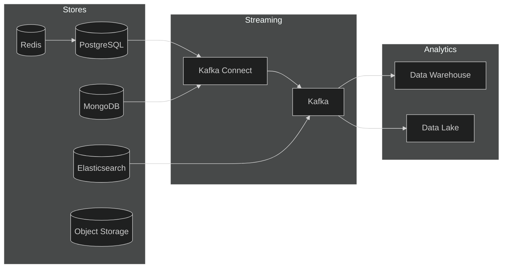
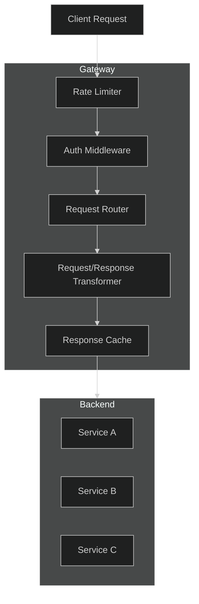
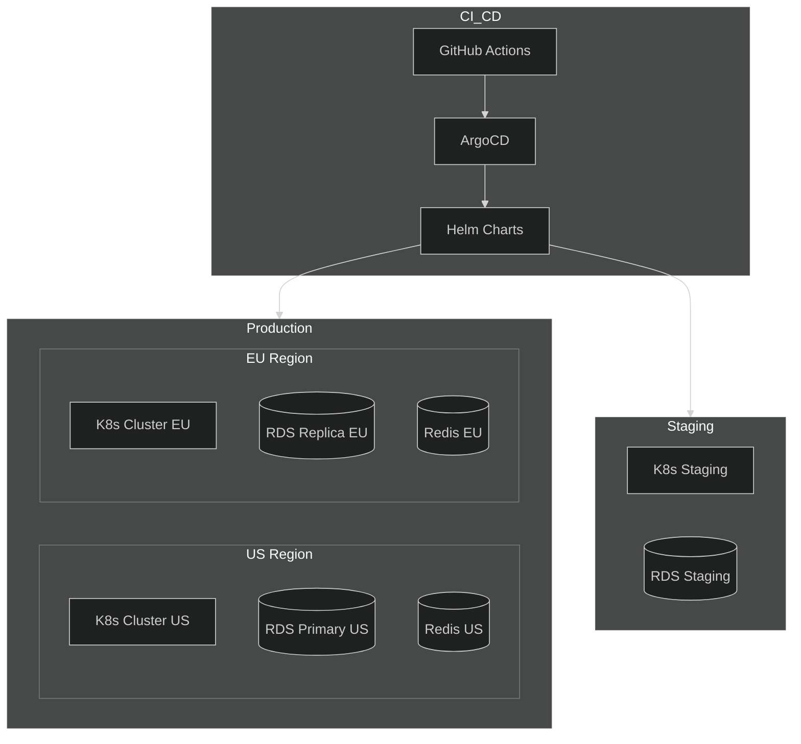

# APEX-OS Business Platform — Unified Architecture

## 1. Unified Architecture

## 2. Shared Services Layer

| Service | Responsibility | Protocol |
|---------|---------------|----------|
| Auth Service | Authentication, authorization, JWT issuance | gRPC / REST |
| User Service | User profiles, roles, permissions | gRPC |
| Notification Service | Email, SMS, push notifications | Event-driven |
| Audit Service | Compliance logging, audit trails | Event-driven |
| Config Service | Feature flags, dynamic configuration | gRPC |
| File Service | Document storage, media handling | REST |
| Search Service | Full-text search, indexing | REST |
| Billing Service | Subscriptions, invoicing, payments | REST |
| Workflow Service | Business process orchestration | Event-driven |
| Cache Service | Distributed caching, session store | Redis protocol |

### Service Communication Patterns

- **Synchronous**: gRPC for internal service-to-service calls
- **Asynchronous**: Event bus (Kafka) for decoupled workflows
- **External**: REST/GraphQL via API Gateway

## 3. Data Layer

### Data Store Responsibilities

| Store | Purpose | Data Type |
|-------|---------|-----------|
| PostgreSQL | Transactional data, ACID compliance | Relational |
| MongoDB | Document storage, flexible schemas | Document |
| Redis | Caching, sessions, real-time data | Key-Value |
| Elasticsearch | Full-text search, log analytics | Search Index |
| S3 | Media files, documents, backups | Object |
| Kafka | Event streaming, event sourcing | Stream |
| Data Warehouse | Reporting, BI, analytics | Columnar |
| Data Lake | Raw data, ML training | File-based |

## 4. API Gateway

### Gateway Responsibilities

- **Authentication**: JWT validation, API key verification
- **Rate Limiting**: Per-client throttling, quota enforcement
- **Routing**: Path-based and header-based routing
- **Transformation**: Request/response format conversion
- **Caching**: Response caching for read-heavy endpoints
- **Observability**: Request logging, metrics, tracing

## 5. Deployment Topology

### Deployment Strategy

| Environment | Strategy | Auto-scaling |
|-------------|----------|-------------|
| Production | Rolling updates | Yes |
| Staging | Blue-green | No |
| Development | On-demand | No |

### Infrastructure Components

- **Container Orchestration**: Kubernetes (EKS/GKE)
- **GitOps**: ArgoCD for continuous deployment
- **Helm**: Package management and templating
- **Service Mesh**: Istio for traffic management, mTLS
- **Secrets**: HashiCorp Vault
- **Monitoring**: Prometheus + Grafana
- **Logging**: ELK Stack / Loki
- **Tracing**: Jaeger / OpenTelemetry
