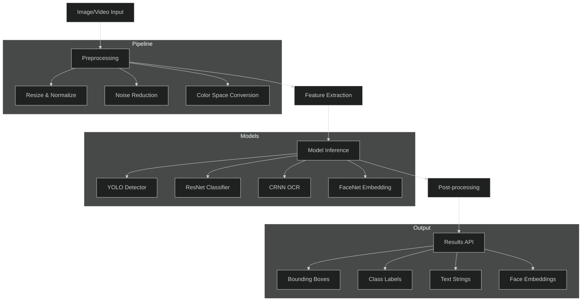
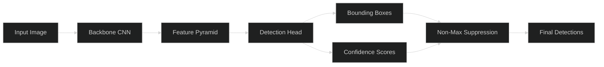
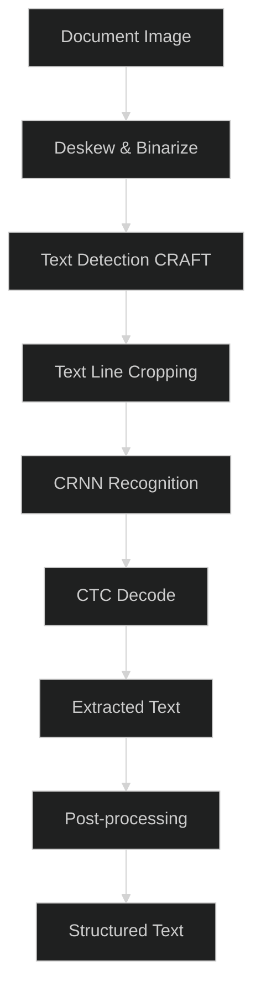
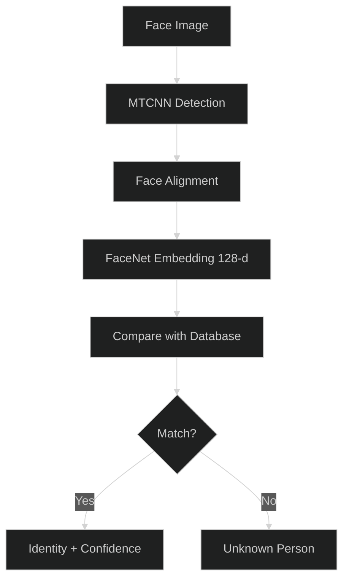

# APEX-OS Computer Vision

## Architecture

## Object Detection

Detects and localizes multiple objects in a single pass.

- **Model**: YOLOv8 / RT-DETR
- **Output**: `(x, y, w, h, class, confidence)`
- **Use cases**: People counting, vehicle detection, defect detection

## Image Recognition

Classifies images into predefined categories.

- **Model**: ResNet-50, EfficientNet-B4
- **Output**: Top-K class predictions with probabilities
- **Use cases**: Product classification, scene understanding, quality grading

## OCR (Optical Character Recognition)

Extracts text from images and documents.

- **Detection**: CRAFT / DBNet
- **Recognition**: CRNN + CTC decoding
- **Languages**: Multi-language support
- **Use cases**: Document digitization, receipt parsing, license plate reading

## Face Recognition

Identifies and verifies individuals from facial images.

- **Detection**: MTCNN / RetinaFace
- **Embedding**: FaceNet / ArcFace (128-d vector)
- **Matching**: Cosine similarity with threshold
- **Use cases**: Access control, attendance tracking, identity verification

## API Endpoints

| Endpoint | Method | Description |
|----------|--------|-------------|
| `/v1/vision/detect` | POST | Object detection |
| `/v1/vision/classify` | POST | Image classification |
| `/v1/vision/ocr` | POST | Text extraction |
| `/v1/vision/face/enroll` | POST | Register face |
| `/v1/vision/face/verify` | POST | Verify identity |
| `/v1/vision/face/identify` | POST | Identify person |

## Performance Targets

| Metric | Target |
|--------|--------|
| Detection latency | < 50ms |
| Classification latency | < 30ms |
| OCR latency | < 200ms |
| Face recognition latency | < 100ms |
| Throughput | 100+ req/s |
